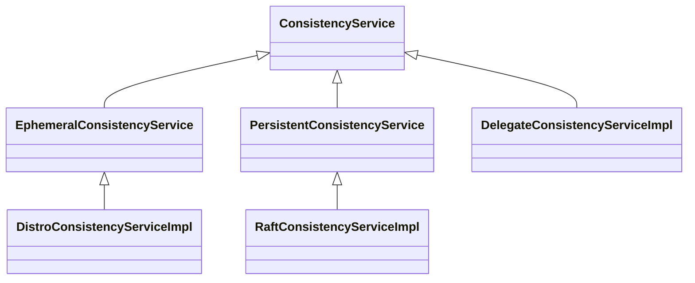

## Nacos Server

### Naming Server

#### 接口流程

```sequence
InstanceController -> InstanceController: create Instance from http request
InstanceController -> ServiceManager: registerInstance 
ServiceManager -> ServiceManager: create empty Service
ServiceManager -> Service: init
Service -> HealthCheckTask: start HealthCheckTask（5秒， 延迟5秒）
HealthCheckTask -> HealthCheckProcessor: process \n HealthCheckProcessor(通过ip+端口+http协议) \n TcpSuperSenseProcessor(通过ip+端口+TCP协议) \n ...
HealthCheckProcessor -> Nacos Clinets 服务注册者: 执行健康检查
ServiceManager -> ServiceManager: create new Instances
ServiceManager -> ConsistencyService: put()

```

We introduce a 'service —> cluster —> instance' model, in which service stores a list of clusters, which contain a list of instances

#### ConsistencyService

ConsistencyService接口继承关系图：


PersistentConsistencyService：持久化的一致性服务

EphemeralConsistencyService：短暂的一致性服务

RaftConsistencyServiceImpl：负责在Raft集群内保持数据持久的一致性

DistroConsistencyServiceImpl：负责在内存Map中保存数据，维持数据短暂的一致性

DelegateConsistencyServiceImpl：代理服务，负责将数据交由以上2种服务来处理

