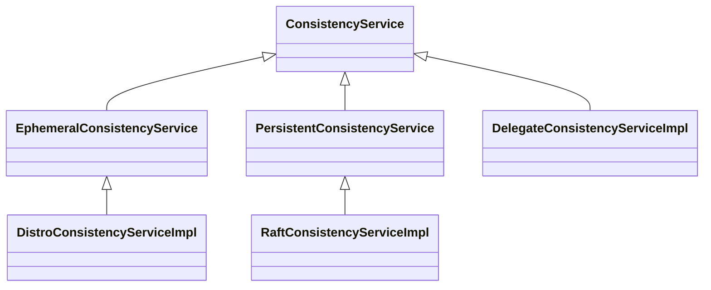

## Nacos Server

### Naming Server

service —> cluster —> instance

service: 代表服务提供者

cluster: 代表服务提供者的集群分组

instance：代表服务提供者的各个实例

#### 接口流程

```sequence
InstanceController -> InstanceController: create Instance from http request
InstanceController -> ServiceManager: registerInstance 
ServiceManager -> ServiceManager: create empty Service
ServiceManager -> Service: init
Service -> HealthCheckTask: start HealthCheckTask（5秒， 延迟5秒）
HealthCheckTask -> HealthCheckProcessor: process \n HealthCheckProcessor(通过ip+端口+http协议) \n TcpSuperSenseProcessor(通过ip+端口+TCP协议) \n ...
HealthCheckProcessor -> Nacos Clinets 服务注册者: 执行健康检查
ServiceManager -> ServiceManager: create new Instances
ServiceManager -> ConsistencyService: put()

```

#### ConsistencyService

ConsistencyService接口继承关系图：


PersistentConsistencyService：持久化的一致性服务

EphemeralConsistencyService：短暂的一致性服务

RaftConsistencyServiceImpl：负责在Raft集群内保持数据持久的一致性

DistroConsistencyServiceImpl：负责在内存Map中保存数据，维持数据短暂的一致性

DelegateConsistencyServiceImpl：代理服务，负责将数据交由以上2种服务来处理

```sequence
title: RaftConsistencyServiceImpl的put实现
ServiceManager -> RaftConsistencyServiceImpl: put()
RaftConsistencyServiceImpl -> RaftCore: signalPublish()
```

```sequence
title: DistroConsistencyServiceImpl的put实现
ServiceManager -> DistroConsistencyServiceImpl: put()
DistroConsistencyServiceImpl -> DistroConsistencyServiceImpl: onPut()\n create Datum and save to dataStore(MAP)
DistroConsistencyServiceImpl -> Notifier: addTask()\n tasks(BlockingQueue)offer
Notifier -> Notifier: tasks take and handle
Notifier -> Notifier: run(): call RecordListener onChange or onDelete method
DistroConsistencyServiceImpl -> TaskDispatcher: addTask()\n tasks(BlockingQueue)offer
TaskDispatcher -> TaskDispatcher: run(): 
TaskDispatcher -> DataSyncer: create SyncTask and  submit by dataSyncer

```

