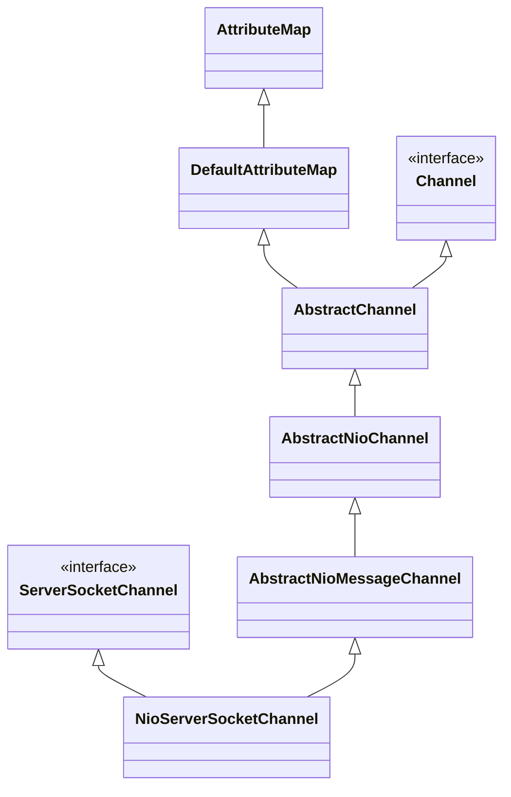

# Netty

```sequence
ServerBootstrap -> ServerBootstrap:new ServerBootstrap()
EventLoopGroup -> EventLoopGroup:new EventLoopGroup()
EventLoopGroup -> ServerBootstrap: config ServerBootstrap \n with group channal handler
ServerBootstrap -> ServerBootstrap: bind
ServerBootstrap -> NioServerSocketChannel: create NioServerSocketChannel
NioServerSocketChannel -> ChannelPipeline: create ChannelPipeline \n and init head and tail context
NioServerSocketChannel -> ServerBootstrap: init NioServerSocketChannel
ServerBootstrap -> ServerBootstrap: init channel options and arrtibutes \n add config handler
ServerBootstrap -> EventLoopGroup: register NioServerSocketChannel
ServerBootstrap -> ServerBootstrap: doBind0()
```

1. 构建ServerBootstrap并为其设置group（NioEventLoopGroup） channel（NioServerSocketChannel） handler（LoggingHandler） childHanlder（ChannelInitializer）等参数
2. 调用ServerBootstrap的bind方法绑定端口
3. bind方法主要构件NioServerSocketChannel并对其进行初始化
4. NioServerSocketChannel构建过程中会获取ServerSocketChannel，并初始化ChannelPipeline
5. ChannelPipeline（双向链表）初始化的时候会固定2个context：TailContext HeadContext
6. NioServerSocketChannel构建之后，对其进行初始化，设置options、arrtibutes以及ServerBootstrap设置的handler
7. 将NioServerSocketChannel注册到NioEventLoopGroup
8. 调用doBind0进行端口绑定，通过javaChanel（ServerSocketChannel）进行端口绑定

## NioServerSocketChannel

### 继承关系



### 构建

NioServerSocketChannel构造方法：create ServerSocketChannel（NioServerSocketChannel包装了JDK的ServerSocketChannel设置事件为ACCEPT） and NioServerSocketChannelConfig

```java
public NioServerSocketChannel() {
    this(newSocket(DEFAULT_SELECTOR_PROVIDER));
}

public NioServerSocketChannel(ServerSocketChannel channel) {
        super(null, channel, SelectionKey.OP_ACCEPT);
        config = new NioServerSocketChannelConfig(this, javaChannel().socket());
}

private static ServerSocketChannel newSocket(SelectorProvider provider) {
        try {
            /**
             *  Use the {@link SelectorProvider} to open {@link SocketChannel} and so remove condition in
             *  {@link SelectorProvider#provider()} which is called by each ServerSocketChannel.open() otherwise.
             *
             *  See <a href="https://github.com/netty/netty/issues/2308">#2308</a>.
             */
            return provider.openServerSocketChannel();
        } catch (IOException e) {
            throw new ChannelException(
                    "Failed to open a server socket.", e);
        }
    }
```

AbstractNioChannel构造方法：设置ServerSocketChannel configureBlocking(false)设置成非阻塞式模式

```java
protected AbstractNioChannel(Channel parent, SelectableChannel ch, int readInterestOp) {
    super(parent);
    this.ch = ch;
    this.readInterestOp = readInterestOp;
    try {
        ch.configureBlocking(false);
    } catch (IOException e) {
        try {
            ch.close();
        } catch (IOException e2) {
            logger.warn(
                        "Failed to close a partially initialized socket.", e2);
        }

        throw new ChannelException("Failed to enter non-blocking mode.", e);
    }
}
```

AbstractChannel构造方法：初始化ChannelId、NioMessageUnsafe、DefaultChannelPipeline

```java
protected AbstractChannel(Channel parent) {
    this.parent = parent;
    id = newId();
    unsafe = newUnsafe();
    pipeline = newChannelPipeline();
}
```

### 初始化

```java
ServerBootstrap.class
  
void init(Channel channel) {
        setChannelOptions(channel, newOptionsArray(), logger);
        setAttributes(channel, attrs0().entrySet().toArray(EMPTY_ATTRIBUTE_ARRAY));

        ChannelPipeline p = channel.pipeline();

        final EventLoopGroup currentChildGroup = childGroup;
        final ChannelHandler currentChildHandler = childHandler;
        final Entry<ChannelOption<?>, Object>[] currentChildOptions;
        synchronized (childOptions) {
            currentChildOptions = childOptions.entrySet().toArray(EMPTY_OPTION_ARRAY);
        }
        final Entry<AttributeKey<?>, Object>[] currentChildAttrs = childAttrs.entrySet().toArray(EMPTY_ATTRIBUTE_ARRAY);

        p.addLast(new ChannelInitializer<Channel>() {
            @Override
            public void initChannel(final Channel ch) {
                final ChannelPipeline pipeline = ch.pipeline();
                ChannelHandler handler = config.handler();
                if (handler != null) {
                    pipeline.addLast(handler);
                }

                ch.eventLoop().execute(new Runnable() {
                    @Override
                    public void run() {
                        pipeline.addLast(new ServerBootstrapAcceptor(
                                ch, currentChildGroup, currentChildHandler, currentChildOptions, currentChildAttrs));
                    }
                });
            }
        });
    }
```

1. setChannelOptions
2. setAttributes
3. pipeline addLast config handler
4. pipeline addLast ServerBootstrapAcceptor