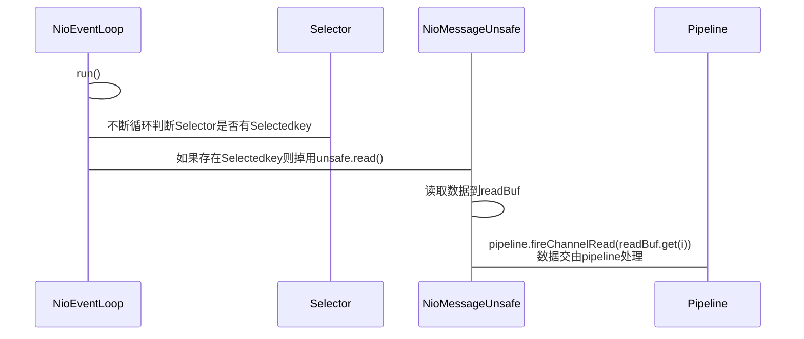

# Netty事件处理

## 大体流程

## 总结：

1. NioEventLoop线程run方法，不断循环从selector中判断是否有未处理的Selectedkey
2. 如果存在则调用unsafe.read进行读取，unsafe的实现是：NioMessageUnsafe
3. NioMessageUnsafe的read方法，将数据读取写到readBuf（List<Object>）
4. 然后调用pipeline.fireChannelRead(readBuf.get(i));将数据交由pipeline管道进行处理

