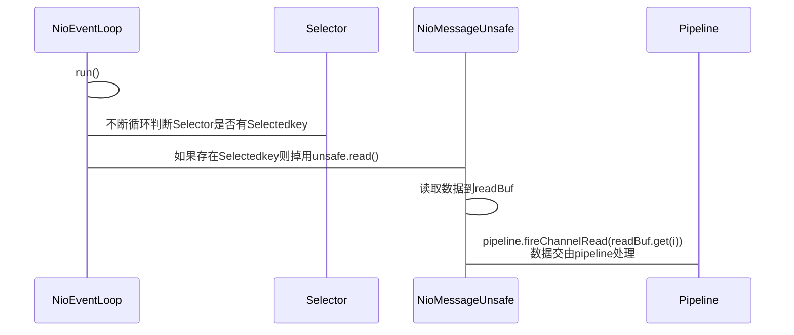

# Netty事件处理

## 大体流程

## 总结：

1. NioEventLoop线程run方法，不断循环从selector中判断是否有未处理的Selectedkey
2. 如果存在则调用unsafe.read进行读取，unsafe的实现是：NioMessageUnsafe
3. NioMessageUnsafe的read方法，将数据读取写到readBuf（List<Object>）
4. 然后调用pipeline.fireChannelRead(readBuf.get(i));将数据交由pipeline管道进行处理

# Netty拆包器

对于粘包问题，Netty通过拆包器来进行分包，拆包器有：

1. 固定长度的拆包器 FixedLengthFrameDecoder

   每个应用层数据包的都拆分成都是固定长度的大小，比如 1024字节。

2. 行拆包器 LineBasedFrameDecoder

   每个应用层数据包，都以换行符作为分隔符，进行分割拆分。

3. 分隔符拆包器 DelimiterBasedFrameDecoder

   每个应用层数据包，都通过自定义的分隔符，进行分割拆分。

4. 基于数据包长度的拆包器 LengthFieldBasedFrameDecoder

   将应用层数据包的长度，作为接收端应用层数据包的拆分依据。按照应用层数据包的大小，拆包。这个拆包器，有一个要求，就是应用层协议中包含数据包的长度。