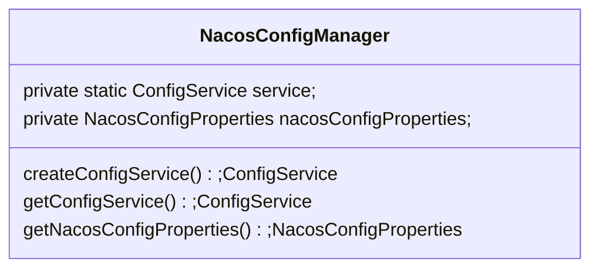
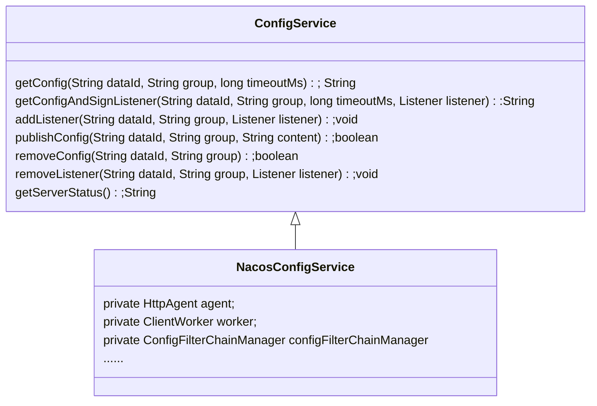
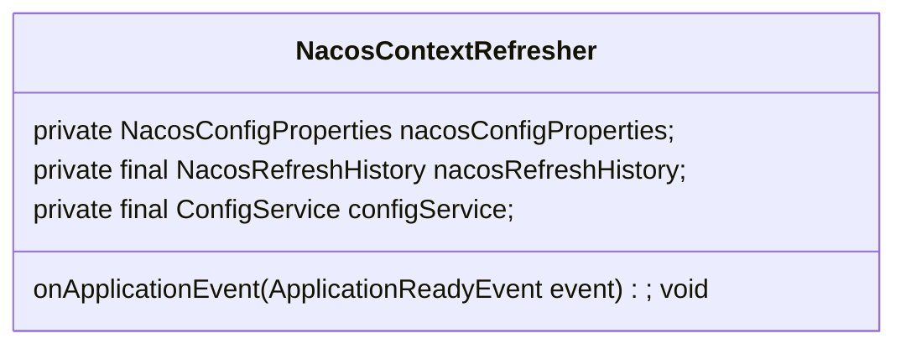

# Spring Cloud Config With Nacos

## NacosConfigManager



NacosConfigManager对象由NacosConfigAutoConfiguration进行构建，NacosConfigManager通过ConfigFactory创建并维护了NacosConfigService

## NacosConfigService

### 继承关系：



ConfigService（接口）：抽象了配置服务，定义了与配置服务交互的能力，比如：getConfig获取配置，publishConfig发布配置等

NacosConfigService：实现了ConfigService，通过HttpAgent与ClientWorker实现了与配置服务交互的能力

### NacosConfigService 构造方法

```java
public NacosConfigService(Properties properties) throws NacosException {
    String encodeTmp = properties.getProperty(PropertyKeyConst.ENCODE);
    if (StringUtils.isBlank(encodeTmp)) {
        encode = Constants.ENCODE;
    } else {
        encode = encodeTmp.trim();
    }
    initNamespace(properties);
    //启动HttpAgent
    agent = new MetricsHttpAgent(new ServerHttpAgent(properties));
    agent.start();
    //构建ClientWorker
    worker = new ClientWorker(agent, configFilterChainManager, properties);
}
```

**HttpAgent**

```sequence
NacosConfigService -> ServerHttpAgent: new ServerHttpAgent(properties)
ServerHttpAgent -> ServerHttpAgent: new ServerListManager(properties)
ServerHttpAgent -> ServerHttpAgent: new SecurityProxy(properties)
ServerHttpAgent -> SecurityProxy: securityProxy.login \n (serverListMgr.getServerUrls());
SecurityProxy -> SecurityProxy: send login http \n to nacos config server
NacosConfigService -> MetricsHttpAgent: new MetricsHttpAgent(ServerHttpAgent).start
MetricsHttpAgent -> MetricsHttpAgent: create GetServerListTask() and run \n try to get server list pre 30 second
```

1. 通过properties构建ServerHttpAgent对象
2. ServerHttpAgent解析properties构建对应的ServerListManager维护配置服务信息以及SecurityProxy用于访问配置服务
3. 通过SecurityProxy向所有配置服务器发送login请求（如果username配置了的话发送请求，否则不发送）
4. 启动定时任务默认每隔5秒钟再次发送login请求
5. 通过ServerHttpAgent构建MetricsHttpAgent并调用start方法启动
6. 构建GetServerListTask任务，每隔30秒获取最新的配置服务器列表

**ClientWorker**

```sequence
NacosConfigService -> ClientWorker: new ClientWorker(properties)
ClientWorker -> ClientWorker: Initialize the timeout parameter
ClientWorker -> ClientWorker: create executor Executor whitch core poll size is 1
ClientWorker -> ClientWorker: create executorService Executor whitch core poll size equals cpu num
ClientWorker -> ClientWorker: schedule Runnable to checkConfigInfo with executor
ClientWorker -> LongPollingRunnable: execute LongPollingRunnable to checkConfigInfo with executorService
LongPollingRunnable -> LongPollingRunnable: try to get config from nacos server
```

1. 构建ClientWorker对象
2. ClientWorker构造方法解析properties获取timeout等配置
3. 创建core poll size为1的Executor：executor，创建core poll size为cpu数量的Executor：executorService
4. 通过executor（core poll size 1）不间断的(相隔10毫秒)执行checkConfigInfo()方法
5. checkConfigInfo()方法分批次执行LongPollingRunnable，向Nacos Server进行长轮询
6. LongPollingRunnable获取ClientWorker维护的CacheData向配置服务器请求修改项，然后依次去拉取最新的数据进行更新

## NacosContextRefresher

NacosContextRefresher对象由NacosConfigAutoConfiguration进行构建

NacosContextRefresher监听ApplicationReadyEvent事件，当收到该事件时，获取NacosPropertySource构建Listener并注册到ConfigServer



流程图：

```sequence
NacosContextRefresher -> NacosContextRefresher: Listen ApplicationReadyEvent
NacosContextRefresher -> NacosPropertySourceRepository: get NacosPropertySource
NacosPropertySourceRepository -> NacosContextRefresher: return NacosPropertySource
NacosContextRefresher -> NacosContextRefresher: create Listener
NacosContextRefresher -> ConfigService: add Listener to ConfigerService
```


