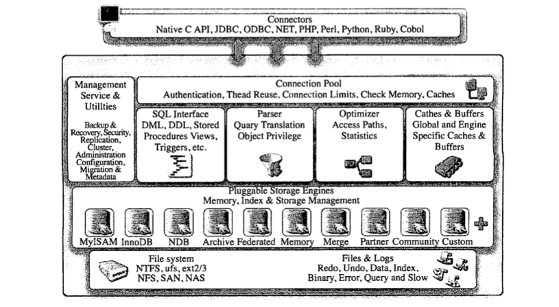
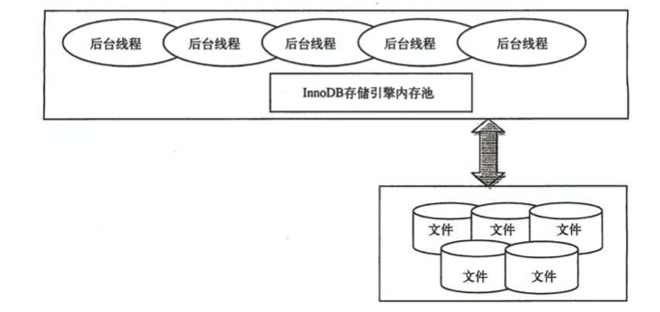
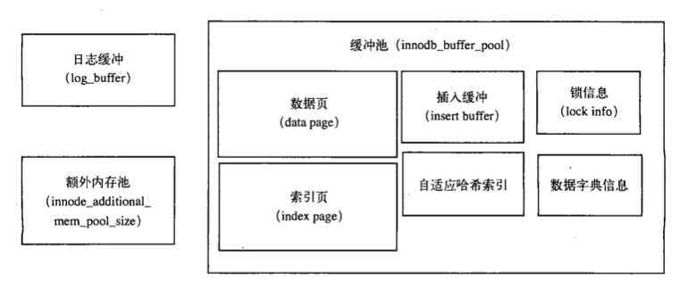
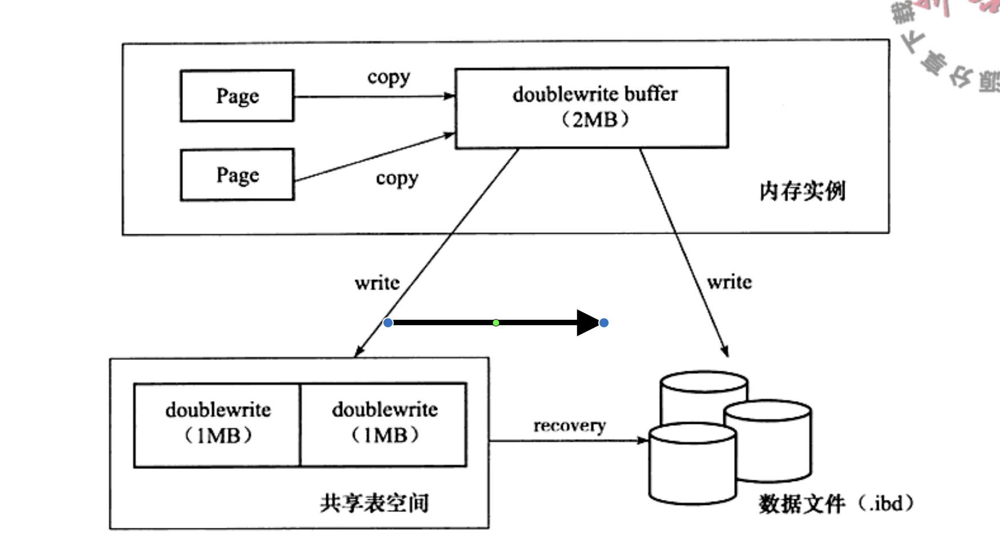

# Mysql & Innodb

## 体系结构

组成部分：

1. 连接池组件
2. 管理服务和工具组件
3. SQL接口组件
4. 查询分析器组件
5. 优化器组件
6. 缓冲组件
7. 插件式存储引擎
8. 物理文件

## 存储引擎

### InnoDB（默认）

支持事务，支持行锁，支持外键，支持非锁定读；

表文件单独存放在独立的idb文件中；

支持MVCC多版本并发控制，实现了SQL标准的4种隔离级别

支持next-key locking，避免幻读

提供插入缓冲（insert buffer），二次写（double write），自适应哈希索引（adaptive hash index），预读（read ahead）等高性能高可用功能

采用聚集（clustered）的方式存储数据：每张表的数据都按照主键顺序进行存放，如果没有显式的定义主键，innodb会为该表生成一个6字节的ROWID作为主键

### MyISAM

不支持事务，不支持表锁和全文索引，但是对于一些OLAP（Online Analytical Processing 在线分析处理）场景下操作速度快

MyISAM存储引擎表由MYD和MYI组成，MYD存放数据文件，MYI存放索引文件，数据文件还可以通过myisampack工具来进行压缩，压缩后的表是只读的，也可以通过myisampack来解压，可以用于一些存档数据（只查不改）的查询，速度快，数据占用空间小

### NDB

NDB是集群存储引擎，NDB数据全部存放于内存中（5.1版本开始非索引数据可以存放在磁盘上），因此主键查询速度极快

可以通过增加集群节点数，线性提高性能

### Memory

表中的数据全部存放在内存中，查询速度极快，数据库重启或是宕机则数据丢失，可以用于存放临时数据

默认使用哈希索引

## 数据库连接方式

1. TCP/IP
2. 命名管道和共享内存（数据库和连接进程处于同一台机器（windows），可以通过该方式进行连接）
3. Unix域套接字（数据库和连接进程处于同一台机器（Linux或Unix），可以通过该方式进行连接）

## InnoDB

### 体系架构

### 后台线程

1. IO thread
   1. insert buffer thread
   2. log thread
   3. read thread
   4. write thread
2. Master thread
3. 锁监控线程
4. 错误监控线程
#### Master thread

Master thread内部由几个循环组成：

1. 主循环loop
2. 后台循环background loop
3. 刷新循环flush loop
4. 暂停循环suspend loop

master thread根据数据库运行状态进在4种循环中进行切换

##### 主循环loop

大多数操作都发生在主循环中，按照时间可以分为每秒的操作和每10秒的操作

每秒一次的操作包括：

1. 总是对日志缓冲进行落盘（不管事务是否已经提交都进行日志落盘，这可以保证长事务在最后提交的时候响应也非常快速）

 	2. 可能合并插入缓冲（innodb会根据当前1秒内的IO情况进行判定是否进行合并插入缓冲，如果innodb认为当前IO压力小，则会进行合并插入缓冲）
 	3. 可能对缓冲池中的脏页进行落盘（刷新做多100个脏页，当脏页数量超过配置的百分比阈值（buf_get_modified_ratio_pact）则进行落盘）
 	4. 可能切换到后台循环background loop

每10秒的操作包括：

1. 刷新100个脏页（可能）
2. 合并之多5个插入缓冲（总是）
3. 将日志缓冲刷新到磁盘（总是）
4. 删除无用的undo页（总是）
5. 刷新100个或是10个脏页到磁盘（总是）
6. 产生一个检查点checkpoint（总是）

##### 后台循环background loop

当数据库空闲或是数据库关闭时，会进入该循环，该循环执行以下操作：

1. 总是删除无用的undo页

2. 总是合并20个插入缓冲

3. 总是跳回到主循环

4. 不断刷新100个脏页，直到符合条件（使得脏页占比小于阈值）（可能由flush loop来做这一步）

##### 刷新循环flush loop

1. 不断刷新100个脏页，直到符合条件（使得脏页占比小于阈值）

### 内存

可以通过配置文件中的：innodb_buffer_pool_size 和 innodb_log_buffer_size的大小决定

#### 缓冲池buffer pool

用于存放各种数据的缓存，以Page页的方式管理数据，一页为16K。

通过LRU（最近最少使用）算法来保留数据或是删除数据。

每次修改数据先修改缓存池中的数据，然后在落盘，还未落盘的数据称为脏页

可以通过命令：SHOW ENGINE INNODB STATUS来查看innodb_buffer_pool的使用情况

#### 重做日志缓冲池redo log buffer

用于存储redo log，一般该内存区域不用特别大，因为redo log会按照每一秒进行落盘，只要保证每秒产生的事务量在这个缓冲大小内就可以

#### 额外的内存池additional memory pool

不太关注，不管了

### 关键特性

1. 插入缓冲 Insert Buffer
2. 两次写 Double Write
3. 自适应哈希索引 Adaptive Hash Index
4. 异步IO Async IO
5. 刷新邻接页 Flush Neighbor Page

#### 插入缓冲Insert Buffer

Insert Buffer：

对于插入的数据，主键自增的情况下，对于聚集索引页来说是顺序写入

对于非聚集索引页（辅助索引页）来说，如果辅助索引是非唯一的，则先判断非聚集索引页是否存在缓存中，如果存在则直接进行插入，如果不在则将插入数据放入Insert Buffer中，然后通过一定的频率进行Insert Buffer和辅助索引的合并操作。这时通常能将多个插入合并到一个操作中，提高非聚集索引的插入性能。

对于非聚集索引来说，如果辅助索引是唯一的，则需要访问所有该非聚集索引页来判断唯一情况。通常是随机访问，这也是由于B+树的特性决定的。

Change Buffer：

IChange Buffer是nsert Buffer的升级，可以对Insert Delte Update 进行缓冲，分别对应Insert Buffer，Delete Buffer，Purge Buffer。生效条件依旧是非聚集索引（辅助索引）且非唯一

#### 两次写Double Write

脏页进行落盘的时候，为避免写入部分数据时宕机（部分写失效），引入Double Write机制，落盘的时候先将脏页复制到Double Write Buffer（2M大小）然后由Double Write Buffer分2次每次1M大小顺序的写入共享表空间，再将Double Write Buffer中的页写入各个表空间文件中。

#### 自适应哈希索引Adaptive Hash Index（AHI）

哈希索引的时间复杂度为O1，查询次数为1次，而B+树的查询次数由其高度决定。

InnoDB会监控对表上个***索引页***的查询，如果发现改用哈希索引能带来性能提升，则为热点Page建立哈希索引。

AHI要求：以一定模式访问超过一定次数

#### 异步IO Async IO

某条SQL可能扫描多个页，存储引擎并不会串行的进行访问，而是采用异步IO的方式，并行对多个页发起IO访问。

如果多个页是连续的，则会对连续的多个页访问进行合并，减少IO次数

#### 刷新邻接页 Flush Neighbor Page

InnoDB刷新脏页时，会检测该页所在的区（extend）的所有页，如果也有脏页，则一起进行刷新。这样的好处可以通过AIO将多个IO操作合并为一个IO操作。

问题：有可能将临近的不怎么脏的脏页进行了落盘，但是很快该页又变成了脏页；对固态硬盘的情况下的性能提升不明显

## 文件

### 参数文件（配置文件）

Mysql启动时读取参数文件，如果没有参数文件则加载默认参数

可以通过mysql --help | grep my.cof 来查看，mysql配置文件的读取顺序

### 日志文件

#### 错误日志

通过SHOW VARIABLES LIKE 'log error' 可以定位日志文件，通过错误日志可以查询Mysql启动 运行 关闭过程的日志，该日志不仅记录错误，还记录了告警以及正常信息

#### 二进制日志binary log

二进制日志记录了对Mysql数据库的所有更改操作，例如update insert delete操作

二进制日志可以用于：

1. 恢复：某些数据的恢复需要二进制日志，例如：在一个数据库全备文件恢复后，可以通过该日志文件进行point-int-time的恢复
2. 复制：主从复制
3. 审计：可以通过二进制日志审计是否对数据库存在注入攻击

#### 慢查询日志

启用慢日志之后，Mysql将执行时间低于（不等于）阈值的SQL记录下来，通过SHOW VARIABLES LIKE 'long_query_time'可以查询阈值大小（单位秒）

通过SHOW VARIABLES LIKE 'log_show_queries'可以查询慢日志启用情况

另一个参数'log_queries_not_using_indexs'，可以将没有使用索引的SQL语句记录到慢查询日志

对于慢查询日志文件，可以通过mysqldumpslow命令进行分析

Mysql5.1之后，可以将慢查询日志输出到表：mysql.show_log

#### 查询日志

查询日志记录所有对Mysql数据库的请求信息，和慢查询日志一样可以输出到表：mysql.general_log

### 表结构定义文件

顾名思义，该文件记录了表以及视图的定义信息，以frm为文件后缀，可以通过cat命令查看内容

### InnoDB存储引擎文件

#### 表空间文件

InnoDB将存储的数据按照表空间进行存放。默认配置下会有一个初始大小为10MB，名称为ibdata1的文件。该文件就是哦人的表空间文件，用户可以通过多个文件组成一个表空间，如果多个文件存在于不同的磁盘上，可以对IO负载做均衡。

参数innodb_file_per_table参数，可以将每个表的数据存储在独立的表空间文件中，命名规则为：表名.ibd

默认的表空间和单独的表空间的区别：

单独的表空间文件仅存储该表的数据、索引和插入缓冲Bitmap等信息，其余数据还是存放在默认的表空间文件中。

#### 重做日志文件redo log file

redo log file存在于InnoDB数据目录下， 记录了InnoDB存储引擎的事务日志，一般存在2个命名为ib_logfile0和ib_logfile1的文件（可以设置多个），两个文件轮流交替使用。

redo log从redo log buffer写入文件时，按照512字节（B）进行写入，也就是一个扇区的大小进行写入。因为扇区是写入的最小单位，因此可以保证写入是必定成功的。所以不需要double write。

每次到检查点（check point）都会将redo log写入到磁盘。还有一种情况当事务提交时，对于redo log的写入，通过参数innodb_flush_log_at_frx_commit进行控制，参数值0表示，事务提交时不将redo log写入磁盘，而是等待master thread的每秒刷新。1表示事务提交时将redo log同步写入磁盘。2表示事务提交时将redo log异步写入到磁盘，也就是文件系统的缓存中。为了保证ACID中的持久性，必须设置为1。

## 表

### InnoDB逻辑存储结构

#### 表空间

