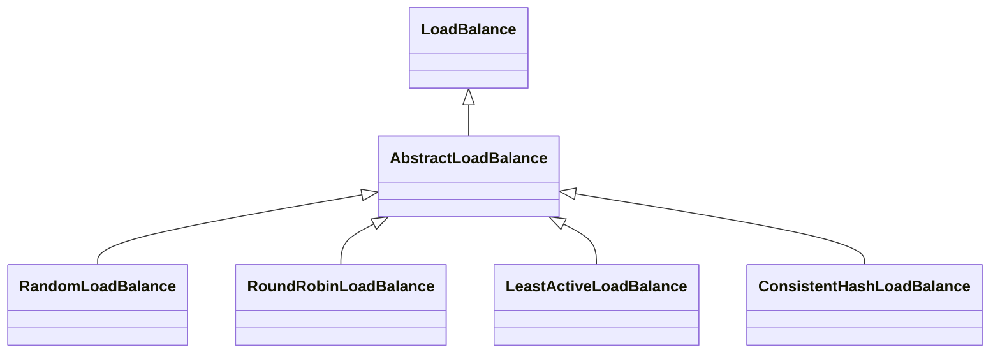

# Dubbo服务调用

## 大致流程

1. ReferenceAnnotationBeanPostProcessor扫描Reference注解
2. 构建ReferenceBean
3. 通过ReferenceBean构建代理对象注入容器
4. 代理方法使用Invoker（DubboInvoker）调用服务
5. 调用过程涉及服务寻址、服务路由判断、负载均衡、远程调用

## 关键代码

### 服务订阅

   ```java
   ReferenceConfig.class
   //初始化ReferenceBean
   private void init() {
           if (initialized) {
               return;
           }
       //封装订阅URL的参数到MAP
           checkStubAndLocal(interfaceClass);
           checkMock(interfaceClass);
           Map<String, String> map = new HashMap<String, String>();
   
           map.put(SIDE_KEY, CONSUMER_SIDE);
   
           appendRuntimeParameters(map);
           if (!isGeneric()) {
               String revision = Version.getVersion(interfaceClass, version);
               if (revision != null && revision.length() > 0) {
                   map.put(REVISION_KEY, revision);
               }
   
               String[] methods = Wrapper.getWrapper(interfaceClass).getMethodNames();
               if (methods.length == 0) {
                   logger.warn("No method found in service interface " + interfaceClass.getName());
                   map.put(METHODS_KEY, ANY_VALUE);
               } else {
                   map.put(METHODS_KEY, StringUtils.join(new HashSet<String>(Arrays.asList(methods)), COMMA_SEPARATOR));
               }
           }
           map.put(INTERFACE_KEY, interfaceName);
           appendParameters(map, metrics);
           appendParameters(map, application);
           appendParameters(map, module);
           // remove 'default.' prefix for configs from ConsumerConfig
           // appendParameters(map, consumer, Constants.DEFAULT_KEY);
           appendParameters(map, consumer);
           appendParameters(map, this);
           Map<String, Object> attributes = null;
           if (CollectionUtils.isNotEmpty(methods)) {
               attributes = new HashMap<String, Object>();
               for (MethodConfig methodConfig : methods) {
                   appendParameters(map, methodConfig, methodConfig.getName());
                   String retryKey = methodConfig.getName() + ".retry";
                   if (map.containsKey(retryKey)) {
                       String retryValue = map.remove(retryKey);
                       if ("false".equals(retryValue)) {
                           map.put(methodConfig.getName() + ".retries", "0");
                       }
                   }
                   attributes.put(methodConfig.getName(), convertMethodConfig2AyncInfo(methodConfig));
               }
           }
   
           String hostToRegistry = ConfigUtils.getSystemProperty(DUBBO_IP_TO_REGISTRY);
           if (StringUtils.isEmpty(hostToRegistry)) {
               hostToRegistry = NetUtils.getLocalHost();
           } else if (isInvalidLocalHost(hostToRegistry)) {
               throw new IllegalArgumentException("Specified invalid registry ip from property:" + DUBBO_IP_TO_REGISTRY + ", value:" + hostToRegistry);
           }
           map.put(REGISTER_IP_KEY, hostToRegistry);
       //构建代理
           ref = createProxy(map);
   
           String serviceKey = URL.buildKey(interfaceName, group, version);
           ApplicationModel.initConsumerModel(serviceKey, buildConsumerModel(serviceKey, attributes));
           initialized = true;
       }
   ```
   1. 构建MAP封装了订阅所需参数，包括订阅的服务信息(接口、方法、版本)、本地IP等
   2. 尝试构建代理对象

  ```java
   ReferenceConfig.class
   //代理对象构建过程，其中包含了服务的订阅
   private T createProxy(Map<String, String> map) {
           if (shouldJvmRefer(map)) {
               URL url = new URL(LOCAL_PROTOCOL, LOCALHOST_VALUE, 0, interfaceClass.getName()).addParameters(map);
               invoker = REF_PROTOCOL.refer(interfaceClass, url);
               if (logger.isInfoEnabled()) {
                   logger.info("Using injvm service " + interfaceClass.getName());
               }
           } else {
               //用户是否指定了访问的url
               urls.clear(); // reference retry init will add url to urls, lead to OOM
               if (url != null && url.length() > 0) { // user specified URL, could be peer-to-peer address, or register center's address.
                   String[] us = SEMICOLON_SPLIT_PATTERN.split(url);
                   if (us != null && us.length > 0) {
                       for (String u : us) {
                           URL url = URL.valueOf(u);
                           if (StringUtils.isEmpty(url.getPath())) {
                               url = url.setPath(interfaceName);
                           }
                           if (REGISTRY_PROTOCOL.equals(url.getProtocol())) {
                               urls.add(url.addParameterAndEncoded(REFER_KEY, StringUtils.toQueryString(map)));
                           } else {
                               urls.add(ClusterUtils.mergeUrl(url, map));
                           }
                       }
                   }
               } else { // assemble URL from register center's configuration
                   // if protocols not injvm checkRegistry
                   if (!LOCAL_PROTOCOL.equalsIgnoreCase(getProtocol())){
                       checkRegistry();
                       //获取所有注册中心的URL准备服务订阅
                       List<URL> us = loadRegistries(false);
                       if (CollectionUtils.isNotEmpty(us)) {
                           for (URL u : us) {
                               URL monitorUrl = loadMonitor(u);
                               if (monitorUrl != null) {
                                   map.put(MONITOR_KEY, URL.encode(monitorUrl.toFullString()));
                               }
                               urls.add(u.addParameterAndEncoded(REFER_KEY, StringUtils.toQueryString(map)));
                           }
                       }
                       if (urls.isEmpty()) {
                           throw new IllegalStateException("No such any registry to reference " + interfaceName + " on the consumer " + NetUtils.getLocalHost() + " use dubbo version " + Version.getVersion() + ", please config <dubbo:registry address=\"...\" /> to your spring config.");
                       }
                   }
               }
  
               //通过REF_PROTOCOL(Adapter)去调用refer方法，根据不通过协议来处理，通常RegistryProtocol处理服务的订阅逻辑
               if (urls.size() == 1) {
                   invoker = REF_PROTOCOL.refer(interfaceClass, urls.get(0));
               } else {
                   List<Invoker<?>> invokers = new ArrayList<Invoker<?>>();
                   URL registryURL = null;
                   for (URL url : urls) {
                       invokers.add(REF_PROTOCOL.refer(interfaceClass, url));
                       if (REGISTRY_PROTOCOL.equals(url.getProtocol())) {
                           registryURL = url; // use last registry url
                       }
                   }
                   if (registryURL != null) { // registry url is available
                       // use RegistryAwareCluster only when register's CLUSTER is available
                       URL u = registryURL.addParameter(CLUSTER_KEY, RegistryAwareCluster.NAME);
                       // The invoker wrap relation would be: RegistryAwareClusterInvoker(StaticDirectory) -> FailoverClusterInvoker(RegistryDirectory, will execute route) -> Invoker
                       invoker = CLUSTER.join(new StaticDirectory(u, invokers));
                   } else { // not a registry url, must be direct invoke.
                       invoker = CLUSTER.join(new StaticDirectory(invokers));
                   }
               }
           }
   
           if (shouldCheck() && !invoker.isAvailable()) {
               throw new IllegalStateException("Failed to check the status of the service " + interfaceName + ". No provider available for the service " + (group == null ? "" : group + "/") + interfaceName + (version == null ? "" : ":" + version) + " from the url " + invoker.getUrl() + " to the consumer " + NetUtils.getLocalHost() + " use dubbo version " + Version.getVersion());
           }
           if (logger.isInfoEnabled()) {
               logger.info("Refer dubbo service " + interfaceClass.getName() + " from url " + invoker.getUrl());
           }
           /**
            * @since 2.7.0
            * ServiceData Store
            */
           MetadataReportService metadataReportService = null;
           if ((metadataReportService = getMetadataReportService()) != null) {
               URL consumerURL = new URL(CONSUMER_PROTOCOL, map.remove(REGISTER_IP_KEY), 0, map.get(INTERFACE_KEY), map);
               metadataReportService.publishConsumer(consumerURL);
           }
           // create service proxy
   		  // 构建代理
           return (T) PROXY_FACTORY.getProxy(invoker);
       }
  ```

1. 获取注册中心url，通过Protocol Adapter来进行处理，通常RegistryProtocol来处理服务订阅逻辑
2. 服务订阅之后返回invoker，然后构建代理对象

```java
InvokerInvocationHandler.class
//动态代理的InvokerInvocationHandler，可见都是调用的invoker的方法来进行远程调用
@Override
public Object invoke(Object proxy, Method method, Object[] args) throws Throwable {
    String methodName = method.getName();
    Class<?>[] parameterTypes = method.getParameterTypes();
    if (method.getDeclaringClass() == Object.class) {
        return method.invoke(invoker, args);
    }
    if ("toString".equals(methodName) && parameterTypes.length == 0) {
        return invoker.toString();
    }
    if ("hashCode".equals(methodName) && parameterTypes.length == 0) {
        return invoker.hashCode();
    }
    if ("equals".equals(methodName) && parameterTypes.length == 1) {
        return invoker.equals(args[0]);
    }

    return invoker.invoke(new RpcInvocation(method, args)).recreate();
}
```

1. 由InvokerInvocationHandler可见，所有代理方法的调用实际都是调用了invoker对象的invoke方法来处理具体调用逻辑
2. invoker即真实的服务调用者，不同的invoker实现有不通的调用逻辑

### 服务调用

1. MockClusterInvoker：用于处理mock，如果url指定不使用mock数据则使用FailoverClusterInvoker(FailoverClusterInvoker没有invoke重载 invoke由父类AbstractClusterInvoker实现)进行调用

2. AbstractClusterInvoker

   @Override
   public Result invoke(final Invocation invocation) throws RpcException {
       checkWhetherDestroyed();

   ```java
   AbstractClusterInvoker.class
   
   public Result invoke(final Invocation invocation) throws RpcException {
           checkWhetherDestroyed();
   
           // binding attachments into invocation.
           Map<String, String> contextAttachments = RpcContext.getContext().getAttachments();
           if (contextAttachments != null && contextAttachments.size() != 0) {
               ((RpcInvocation) invocation).addAttachments(contextAttachments);
           }
   
           List<Invoker<T>> invokers = list(invocation);
           LoadBalance loadbalance = initLoadBalance(invokers, invocation);
           RpcUtils.attachInvocationIdIfAsync(getUrl(), invocation);
           return doInvoke(invocation, invokers, loadbalance);
       }
   ```
   1. 根据调用信息invocation获取所有的invoker(一个服务可能有多个服务提供者)
   2. 通过负载均衡算法获取一个invoker进行调用(LoadBalance默认为：RandomLoadBalance)

   

   ```java
   FailoverClusterInvoker.class
   //FailoverClusterInvoker doInvoke发起请求，顾名思义FailoverClusterInvoker可以实现重试故障转移
   public Result doInvoke(Invocation invocation, final List<Invoker<T>> invokers, LoadBalance loadbalance) throws RpcException {
       List<Invoker<T>> copyInvokers = invokers;
       checkInvokers(copyInvokers, invocation);
       String methodName = RpcUtils.getMethodName(invocation);
       //从url中获取重试次数，默认重试次数为2次
       int len = getUrl().getMethodParameter(methodName, RETRIES_KEY, DEFAULT_RETRIES) + 1;
       if (len <= 0) {
           len = 1;
       }
       // retry loop.
       RpcException le = null; // last exception.
       List<Invoker<T>> invoked = new ArrayList<Invoker<T>>(copyInvokers.size()); // invoked invokers.
       Set<String> providers = new HashSet<String>(len);
       //进行调用，如果失败则进行重试，每次重试都通过LoadBalance获取invoker
       for (int i = 0; i < len; i++) {
           //Reselect before retry to avoid a change of candidate `invokers`.
           //NOTE: if `invokers` changed, then `invoked` also lose accuracy.
           if (i > 0) {
               checkWhetherDestroyed();
               copyInvokers = list(invocation);
               // check again
               checkInvokers(copyInvokers, invocation);
           }
           Invoker<T> invoker = select(loadbalance, invocation, copyInvokers, invoked);
           invoked.add(invoker);
           RpcContext.getContext().setInvokers((List) invoked);
           try {
               Result result = invoker.invoke(invocation);
               if (le != null && logger.isWarnEnabled()) {
                   logger.warn("Although retry the method " + methodName
                           + " in the service " + getInterface().getName()
                           + " was successful by the provider " + invoker.getUrl().getAddress()
                           + ", but there have been failed providers " + providers
                           + " (" + providers.size() + "/" + copyInvokers.size()
                           + ") from the registry " + directory.getUrl().getAddress()
                           + " on the consumer " + NetUtils.getLocalHost()
                           + " using the dubbo version " + Version.getVersion() + ". Last error is: "
                           + le.getMessage(), le);
               }
               return result;
           } catch (RpcException e) {
               if (e.isBiz()) { // biz exception.
                   throw e;
               }
               le = e;
           } catch (Throwable e) {
               le = new RpcException(e.getMessage(), e);
           } finally {
               providers.add(invoker.getUrl().getAddress());
           }
       }
       throw new RpcException(le.getCode(), "Failed to invoke the method "
               + methodName + " in the service " + getInterface().getName()
               + ". Tried " + len + " times of the providers " + providers
               + " (" + providers.size() + "/" + copyInvokers.size()
               + ") from the registry " + directory.getUrl().getAddress()
               + " on the consumer " + NetUtils.getLocalHost() + " using the dubbo version "
               + Version.getVersion() + ". Last error is: "
               + le.getMessage(), le.getCause() != null ? le.getCause() : le);
   }
   ```

   1. 获取URL中的retry次数配置，默认为2次
   2. 每次调用都重新通过LoadBalance获取invoker进行调用
   3. 远程调用在实际执行时会添加一个过滤器链，过滤器链的控制逻辑在ProtocolFilterWrapper类的buildInvokerChain()方法中实现，并由Invoker的实现者触发。在默认情况下过滤器链的调用顺序为:ConsumerContextFilter->MonitorFilter->FutureFilter，ConsumerContextFilter过滤器主要处理消费者调用时携带的上下文信息，并附加到RpcContext中。MonitorFilter主要对调用过程进行监控，其核心代码是collect方法，该方法会将监控的数据通过Monitor进行收集，收集合存入在本地内存，每隔固定的时间上传到监控节点上。Monitor的默认实现是DubboMonitor，DubboMonitor中会定义一个ConcurrentHahsMap，MonitorFilter的collect方法在执行时会将监控数据保存到该ConcurrentHahsMap中，另外，DubboMonitor默认会开启一个基于线程池的定时任务执行器ScheduledExecutorService，并且在构造函数中启动一个周期性执行任务将ConcureentHashMap中的数据发送到节点上，发送逻辑在send()方法中实现。

### 负载均衡LoadBalance



1. RandomLoadBalance：带权重的随机随机算法
2. RoundRobinLoadBalance：轮询算法
3. LeastActiveLoadBalance：最小活跃算法：活跃值指的是访问响应时间，最小活跃值也就是响应最快，活跃值相同则随机
4. ConsistentHashLoadBalance：一致性Hash算法，相同参数的请求总是发到同一提供者