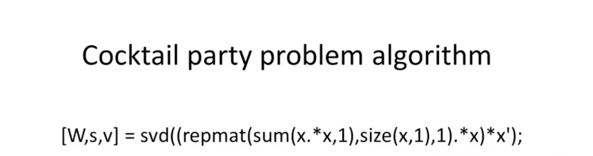

## 机器学习的定义

1. Arthur Samuel(1959). Machine Learning : Field of study that gives computes the ability to learn without being explicitly programmed

   一个让计算机有能力去学习却不需要明确程序的学习的领域

2. Tom Mitchell(1998) Well-posed Learning Problem: A computer program is said to learn from experience E with respect to some task T and some performance measure P, if its performance on T, as measured by P, improves with experience E.

   一个良好的学习程序：计算机程序从经验E中学习，为解决某一任务T进行某一性能度量P，通过P测定在T上的表现因经验E而提高

## 机器学习的分类

1. 监督学习
2. 无监督学习
3. 强化学习
4. ......

### 监督学习 Supervised Learning

从已知的明确数据中进行总结归纳，以此来预测未知问题。

常见的有：回归问题和分类问题，回归和分类的区别在于预测值的线连续性，回归的预测数据是连续的而分类则是离散的

### 无监督学习 Unsupervised Learning

所给出的数据是未知的，通常用作聚类、鸡尾酒会问题

聚类和分类不同，分类的最终结果是给定的，比如去分类肿瘤的良心和恶性，但是聚类的结果是未知的，程序将数据聚类之后，至于每个聚簇是什么类型是要人判断的

鸡尾酒会问题：用算法对音频中的内容做提取

