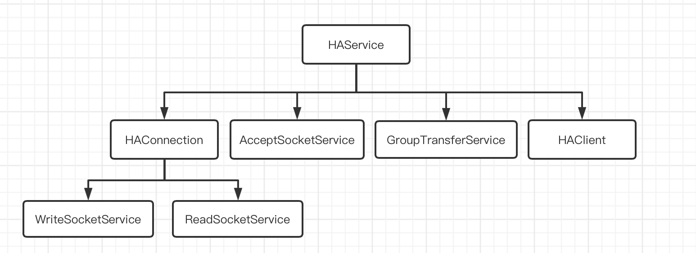

# RocketMQ Broker HA Master-Slave

**源码基于：4.7.1**

RocketMQ支持

1. 多Master多Slave模式-同步双写
2. 多Master多Slave模式-异步双写

同步与异步的差别就在于，broker是否要在同步slave到之后返回ack

AcceptSocketService:：用于接受Slave的Socket连接，接收到一个连接则封装成HAConnection

GroupTransferService：用于处理同步等待Master-Slave数据同步

HAClient：用于连接Master并上报自己的CommitLog的MaxOffset，接受Master同步过来的CommitLog数据

HAConnection：封装了MasterSlave的连接，包括WriteSocketService和ReadSocketService

WriteSocketService：用于Master向Slave写commitLog数据

ReadSocketService：用于Master接受Slave的数据，比如接受Slave上报的Slave CommitLog Max Offset