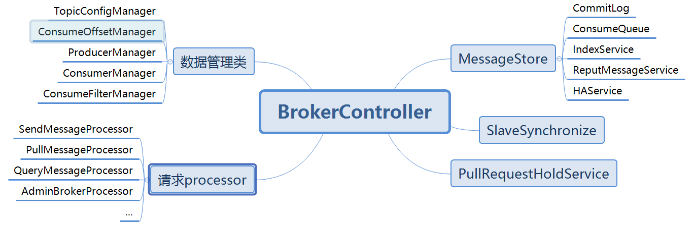

# RocketMQ Broker

**源码基于：4.7.1**

Broker主要工作：



## Processor

processor用于处理请求，主要包括几个类型的请求处理：

1. MQAdmin发起的MQ维护请求：AdminBrokerProcess
2. Consumer发起的查询offset以及拉取Msg请求：PullMessageProcess
3. Producer发起的Send Msg请求：SendMessageProcess EndTransactionProcessor

### SendMessageProcess message接收流程

```java
SendMessageProcess.class
  
public CompletableFuture<RemotingCommand> asyncProcessRequest(ChannelHandlerContext ctx,
                                                              RemotingCommand request) throws RemotingCommandException {
    final SendMessageContext mqtraceContext;
    switch (request.getCode()) {
        case RequestCode.CONSUMER_SEND_MSG_BACK:
            return this.asyncConsumerSendMsgBack(ctx, request);
        default:
        		//通过请求获取requestHeader
            SendMessageRequestHeader requestHeader = parseRequestHeader(request);
            if (requestHeader == null) {
                return CompletableFuture.completedFuture(null);
            }
        		//构建mqtraceContext
            mqtraceContext = buildMsgContext(ctx, requestHeader);
            this.executeSendMessageHookBefore(ctx, request, mqtraceContext);
            if (requestHeader.isBatch()) {
              	//处理批量的消息
                return this.asyncSendBatchMessage(ctx, request, mqtraceContext, requestHeader);
            } else {
              	//处理单个的消息
                return this.asyncSendMessage(ctx, request, mqtraceContext, requestHeader);
            }
    }
}
```
1. 通过请求构建requestHeader以及mqtraceContext
2. 根据是否是批量消息走不同的处理流程


```java
SendMessageProcess.class

private CompletableFuture<RemotingCommand> asyncSendMessage(ChannelHandlerContext ctx, RemotingCommand request,
                                                            SendMessageContext mqtraceContext,
                                                            SendMessageRequestHeader requestHeader) {
  	//预先生成返回的response对象
  	//preSend方法中会调用msgCheck方法，该方法会自动构建Topic
    final RemotingCommand response = preSend(ctx, request, requestHeader);
    final SendMessageResponseHeader responseHeader = (SendMessageResponseHeader)response.readCustomHeader();

    if (response.getCode() != -1) {
        return CompletableFuture.completedFuture(response);
    }

    final byte[] body = request.getBody();

    int queueIdInt = requestHeader.getQueueId();
    TopicConfig topicConfig = this.brokerController.getTopicConfigManager().selectTopicConfig(requestHeader.getTopic());

    if (queueIdInt < 0) {
        queueIdInt = randomQueueId(topicConfig.getWriteQueueNums());
    }
  	//封装MessageExtBrokerInner对象用于本地存储
    MessageExtBrokerInner msgInner = new MessageExtBrokerInner();
    msgInner.setTopic(requestHeader.getTopic());
    msgInner.setQueueId(queueIdInt);

    if (!handleRetryAndDLQ(requestHeader, response, request, msgInner, topicConfig)) {
        return CompletableFuture.completedFuture(response);
    }

    msgInner.setBody(body);
    msgInner.setFlag(requestHeader.getFlag());
    MessageAccessor.setProperties(msgInner, MessageDecoder.string2messageProperties(requestHeader.getProperties()));
    msgInner.setPropertiesString(requestHeader.getProperties());
    msgInner.setBornTimestamp(requestHeader.getBornTimestamp());
    msgInner.setBornHost(ctx.channel().remoteAddress());
    msgInner.setStoreHost(this.getStoreHost());
    msgInner.setReconsumeTimes(requestHeader.getReconsumeTimes() == null ? 0 : requestHeader.getReconsumeTimes());
    String clusterName = this.brokerController.getBrokerConfig().getBrokerClusterName();
    MessageAccessor.putProperty(msgInner, MessageConst.PROPERTY_CLUSTER, clusterName);
    msgInner.setPropertiesString(MessageDecoder.messageProperties2String(msgInner.getProperties()));

    CompletableFuture<PutMessageResult> putMessageResult = null;
    Map<String, String> origProps = MessageDecoder.string2messageProperties(requestHeader.getProperties());
    String transFlag = origProps.get(MessageConst.PROPERTY_TRANSACTION_PREPARED);
    if (transFlag != null && Boolean.parseBoolean(transFlag)) {
      	//事务消息处理
        if (this.brokerController.getBrokerConfig().isRejectTransactionMessage()) {
          	//如果当前broker拒绝事务消息，则返回错误
            response.setCode(ResponseCode.NO_PERMISSION);
            response.setRemark(
                    "the broker[" + this.brokerController.getBrokerConfig().getBrokerIP1()
                            + "] sending transaction message is forbidden");
            return CompletableFuture.completedFuture(response);
        }
        putMessageResult = this.brokerController.getTransactionalMessageService().asyncPrepareMessage(msgInner);
    } else {
      	//非事务消息的处理
        putMessageResult = this.brokerController.getMessageStore().asyncPutMessage(msgInner);
    }
  	//处理返回
    return handlePutMessageResultFuture(putMessageResult, response, request, msgInner, responseHeader, mqtraceContext, ctx, queueIdInt);
}
```

1. preSend预先生成resposne，并对本broker不存在的topic进行处理（自动创建TopicConfig）
2. 封装MessageExtBrokerInner
3. 如果是事务消息判断当前broker是否支持事务消息，如果支持则通过TransactionalMessageService来处理
4. 如果是非事务消息则通过MessageStore来处理

### Broker自动创建topic

对于topic的创建有两种方式：

1. MQAdmin调用broker接口预先就将topic创建好，那么consumer就可以寻址发现对应的broker然后发送msg
2. 没有预先创建topic的时候，broker收到topic可以进行自动创建

#### MQAdmin预先创建

```java
AdminBrokerProcessor.class
  
private synchronized RemotingCommand updateAndCreateTopic(ChannelHandlerContext ctx,
    RemotingCommand request) throws RemotingCommandException {
    final RemotingCommand response = RemotingCommand.createResponseCommand(null);
    final CreateTopicRequestHeader requestHeader =
        (CreateTopicRequestHeader) request.decodeCommandCustomHeader(CreateTopicRequestHeader.class);
    log.info("updateAndCreateTopic called by {}", RemotingHelper.parseChannelRemoteAddr(ctx.channel()));

    String topic = requestHeader.getTopic();

    if (!TopicValidator.validateTopic(topic, response)) {
        return response;
    }
    if (TopicValidator.isSystemTopic(topic, response)) {
        return response;
    }
  	//直接构建TopicConfig
    TopicConfig topicConfig = new TopicConfig(topic);
    topicConfig.setReadQueueNums(requestHeader.getReadQueueNums());
    topicConfig.setWriteQueueNums(requestHeader.getWriteQueueNums());
    topicConfig.setTopicFilterType(requestHeader.getTopicFilterTypeEnum());
    topicConfig.setPerm(requestHeader.getPerm());
    topicConfig.setTopicSysFlag(requestHeader.getTopicSysFlag() == null ? 0 : requestHeader.getTopicSysFlag());
		//将TopicConfig保存至TopicConfigManager
    this.brokerController.getTopicConfigManager().updateTopicConfig(topicConfig);
		//将TopicConfig注册到NameSrv
    this.brokerController.registerIncrementBrokerData(topicConfig, this.brokerController.getTopicConfigManager().getDataVersion());

    response.setCode(ResponseCode.SUCCESS);
    return response;
}
```

1. 直接构建topicConfig，并添加到TopicConfigManager
2. 然后broker会将本机支持的topic信息注册到namesvr，之后consumer就可以正常通过topic进行寻址了

#### Broker自动创建

```java
AbstractSendMessageProcessor.class
  
protected RemotingCommand msgCheck(final ChannelHandlerContext ctx,
    final SendMessageRequestHeader requestHeader, final RemotingCommand response) {
    if (!PermName.isWriteable(this.brokerController.getBrokerConfig().getBrokerPermission())
        && this.brokerController.getTopicConfigManager().isOrderTopic(requestHeader.getTopic())) {
        response.setCode(ResponseCode.NO_PERMISSION);
        response.setRemark("the broker[" + this.brokerController.getBrokerConfig().getBrokerIP1()
            + "] sending message is forbidden");
        return response;
    }

    if (!TopicValidator.validateTopic(requestHeader.getTopic(), response)) {
        return response;
    }
    if (TopicValidator.isNotAllowedSendTopic(requestHeader.getTopic(), response)) {
        return response;
    }

    TopicConfig topicConfig =
        this.brokerController.getTopicConfigManager().selectTopicConfig(requestHeader.getTopic());
    if (null == topicConfig) {
        int topicSysFlag = 0;
        if (requestHeader.isUnitMode()) {
            if (requestHeader.getTopic().startsWith(MixAll.RETRY_GROUP_TOPIC_PREFIX)) {
                topicSysFlag = TopicSysFlag.buildSysFlag(false, true);
            } else {
                topicSysFlag = TopicSysFlag.buildSysFlag(true, false);
            }
        }

        log.warn("the topic {} not exist, producer: {}", requestHeader.getTopic(), ctx.channel().remoteAddress());
        topicConfig = this.brokerController.getTopicConfigManager().createTopicInSendMessageMethod(
            requestHeader.getTopic(),
            requestHeader.getDefaultTopic(),
            RemotingHelper.parseChannelRemoteAddr(ctx.channel()),
            requestHeader.getDefaultTopicQueueNums(), topicSysFlag);

        if (null == topicConfig) {
            if (requestHeader.getTopic().startsWith(MixAll.RETRY_GROUP_TOPIC_PREFIX)) {
                topicConfig =
                    this.brokerController.getTopicConfigManager().createTopicInSendMessageBackMethod(
                        requestHeader.getTopic(), 1, PermName.PERM_WRITE | PermName.PERM_READ,
                        topicSysFlag);
            }
        }

        if (null == topicConfig) {
            response.setCode(ResponseCode.TOPIC_NOT_EXIST);
            response.setRemark("topic[" + requestHeader.getTopic() + "] not exist, apply first please!"
                + FAQUrl.suggestTodo(FAQUrl.APPLY_TOPIC_URL));
            return response;
        }
    }

    int queueIdInt = requestHeader.getQueueId();
    int idValid = Math.max(topicConfig.getWriteQueueNums(), topicConfig.getReadQueueNums());
    if (queueIdInt >= idValid) {
        String errorInfo = String.format("request queueId[%d] is illegal, %s Producer: %s",
            queueIdInt,
            topicConfig.toString(),
            RemotingHelper.parseChannelRemoteAddr(ctx.channel()));

        log.warn(errorInfo);
        response.setCode(ResponseCode.SYSTEM_ERROR);
        response.setRemark(errorInfo);

        return response;
    }
    return response;
}
```

## MessageStore

```java
DefaultMessageStore.class
//消息存储
@Override
public CompletableFuture<PutMessageResult> asyncPutMessage(MessageExtBrokerInner msg) {
    PutMessageStatus checkStoreStatus = this.checkStoreStatus();
    if (checkStoreStatus != PutMessageStatus.PUT_OK) {
        return CompletableFuture.completedFuture(new PutMessageResult(checkStoreStatus, null));
    }

    PutMessageStatus msgCheckStatus = this.checkMessage(msg);
    if (msgCheckStatus == PutMessageStatus.MESSAGE_ILLEGAL) {
        return CompletableFuture.completedFuture(new PutMessageResult(msgCheckStatus, null));
    }

    long beginTime = this.getSystemClock().now();
    CompletableFuture<PutMessageResult> putResultFuture = this.commitLog.asyncPutMessage(msg);

    putResultFuture.thenAccept((result) -> {
        long elapsedTime = this.getSystemClock().now() - beginTime;
        if (elapsedTime > 500) {
            log.warn("putMessage not in lock elapsed time(ms)={}, bodyLength={}", elapsedTime, msg.getBody().length);
        }
        this.storeStatsService.setPutMessageEntireTimeMax(elapsedTime);

        if (null == result || !result.isOk()) {
            this.storeStatsService.getPutMessageFailedTimes().incrementAndGet();
        }
    });

    return putResultFuture;
}
```

## 数据管理

### TopicConfigManager


## HA

