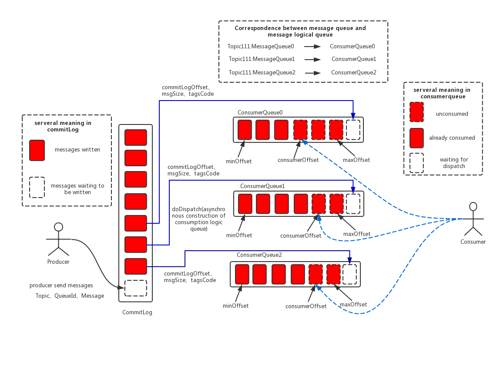
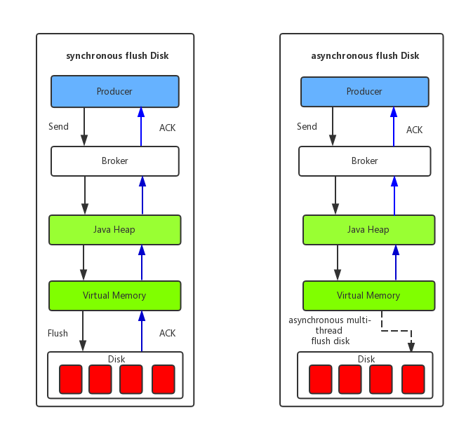

# RocketMQ Broker

**源码基于：4.7.1**

Broker主要工作：


## Processor请求处理器

processor用于处理请求，主要包括几个类型的请求处理：

1. MQAdmin发起的MQ维护请求：AdminBrokerProcess
2. Consumer发起的查询offset以及拉取Msg请求：PullMessageProcess
3. Producer发起的Send Msg请求：SendMessageProcess EndTransactionProcessor

### SendMessageProcess message接收流程

```java
SendMessageProcess.class
  
public CompletableFuture<RemotingCommand> asyncProcessRequest(ChannelHandlerContext ctx,
                                                              RemotingCommand request) throws RemotingCommandException {
    final SendMessageContext mqtraceContext;
    switch (request.getCode()) {
        case RequestCode.CONSUMER_SEND_MSG_BACK:
            return this.asyncConsumerSendMsgBack(ctx, request);
        default:
        		//通过请求获取requestHeader
            SendMessageRequestHeader requestHeader = parseRequestHeader(request);
            if (requestHeader == null) {
                return CompletableFuture.completedFuture(null);
            }
        		//构建mqtraceContext
            mqtraceContext = buildMsgContext(ctx, requestHeader);
            this.executeSendMessageHookBefore(ctx, request, mqtraceContext);
            if (requestHeader.isBatch()) {
              	//处理批量的消息
                return this.asyncSendBatchMessage(ctx, request, mqtraceContext, requestHeader);
            } else {
              	//处理单个的消息
                return this.asyncSendMessage(ctx, request, mqtraceContext, requestHeader);
            }
    }
}
```
1. 通过请求构建requestHeader以及mqtraceContext
2. 根据是否是批量消息走不同的处理流程


```java
SendMessageProcess.class

private CompletableFuture<RemotingCommand> asyncSendMessage(ChannelHandlerContext ctx, RemotingCommand request,
                                                            SendMessageContext mqtraceContext,
                                                            SendMessageRequestHeader requestHeader) {
  	//预先生成返回的response对象
  	//preSend方法中会调用msgCheck方法，该方法会自动构建Topic
    final RemotingCommand response = preSend(ctx, request, requestHeader);
    final SendMessageResponseHeader responseHeader = (SendMessageResponseHeader)response.readCustomHeader();

    if (response.getCode() != -1) {
        return CompletableFuture.completedFuture(response);
    }

    final byte[] body = request.getBody();

    int queueIdInt = requestHeader.getQueueId();
    TopicConfig topicConfig = this.brokerController.getTopicConfigManager().selectTopicConfig(requestHeader.getTopic());

    if (queueIdInt < 0) {
        queueIdInt = randomQueueId(topicConfig.getWriteQueueNums());
    }
  	//封装MessageExtBrokerInner对象用于本地存储
    MessageExtBrokerInner msgInner = new MessageExtBrokerInner();
    msgInner.setTopic(requestHeader.getTopic());
    msgInner.setQueueId(queueIdInt);

    if (!handleRetryAndDLQ(requestHeader, response, request, msgInner, topicConfig)) {
        return CompletableFuture.completedFuture(response);
    }

    msgInner.setBody(body);
    msgInner.setFlag(requestHeader.getFlag());
    MessageAccessor.setProperties(msgInner, MessageDecoder.string2messageProperties(requestHeader.getProperties()));
    msgInner.setPropertiesString(requestHeader.getProperties());
    msgInner.setBornTimestamp(requestHeader.getBornTimestamp());
    msgInner.setBornHost(ctx.channel().remoteAddress());
    msgInner.setStoreHost(this.getStoreHost());
    msgInner.setReconsumeTimes(requestHeader.getReconsumeTimes() == null ? 0 : requestHeader.getReconsumeTimes());
    String clusterName = this.brokerController.getBrokerConfig().getBrokerClusterName();
    MessageAccessor.putProperty(msgInner, MessageConst.PROPERTY_CLUSTER, clusterName);
    msgInner.setPropertiesString(MessageDecoder.messageProperties2String(msgInner.getProperties()));

    CompletableFuture<PutMessageResult> putMessageResult = null;
    Map<String, String> origProps = MessageDecoder.string2messageProperties(requestHeader.getProperties());
    String transFlag = origProps.get(MessageConst.PROPERTY_TRANSACTION_PREPARED);
    if (transFlag != null && Boolean.parseBoolean(transFlag)) {
      	//事务消息处理
        if (this.brokerController.getBrokerConfig().isRejectTransactionMessage()) {
          	//如果当前broker拒绝事务消息，则返回错误
            response.setCode(ResponseCode.NO_PERMISSION);
            response.setRemark(
                    "the broker[" + this.brokerController.getBrokerConfig().getBrokerIP1()
                            + "] sending transaction message is forbidden");
            return CompletableFuture.completedFuture(response);
        }
        putMessageResult = this.brokerController.getTransactionalMessageService().asyncPrepareMessage(msgInner);
    } else {
      	//非事务消息的处理
        putMessageResult = this.brokerController.getMessageStore().asyncPutMessage(msgInner);
    }
  	//处理返回
    return handlePutMessageResultFuture(putMessageResult, response, request, msgInner, responseHeader, mqtraceContext, ctx, queueIdInt);
}
```

1. preSend预先生成resposne，并对本broker不存在的topic进行处理（自动创建TopicConfig）
2. 封装MessageExtBrokerInner
3. 如果是事务消息判断当前broker是否支持事务消息，如果支持则通过TransactionalMessageService来处理
4. 如果是非事务消息则通过MessageStore来处理

### Broker创建Topic

对于topic的创建有两种方式：

1. MQAdmin调用broker接口预先就将topic创建好，那么consumer就可以寻址发现对应的broker然后发送msg
2. 没有预先创建topic的时候，broker收到topic可以进行自动创建

#### 1. MQAdmin预先创建

```java
AdminBrokerProcessor.class
  
private synchronized RemotingCommand updateAndCreateTopic(ChannelHandlerContext ctx,
    RemotingCommand request) throws RemotingCommandException {
    final RemotingCommand response = RemotingCommand.createResponseCommand(null);
    final CreateTopicRequestHeader requestHeader =
        (CreateTopicRequestHeader) request.decodeCommandCustomHeader(CreateTopicRequestHeader.class);
    log.info("updateAndCreateTopic called by {}", RemotingHelper.parseChannelRemoteAddr(ctx.channel()));

    String topic = requestHeader.getTopic();

    if (!TopicValidator.validateTopic(topic, response)) {
        return response;
    }
    if (TopicValidator.isSystemTopic(topic, response)) {
        return response;
    }
  	//直接构建TopicConfig
    TopicConfig topicConfig = new TopicConfig(topic);
    topicConfig.setReadQueueNums(requestHeader.getReadQueueNums());
    topicConfig.setWriteQueueNums(requestHeader.getWriteQueueNums());
    topicConfig.setTopicFilterType(requestHeader.getTopicFilterTypeEnum());
    topicConfig.setPerm(requestHeader.getPerm());
    topicConfig.setTopicSysFlag(requestHeader.getTopicSysFlag() == null ? 0 : requestHeader.getTopicSysFlag());
	//将TopicConfig保存至TopicConfigManager
    this.brokerController.getTopicConfigManager().updateTopicConfig(topicConfig);
	//将TopicConfig注册到NameSrv
    this.brokerController.registerIncrementBrokerData(topicConfig, this.brokerController.getTopicConfigManager().getDataVersion());

    response.setCode(ResponseCode.SUCCESS);
    return response;
}
```

1. 直接构建topicConfig，并添加到TopicConfigManager
2. 然后broker会将本机支持的topic信息注册到namesvr，之后consumer就可以正常通过topic进行寻址了

#### 2. Broker自动创建

```java
AbstractSendMessageProcessor.class
  
protected RemotingCommand msgCheck(final ChannelHandlerContext ctx,
    final SendMessageRequestHeader requestHeader, final RemotingCommand response) {
    //判断Broker是否支持写入
    if (!PermName.isWriteable(this.brokerController.getBrokerConfig().getBrokerPermission())
        && this.brokerController.getTopicConfigManager().isOrderTopic(requestHeader.getTopic())) {
        response.setCode(ResponseCode.NO_PERMISSION);
        response.setRemark("the broker[" + this.brokerController.getBrokerConfig().getBrokerIP1()
            + "] sending message is forbidden");
        return response;
    }
    //判断Topic名称是否合法 避免有非法字符等问题
    if (!TopicValidator.validateTopic(requestHeader.getTopic(), response)) {
        return response;
    }
    //判断Topic是否是Broker拒绝的Topic
    if (TopicValidator.isNotAllowedSendTopic(requestHeader.getTopic(), response)) {
        return response;
    }
    //根据请求中的Topic获取Broker的TopicConfig
    TopicConfig topicConfig =
        this.brokerController.getTopicConfigManager().selectTopicConfig(requestHeader.getTopic());
    if (null == topicConfig) {
        int topicSysFlag = 0;
        if (requestHeader.isUnitMode()) {
            if (requestHeader.getTopic().startsWith(MixAll.RETRY_GROUP_TOPIC_PREFIX)) {
                topicSysFlag = TopicSysFlag.buildSysFlag(false, true);
            } else {
                topicSysFlag = TopicSysFlag.buildSysFlag(true, false);
            }
        }

        log.warn("the topic {} not exist, producer: {}", requestHeader.getTopic(), ctx.channel().remoteAddress());
        //创建topicConfig，根据请求的topic以及defaultTopic创建
        topicConfig = this.brokerController.getTopicConfigManager().createTopicInSendMessageMethod(
            requestHeader.getTopic(),
            requestHeader.getDefaultTopic(),
            RemotingHelper.parseChannelRemoteAddr(ctx.channel()),
            requestHeader.getDefaultTopicQueueNums(), topicSysFlag);

        if (null == topicConfig) {
            if (requestHeader.getTopic().startsWith(MixAll.RETRY_GROUP_TOPIC_PREFIX)) {
                topicConfig =
                    this.brokerController.getTopicConfigManager().createTopicInSendMessageBackMethod(
                        requestHeader.getTopic(), 1, PermName.PERM_WRITE | PermName.PERM_READ,
                        topicSysFlag);
            }
        }

        if (null == topicConfig) {
            response.setCode(ResponseCode.TOPIC_NOT_EXIST);
            response.setRemark("topic[" + requestHeader.getTopic() + "] not exist, apply first please!"
                + FAQUrl.suggestTodo(FAQUrl.APPLY_TOPIC_URL));
            return response;
        }
    }

    int queueIdInt = requestHeader.getQueueId();
    int idValid = Math.max(topicConfig.getWriteQueueNums(), topicConfig.getReadQueueNums());
    if (queueIdInt >= idValid) {
        String errorInfo = String.format("request queueId[%d] is illegal, %s Producer: %s",
            queueIdInt,
            topicConfig.toString(),
            RemotingHelper.parseChannelRemoteAddr(ctx.channel()));

        log.warn(errorInfo);
        response.setCode(ResponseCode.SYSTEM_ERROR);
        response.setRemark(errorInfo);

        return response;
    }
    return response;
}
```

```java
TopicConfigManager.class
    
public TopicConfig createTopicInSendMessageMethod(final String topic, final String defaultTopic,
    final String remoteAddress, final int clientDefaultTopicQueueNums, final int topicSysFlag) {
    TopicConfig topicConfig = null;
    boolean createNew = false;

    try {
        if (this.lockTopicConfigTable.tryLock(LOCK_TIMEOUT_MILLIS, TimeUnit.MILLISECONDS)) {
            try {
                //根据topic获取topicConfig，如果存在则直接返回不需要再创建
                topicConfig = this.topicConfigTable.get(topic);
                if (topicConfig != null)
                    return topicConfig;
                //如果根据topic获取不到topicConfig，则尝试根据defaultTopic来获取
                TopicConfig defaultTopicConfig = this.topicConfigTable.get(defaultTopic);
                if (defaultTopicConfig != null) {
                    //判断defaultTopic是不是指定的自动创建Topic所对应的topic名称：TBW102
                    if (defaultTopic.equals(TopicValidator.AUTO_CREATE_TOPIC_KEY_TOPIC)) {
                        if (!this.brokerController.getBrokerConfig().isAutoCreateTopicEnable()) {
                            defaultTopicConfig.setPerm(PermName.PERM_READ | PermName.PERM_WRITE);
                        }
                    }

                    if (PermName.isInherited(defaultTopicConfig.getPerm())) {
                        //根据topic创建TopicConfig
                        topicConfig = new TopicConfig(topic);

                        int queueNums =
                            clientDefaultTopicQueueNums > defaultTopicConfig.getWriteQueueNums() ? defaultTopicConfig
                                .getWriteQueueNums() : clientDefaultTopicQueueNums;

                        if (queueNums < 0) {
                            queueNums = 0;
                        }

                        topicConfig.setReadQueueNums(queueNums);
                        topicConfig.setWriteQueueNums(queueNums);
                        int perm = defaultTopicConfig.getPerm();
                        perm &= ~PermName.PERM_INHERIT;
                        topicConfig.setPerm(perm);
                        topicConfig.setTopicSysFlag(topicSysFlag);
                        topicConfig.setTopicFilterType(defaultTopicConfig.getTopicFilterType());
                    } else {
                        log.warn("Create new topic failed, because the default topic[{}] has no perm [{}] producer:[{}]",
                            defaultTopic, defaultTopicConfig.getPerm(), remoteAddress);
                    }
                } else {
                    log.warn("Create new topic failed, because the default topic[{}] not exist. producer:[{}]",
                        defaultTopic, remoteAddress);
                }

                if (topicConfig != null) {
                    log.info("Create new topic by default topic:[{}] config:[{}] producer:[{}]",
                        defaultTopic, topicConfig, remoteAddress);
                    //将topicConfig添加到topicConfigTable
                    this.topicConfigTable.put(topic, topicConfig);

                    this.dataVersion.nextVersion();

                    createNew = true;
                    //将topicConfigTable持久化
                    this.persist();
                }
            } finally {
                this.lockTopicConfigTable.unlock();
            }
        }
    } catch (InterruptedException e) {
        log.error("createTopicInSendMessageMethod exception", e);
    }

    if (createNew) {
        //将topicConfig信息注册到NameSvr
        this.brokerController.registerBrokerAll(false, true, true);
    }

    return topicConfig;
}
```

主要流程：

1. 根据请求中的topic获取topicConfig
2. 如果没有对应的topicConfig则再次通过请求中的defaultTopic尝试获取topicConfig
3. 如果能获取到则判断defalutTopic是否是特定的TBW102
4. 如果是则根据请求中的topic创建topicConfig
5. 将topicConfig添加到内存并持久化到文件
6. 调用registerBrokerAll将Broker信息包括TopicConfig信息注册到NameSrv以供之后Consumer寻址

## MessageStore消息存储



### 1.消息存储整体架构
消息存储架构图中主要有下面三个跟消息存储相关的文件构成。

(1) CommitLog：消息主体以及元数据的存储主体，存储Producer端写入的消息主体内容,消息内容不是定长的。单个文件大小默认1G ，文件名长度为20位，左边补零，剩余为起始偏移量，比如00000000000000000000代表了第一个文件，起始偏移量为0，文件大小为1G=1073741824；当第一个文件写满了，第二个文件为00000000001073741824，起始偏移量为1073741824，以此类推。消息主要是顺序写入日志文件，当文件满了，写入下一个文件；

(2) ConsumeQueue：消息消费队列，引入的目的主要是提高消息消费的性能，由于RocketMQ是基于主题topic的订阅模式，消息消费是针对主题进行的，如果要遍历commitlog文件中根据topic检索消息是非常低效的。Consumer即可根据ConsumeQueue来查找待消费的消息。其中，ConsumeQueue（逻辑消费队列）作为消费消息的索引，保存了指定Topic下的队列消息在CommitLog中的起始物理偏移量offset，消息大小size和消息Tag的HashCode值。consumequeue文件可以看成是基于topic的commitlog索引文件，故consumequeue文件夹的组织方式如下：topic/queue/file三层组织结构，具体存储路径为：$HOME/store/consumequeue/{topic}/{queueId}/{fileName}。同样consumequeue文件采取定长设计，每一个条目共20个字节，分别为8字节的commitlog物理偏移量、4字节的消息长度、8字节tag hashcode，单个文件由30W个条目组成，可以像数组一样随机访问每一个条目，每个ConsumeQueue文件大小约5.72M；

(3) IndexFile：IndexFile（索引文件）提供了一种可以通过key或时间区间来查询消息的方法。Index文件的存储位置是：$HOME \store\index\${fileName}，文件名fileName是以创建时的时间戳命名的，固定的单个IndexFile文件大小约为400M，一个IndexFile可以保存 2000W个索引，IndexFile的底层存储设计为在文件系统中实现HashMap结构，故rocketmq的索引文件其底层实现为hash索引。

在上面的RocketMQ的消息存储整体架构图中可以看出，RocketMQ采用的是混合型的存储结构，即为Broker单个实例下所有的队列共用一个日志数据文件（即为CommitLog）来存储。RocketMQ的混合型存储结构(多个Topic的消息实体内容都存储于一个CommitLog中)针对Producer和Consumer分别采用了数据和索引部分相分离的存储结构，Producer发送消息至Broker端，然后Broker端使用同步或者异步的方式对消息刷盘持久化，保存至CommitLog中。只要消息被刷盘持久化至磁盘文件CommitLog中，那么Producer发送的消息就不会丢失。正因为如此，Consumer也就肯定有机会去消费这条消息。当无法拉取到消息后，可以等下一次消息拉取，同时服务端也支持**长轮询模式**，如果一个消息拉取请求未拉取到消息，Broker允许等待30s的时间，只要这段时间内有新消息到达，将直接返回给消费端。这里，RocketMQ的具体做法是，使用Broker端的后台服务线程—ReputMessageService不停地分发请求并异步构建ConsumeQueue（逻辑消费队列）和IndexFile（索引文件）数据。
### 2.页缓存PageCache与内存映射MMAP

页缓存（PageCache)是OS对文件的缓存，用于加速对文件的读写。一般来说，程序对文件进行顺序读写的速度几乎接近于内存的读写速度，主要原因就是由于OS使用PageCache机制对读写访问操作进行了性能优化，将一部分的内存用作PageCache。对于数据的写入，OS会先写入至Cache内，随后通过异步的方式由pdflush内核线程将Cache内的数据刷盘至物理磁盘上。对于数据的读取，如果一次读取文件时出现未命中PageCache的情况，OS从物理磁盘上访问读取文件的同时，会顺序对其他相邻块的数据文件进行预读取(**邻近页刷新机制**)。

在RocketMQ中，ConsumeQueue逻辑消费队列存储的数据较少，并且是顺序读取，在page cache机制的预读取作用下，Consume Queue文件的读性能几乎接近读内存，即使在有消息堆积情况下也不会影响性能。而对于CommitLog消息存储的日志数据文件来说，读取消息内容时候会产生较多的随机访问读取，严重影响性能。如果选择合适的系统IO调度算法，比如设置调度算法为“Deadline”（此时块存储采用SSD的话），随机读的性能也会有所提升。

另外，RocketMQ主要通过MappedByteBuffer对文件进行读写操作。其中，利用了NIO中的FileChannel模型将磁盘上的物理文件直接映射到用户态的内存地址中（这种Mmap的方式减少了传统IO将磁盘文件数据在操作系统内核地址空间的缓冲区和用户应用程序地址空间的缓冲区之间来回进行拷贝的性能开销），将对文件的操作转化为直接对内存地址进行操作，从而极大地提高了文件的读写效率（正因为需要使用内存映射机制，故RocketMQ的文件存储都使用定长结构来存储，方便一次将整个文件映射至内存）。
### 3.消息刷盘



(1) 同步刷盘：如上图所示，只有在消息真正持久化至磁盘后RocketMQ的Broker端才会真正返回给Producer端一个成功的ACK响应。同步刷盘对MQ消息可靠性来说是一种不错的保障，但是性能上会有较大影响，一般适用于金融业务应用该模式较多。

(2) 异步刷盘：能够充分利用OS的PageCache的优势，只要消息写入PageCache即可将成功的ACK返回给Producer端。消息刷盘采用后台异步线程提交的方式进行，降低了读写延迟，提高了MQ的性能和吞吐量。

### 4. 消息存储

```java
DefaultMessageStore.class
//Process接受到消息后，调用MessageStore进行消息存储
@Override
public CompletableFuture<PutMessageResult> asyncPutMessage(MessageExtBrokerInner msg) {
    PutMessageStatus checkStoreStatus = this.checkStoreStatus();
    if (checkStoreStatus != PutMessageStatus.PUT_OK) {
        return CompletableFuture.completedFuture(new PutMessageResult(checkStoreStatus, null));
    }

    PutMessageStatus msgCheckStatus = this.checkMessage(msg);
    if (msgCheckStatus == PutMessageStatus.MESSAGE_ILLEGAL) {
        return CompletableFuture.completedFuture(new PutMessageResult(msgCheckStatus, null));
    }

    long beginTime = this.getSystemClock().now();
    //调用commitLog asyncPutMessage将msg数据存入commitLog
    CompletableFuture<PutMessageResult> putResultFuture = this.commitLog.asyncPutMessage(msg);

    putResultFuture.thenAccept((result) -> {
        long elapsedTime = this.getSystemClock().now() - beginTime;
        if (elapsedTime > 500) {
            log.warn("putMessage not in lock elapsed time(ms)={}, bodyLength={}", elapsedTime, msg.getBody().length);
        }
        this.storeStatsService.setPutMessageEntireTimeMax(elapsedTime);

        if (null == result || !result.isOk()) {
            this.storeStatsService.getPutMessageFailedTimes().incrementAndGet();
        }
    });

    return putResultFuture;
}
```

## 数据管理

### TopicConfigManager


## HA

