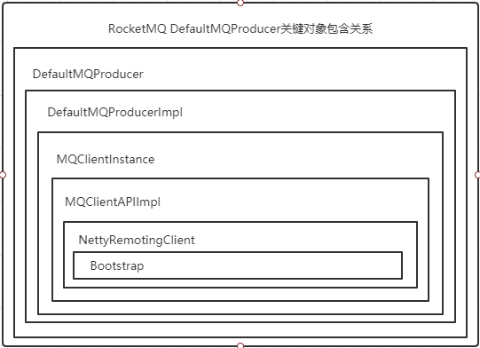
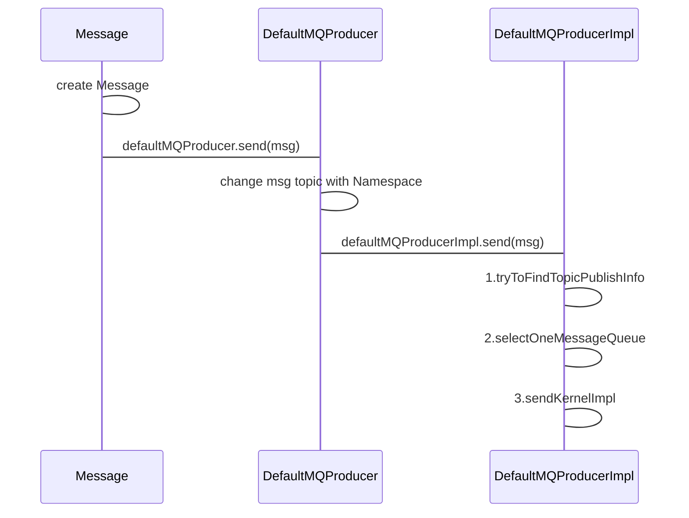

# RocketMQ Producer

**源码基于：4.7.1**

## 用例(普通消息，非事务消息)

```java
public class SyncProducer {
  
	public static void main(String[] args) throws Exception {
    	// 实例化消息生产者Producer
        DefaultMQProducer producer = new DefaultMQProducer("please_rename_unique_group_name");
    	// 设置NameServer的地址
    	producer.setNamesrvAddr("localhost:9876");
    	// 启动Producer实例
        producer.start();
    	for (int i = 0; i < 100; i++) {
    	    // 创建消息，并指定Topic，Tag和消息体
    	    Message msg = new Message("TopicTest" /* Topic */,
        	"TagA" /* Tag */,
        	("Hello RocketMQ " + i).getBytes(RemotingHelper.DEFAULT_CHARSET) /* Message body */
        	);
        	// 发送消息到一个Broker
            SendResult sendResult = producer.send(msg);
            // 通过sendResult返回消息是否成功送达
            System.out.printf("%s%n", sendResult);
    	}
    	// 如果不再发送消息，关闭Producer实例。
    	producer.shutdown();
    }
}
```

## DefaultMQProducer关键对象关联关系



## DefaultMQProducer构建

1. DefaultMQProducer namespace producerGroup赋值
2. DefaultMQProducerImpl对象构建

```java
DefaultMQProducerImpl.class
    
public DefaultMQProducerImpl(final DefaultMQProducer defaultMQProducer, RPCHook rpcHook) {
    this.defaultMQProducer = defaultMQProducer;
    this.rpcHook = rpcHook;
    //构建Executor用于发送异步消息
    //Executor线程池核心大小和最大大小都为CPU核心数
    this.asyncSenderThreadPoolQueue = new LinkedBlockingQueue<Runnable>(50000);
    this.defaultAsyncSenderExecutor = new ThreadPoolExecutor(
        Runtime.getRuntime().availableProcessors(),
        Runtime.getRuntime().availableProcessors(),
        1000 * 60,
        TimeUnit.MILLISECONDS,
        this.asyncSenderThreadPoolQueue,
        new ThreadFactory() {
            private AtomicInteger threadIndex = new AtomicInteger(0);

            @Override
            public Thread newThread(Runnable r) {
                return new Thread(r, "AsyncSenderExecutor_" + this.threadIndex.incrementAndGet());
            }
        });
}
```

## DefaultMQProducer start

DefaultMQProducer start方法重要处理：

1. 调用defaultMQProducerImpl(DefaultMQProducerImpl)的start方法启动defaultMQProducerImpl
2. 如果开启消息追踪则启动traceDispatcher，消息追踪通过SendMessageHook来获取消息发送事件，然后处理

###  DefaultMQProducerImpl start

```java
DefaultMQProducerImpl.class
    
public void start(final boolean startFactory) throws MQClientException {
    switch (this.serviceState) {
        case CREATE_JUST:
            //起始状态就是JUST状态
            this.serviceState = ServiceState.START_FAILED;
            //检测配置，起始就是对ProducerGroup进行检测
            //ProducerGroup不能设置为null且不能设置为DEFAULT_PRODUCER_GROUP(DEFAULT_PRODUCER)
            this.checkConfig();

            //如果ProducerGroup不是CLIENT_INNER_PRODUCER_GROUP(CLIENT_INNER_PRODUCER)，则将其InstanceName设置成PID
            if (!this.defaultMQProducer.getProducerGroup().equals(MixAll.CLIENT_INNER_PRODUCER_GROUP)) {
                this.defaultMQProducer.changeInstanceNameToPID();
            }
            //获取MQClientInstance
            this.mQClientFactory = MQClientManager.getInstance().getOrCreateMQClientInstance(this.defaultMQProducer, rpcHook);

            //注册Producer
            //其实就是将这个对象加入到MQClientInstance的producerTable中，其他地方会在何时时间遍历这个Map获取数据，做其他操作，比如心跳等等
            boolean registerOK = mQClientFactory.registerProducer(this.defaultMQProducer.getProducerGroup(), this);
            if (!registerOK) {
                this.serviceState = ServiceState.CREATE_JUST;
                throw new MQClientException("The producer group[" + this.defaultMQProducer.getProducerGroup()
                    + "] has been created before, specify another name please." + FAQUrl.suggestTodo(FAQUrl.GROUP_NAME_DUPLICATE_URL),
                    null);
            }

            //将这个Producer的CreateTopic以及一个空路由信息保存到topicPublishInfoTable Map中
            //topicPublishInfoTable: String TopicName <-> TopicPublishInfo Topic发布信息(路由信息)
            this.topicPublishInfoTable.put(this.defaultMQProducer.getCreateTopicKey(), new TopicPublishInfo());

            if (startFactory) {
                //启动该Producer对应的这个MQClientInstance
                mQClientFactory.start();
            }

            log.info("the producer [{}] start OK. sendMessageWithVIPChannel={}", this.defaultMQProducer.getProducerGroup(),
                this.defaultMQProducer.isSendMessageWithVIPChannel());
            this.serviceState = ServiceState.RUNNING;
            break;
        case RUNNING:
        case START_FAILED:
        case SHUTDOWN_ALREADY:
            throw new MQClientException("The producer service state not OK, maybe started once, "
                + this.serviceState
                + FAQUrl.suggestTodo(FAQUrl.CLIENT_SERVICE_NOT_OK),
                null);
        default:
            break;
    }
    //向所有Broker发送心跳消息
    this.mQClientFactory.sendHeartbeatToAllBrokerWithLock();

    //定时扫描过期的request并清除、回调
    this.timer.scheduleAtFixedRate(new TimerTask() {
        @Override
        public void run() {
            try {
                RequestFutureTable.scanExpiredRequest();
            } catch (Throwable e) {
                log.error("scan RequestFutureTable exception", e);
            }
        }
    }, 1000 * 3, 1000);
}
```

总结:

1. 对ProducerGroup以及InstanceName进行设置
2. 获取或构建MQClientInstance
3. 将该对象(DefaultMQProducerImpl)加入到MQClientInstance的producerTable
4. 启动MQClientInstance
5. 向Broker发送心跳
6. 启动定时器定时清除过期Request并回调

### MQClientInstance start

```java
MQClientInstance.class
    
public void start() throws MQClientException {

        synchronized (this) {
            switch (this.serviceState) {
                case CREATE_JUST:
                    this.serviceState = ServiceState.START_FAILED;
                    // 如果name srv地址没有指定 则尝试从系统变量中设置的http服务获取name srv
                    // If not specified,looking address from name server
                    if (null == this.clientConfig.getNamesrvAddr()) {
                        this.mQClientAPIImpl.fetchNameServerAddr();
                    }
                    //启动netty服务
                    // Start request-response channel
                    this.mQClientAPIImpl.start();
                    //启动各种定时任务 
                    //1. 定时fetchNameServerAddr:定时从http服务器获取name srv地址 间隔2分钟
                    //2. 定时从name srv更新topic路由信息 默认间隔30秒
                    //3. 定时清除下线的Broker,定时向Broker发送心跳 默认间隔30秒
                    //4. 定时persistAllConsumerOffset：定时持久化Consumer的消费偏移量 默认间隔5秒
                    //5. MQClientInstance定时调整线程池 默认间隔1分钟
                    // Start various schedule tasks
                    this.startScheduledTask();
                    //启动pullMessageService 该服务用于client从broker拉取消息
                    // Start pull service
                    this.pullMessageService.start();
                    //启动rebalanceService 该服务用于client处理负载均衡
                    // Start rebalance service
                    this.rebalanceService.start();
                    //启动另一个defaultMQProducer 暂时猜测是用于推送其他系统消息所使用
                    // Start push service
                    this.defaultMQProducer.getDefaultMQProducerImpl().start(false);
                    log.info("the client factory [{}] start OK", this.clientId);
                    this.serviceState = ServiceState.RUNNING;
                    break;
                case START_FAILED:
                    throw new MQClientException("The Factory object[" + this.getClientId() + "] has been created before, and failed.", null);
                default:
                    break;
            }
        }
    }
```

总结：

1. 如果没有指定name srv则尝试从某个http服务(配置中心)获取name srv
2. 启动netty服务
3. 启动各种定时任务
   1. **定时fetchNameServerAddr:定时从http服务器获取name srv地址 间隔2分钟**
   2. **定时从name srv更新topic路由信息 默认间隔30秒**
   3. **定时清除下线的Broker,定时向Broker发送心跳 默认间隔30秒**
   4. **定时persistAllConsumerOffset：定时持久化Consumer的消费偏移量 默认间隔5秒**
   5. **MQClientInstance定时调整线程池 默认间隔1分钟**
4. 启动pullMessageService 启动rebalanceService 启动另一个defaultMQProducer这都与consumer相关

**重点**：

定时persistAllConsumerOffset：定时持久化Consumer的消费偏移量 默认间隔5秒，这个默认5秒持久化consumer的消费偏移量，如果broker宕机，极有可能造成消息的重复消费，所以consumer一定要做好幂等

## Producer send msg



重点关注两点：

1. tryToFindTopicPublishInfo：topic路由寻址
2. selectOneMessageQueue：负载均衡

### 1. tryToFindTopicPublishInfo：topic路由寻址

```java
DefaultMQProducerImpl.class
    
private TopicPublishInfo tryToFindTopicPublishInfo(final String topic) {
    TopicPublishInfo topicPublishInfo = this.topicPublishInfoTable.get(topic);
    if (null == topicPublishInfo || !topicPublishInfo.ok()) {
        this.topicPublishInfoTable.putIfAbsent(topic, new TopicPublishInfo());
      	//第一次更新本地路由信息
        this.mQClientFactory.updateTopicRouteInfoFromNameServer(topic);
        topicPublishInfo = this.topicPublishInfoTable.get(topic);
    }

    if (topicPublishInfo.isHaveTopicRouterInfo() || topicPublishInfo.ok()) {
        return topicPublishInfo;
    } else {
      	//第二次更新本地路由信息，与第一次更新路由信息不同，该次会获取支持自动创建topic的broker信息
        this.mQClientFactory.updateTopicRouteInfoFromNameServer(topic, true, this.defaultMQProducer);
        topicPublishInfo = this.topicPublishInfoTable.get(topic);
        return topicPublishInfo;
    }
}
```

说明：

1. 从topicPublishInfoTable Map中获取路由信息
2. 如果路由信息在Map中不存在则调用updateTopicRouteInfoFromNameServer向NameSrv请求Topic路由信息并更新topicPublishInfoTable 
3. 如果第一次更新没有获取到topic对应的路由信息则再更新，第二次的更新会获取默认的路由信息也就是那些支持自动创建topic的broker信息。如果broker支持自动创建topic则该broker就存在“TBW102”topic，所以只要对“TBW102”topic寻址就能找到支持自动创建topic的broker，然后发送消息就可以了

### 2. selectOneMessageQueue：负载均衡

```java
MQFaultStrategy.class
    
public MessageQueue selectOneMessageQueue(final TopicPublishInfo tpInfo, final String lastBrokerName) {
    if (this.sendLatencyFaultEnable) {
        //开启了延时容错
        try {
            //首先获取上次使用的Queue index+1
            int index = tpInfo.getSendWhichQueue().getAndIncrement();
            for (int i = 0; i < tpInfo.getMessageQueueList().size(); i++) {
                int pos = Math.abs(index++) % tpInfo.getMessageQueueList().size();
                if (pos < 0)
                    pos = 0;
                //找到index对应的queue
                MessageQueue mq = tpInfo.getMessageQueueList().get(pos);
                if (latencyFaultTolerance.isAvailable(mq.getBrokerName())) {
                    //判断该broker是否故障，如果queue对应的broker可用，则使用该broker
                    if (null == lastBrokerName || mq.getBrokerName().equals(lastBrokerName))
                        //这里还判断了当期选择的这个broker是否是上次使用过的broker,上次使用过的一般都是失败的,搞不懂为啥...
                        return mq;
                }
            }
		   //如果上一步没找个合适的broker，则从所有的broker中选择一个相对合适的，并且broker是可写的
            final String notBestBroker = latencyFaultTolerance.pickOneAtLeast();
            int writeQueueNums = tpInfo.getQueueIdByBroker(notBestBroker);
            if (writeQueueNums > 0) {
                final MessageQueue mq = tpInfo.selectOneMessageQueue();
                if (notBestBroker != null) {
                    mq.setBrokerName(notBestBroker);
                    mq.setQueueId(tpInfo.getSendWhichQueue().getAndIncrement() % writeQueueNums);
                }
                return mq;
            } else {
                latencyFaultTolerance.remove(notBestBroker);
            }
        } catch (Exception e) {
            log.error("Error occurred when selecting message queue", e);
        }

        return tpInfo.selectOneMessageQueue();
    }
	//未开启延时容错，直接按顺序选下一个
    return tpInfo.selectOneMessageQueue(lastBrokerName);
}
```

### 3.sendKernelImpl

```java
DefaultMQProducerImpl.class
    
private SendResult sendKernelImpl(final Message msg,
    final MessageQueue mq,
    final CommunicationMode communicationMode,
    final SendCallback sendCallback,
    final TopicPublishInfo topicPublishInfo,
    final long timeout) throws MQClientException, RemotingException, MQBrokerException, InterruptedException {
    long beginStartTime = System.currentTimeMillis();
    //从缓存获取broker addr
    String brokerAddr = this.mQClientFactory.findBrokerAddressInPublish(mq.getBrokerName());
    if (null == brokerAddr) {
        //如果获取失败 则从name srv再获取一次
        tryToFindTopicPublishInfo(mq.getTopic());
        brokerAddr = this.mQClientFactory.findBrokerAddressInPublish(mq.getBrokerName());
    }

    SendMessageContext context = null;
    if (brokerAddr != null) {
        //切换到VIP channel Broker启动时会开启2个端口接收客户端数据，其中一个端口只接收producer的消息，不接受consumer的拉取请求，被称为VIP channel
        brokerAddr = MixAll.brokerVIPChannel(this.defaultMQProducer.isSendMessageWithVIPChannel(), brokerAddr);

        byte[] prevBody = msg.getBody();
        try {
            //for MessageBatch,ID has been set in the generating process
            if (!(msg instanceof MessageBatch)) {
                //如果该消息不是批量消息，则尝试对该消息设置唯一的UNIQ_KEY
                MessageClientIDSetter.setUniqID(msg);
            }

            //尝试设置InstanceId
            boolean topicWithNamespace = false;
            if (null != this.mQClientFactory.getClientConfig().getNamespace()) {
                msg.setInstanceId(this.mQClientFactory.getClientConfig().getNamespace());
                topicWithNamespace = true;
            }

            //如果数据量比较大 则尝试压缩数据
            int sysFlag = 0;
            boolean msgBodyCompressed = false;
            if (this.tryToCompressMessage(msg)) {
                sysFlag |= MessageSysFlag.COMPRESSED_FLAG;
                msgBodyCompressed = true;
            }

            final String tranMsg = msg.getProperty(MessageConst.PROPERTY_TRANSACTION_PREPARED);
            if (tranMsg != null && Boolean.parseBoolean(tranMsg)) {
                sysFlag |= MessageSysFlag.TRANSACTION_PREPARED_TYPE;
            }
            //CheckForbiddenHook处理
            if (hasCheckForbiddenHook()) {
                CheckForbiddenContext checkForbiddenContext = new CheckForbiddenContext();
                checkForbiddenContext.setNameSrvAddr(this.defaultMQProducer.getNamesrvAddr());
                checkForbiddenContext.setGroup(this.defaultMQProducer.getProducerGroup());
                checkForbiddenContext.setCommunicationMode(communicationMode);
                checkForbiddenContext.setBrokerAddr(brokerAddr);
                checkForbiddenContext.setMessage(msg);
                checkForbiddenContext.setMq(mq);
                checkForbiddenContext.setUnitMode(this.isUnitMode());
                this.executeCheckForbiddenHook(checkForbiddenContext);
            }
            //SendMessageHook处理
            if (this.hasSendMessageHook()) {
                context = new SendMessageContext();
                context.setProducer(this);
                context.setProducerGroup(this.defaultMQProducer.getProducerGroup());
                context.setCommunicationMode(communicationMode);
                context.setBornHost(this.defaultMQProducer.getClientIP());
                context.setBrokerAddr(brokerAddr);
                context.setMessage(msg);
                context.setMq(mq);
                context.setNamespace(this.defaultMQProducer.getNamespace());
                String isTrans = msg.getProperty(MessageConst.PROPERTY_TRANSACTION_PREPARED);
                if (isTrans != null && isTrans.equals("true")) {
                    context.setMsgType(MessageType.Trans_Msg_Half);
                }

                if (msg.getProperty("__STARTDELIVERTIME") != null || msg.getProperty(MessageConst.PROPERTY_DELAY_TIME_LEVEL) != null) {
                    context.setMsgType(MessageType.Delay_Msg);
                }
                this.executeSendMessageHookBefore(context);
            }
            //构建请求header header携带了一些msg的信息，比如是否是压缩msg等等，根据以上的标志位设置
            SendMessageRequestHeader requestHeader = new SendMessageRequestHeader();
            requestHeader.setProducerGroup(this.defaultMQProducer.getProducerGroup());
            requestHeader.setTopic(msg.getTopic());
            requestHeader.setDefaultTopic(this.defaultMQProducer.getCreateTopicKey());
            requestHeader.setDefaultTopicQueueNums(this.defaultMQProducer.getDefaultTopicQueueNums());
            requestHeader.setQueueId(mq.getQueueId());
            requestHeader.setSysFlag(sysFlag);
            requestHeader.setBornTimestamp(System.currentTimeMillis());
            requestHeader.setFlag(msg.getFlag());
            requestHeader.setProperties(MessageDecoder.messageProperties2String(msg.getProperties()));
            requestHeader.setReconsumeTimes(0);
            requestHeader.setUnitMode(this.isUnitMode());
            requestHeader.setBatch(msg instanceof MessageBatch);
            if (requestHeader.getTopic().startsWith(MixAll.RETRY_GROUP_TOPIC_PREFIX)) {
                String reconsumeTimes = MessageAccessor.getReconsumeTime(msg);
                if (reconsumeTimes != null) {
                    requestHeader.setReconsumeTimes(Integer.valueOf(reconsumeTimes));
                    MessageAccessor.clearProperty(msg, MessageConst.PROPERTY_RECONSUME_TIME);
                }

                String maxReconsumeTimes = MessageAccessor.getMaxReconsumeTimes(msg);
                if (maxReconsumeTimes != null) {
                    requestHeader.setMaxReconsumeTimes(Integer.valueOf(maxReconsumeTimes));
                    MessageAccessor.clearProperty(msg, MessageConst.PROPERTY_MAX_RECONSUME_TIMES);
                }
            }
            //根据消息发送类型做不同操作 类型分：异步发送(异步回调结果) OneWay(发送不管结果) 同步发送(同步获取结果)
            //主要就是调用MQClientAPIImpl进行发送
            SendResult sendResult = null;
            switch (communicationMode) {
                case ASYNC:
                    Message tmpMessage = msg;
                    boolean messageCloned = false;
                    if (msgBodyCompressed) {
                        //If msg body was compressed, msgbody should be reset using prevBody.
                        //Clone new message using commpressed message body and recover origin massage.
                        //Fix bug:https://github.com/apache/rocketmq-externals/issues/66
                        tmpMessage = MessageAccessor.cloneMessage(msg);
                        messageCloned = true;
                        msg.setBody(prevBody);
                    }

                    if (topicWithNamespace) {
                        if (!messageCloned) {
                            tmpMessage = MessageAccessor.cloneMessage(msg);
                            messageCloned = true;
                        }
                        msg.setTopic(NamespaceUtil.withoutNamespace(msg.getTopic(), this.defaultMQProducer.getNamespace()));
                    }

                    long costTimeAsync = System.currentTimeMillis() - beginStartTime;
                    if (timeout < costTimeAsync) {
                        throw new RemotingTooMuchRequestException("sendKernelImpl call timeout");
                    }
                    sendResult = this.mQClientFactory.getMQClientAPIImpl().sendMessage(
                        brokerAddr,
                        mq.getBrokerName(),
                        tmpMessage,
                        requestHeader,
                        timeout - costTimeAsync,
                        communicationMode,
                        sendCallback,
                        topicPublishInfo,
                        this.mQClientFactory,
                        this.defaultMQProducer.getRetryTimesWhenSendAsyncFailed(),
                        context,
                        this);
                    break;
                case ONEWAY:
                case SYNC:
                    long costTimeSync = System.currentTimeMillis() - beginStartTime;
                    if (timeout < costTimeSync) {
                        throw new RemotingTooMuchRequestException("sendKernelImpl call timeout");
                    }
                    sendResult = this.mQClientFactory.getMQClientAPIImpl().sendMessage(
                        brokerAddr,
                        mq.getBrokerName(),
                        msg,
                        requestHeader,
                        timeout - costTimeSync,
                        communicationMode,
                        context,
                        this);
                    break;
                default:
                    assert false;
                    break;
            }
            //SendMessageHook处理
            if (this.hasSendMessageHook()) {
                context.setSendResult(sendResult);
                this.executeSendMessageHookAfter(context);
            }

            return sendResult;
        } catch (RemotingException e) {
            if (this.hasSendMessageHook()) {
                context.setException(e);
                this.executeSendMessageHookAfter(context);
            }
            throw e;
        } catch (MQBrokerException e) {
            if (this.hasSendMessageHook()) {
                context.setException(e);
                this.executeSendMessageHookAfter(context);
            }
            throw e;
        } catch (InterruptedException e) {
            if (this.hasSendMessageHook()) {
                context.setException(e);
                this.executeSendMessageHookAfter(context);
            }
            throw e;
        } finally {
            msg.setBody(prevBody);
            msg.setTopic(NamespaceUtil.withoutNamespace(msg.getTopic(), this.defaultMQProducer.getNamespace()));
        }
    }

    throw new MQClientException("The broker[" + mq.getBrokerName() + "] not exist", null);
}
```

流程：

1. findBrokerAddressInPublish获取broker的地址
2. 对消息进行处理
3. 处理Hook
4. 封装SendMessageRequestHeader由MQClientAPIImpl构建RemotingCommand通过netty发送请求

## 异步消息

和以上同步的类似，只不过异步消息会将消息存在Map容器中，由后台线程定时获取部分消息批量发送到Broker，发送过程和同步一致


