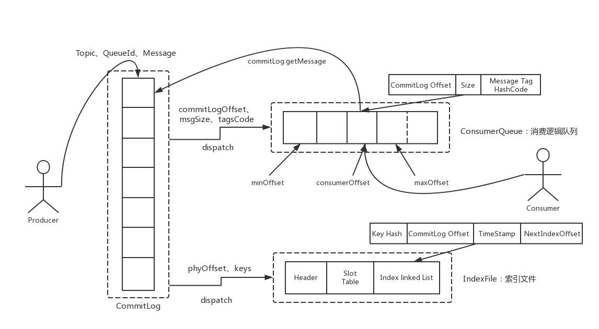

# RocketMQ Transaction Msg事务消息

**源码基于：4.7.1**

## 原理

Apache RocketMQ在4.3.0版中已经支持分布式事务消息，这里RocketMQ采用了2PC的思想来实现了提交事务消息，同时增加一个补偿逻辑来处理二阶段超时或者失败的消息，如下图所示。


#### 1 RocketMQ事务消息流程概要
上图说明了事务消息的大致方案，其中分为两个流程：正常事务消息的发送及提交、事务消息的补偿流程。

1.事务消息发送及提交：

(1) 发送消息（half消息）。

(2) 服务端响应消息写入结果。

(3) 根据发送结果执行本地事务（如果写入失败，此时half消息对业务不可见，本地逻辑不执行）。

(4) 根据本地事务状态执行Commit或者Rollback（Commit操作生成消息索引，消息对消费者可见）

2.补偿流程：

(1) 对没有Commit/Rollback的事务消息（pending状态的消息），从服务端发起一次“回查”

(2) Producer收到回查消息，检查回查消息对应的本地事务的状态

(3) 根据本地事务状态，重新Commit或者Rollback

其中，补偿阶段用于解决消息Commit或者Rollback发生超时或者失败的情况。
#### 2 RocketMQ事务消息设计
1.事务消息在一阶段对用户不可见

在RocketMQ事务消息的主要流程中，一阶段的消息如何对用户不可见。其中，事务消息相对普通消息最大的特点就是一阶段发送的消息对用户是不可见的。那么，如何做到写入消息但是对用户不可见呢？RocketMQ事务消息的做法是：如果消息是half消息，将备份原消息的主题与消息消费队列，然后改变主题为RMQ_SYS_TRANS_HALF_TOPIC。由于消费组未订阅该主题，故消费端无法消费half类型的消息，然后RocketMQ会开启一个定时任务，从Topic为RMQ_SYS_TRANS_HALF_TOPIC中拉取消息进行消费，根据生产者组获取一个服务提供者发送回查事务状态请求，根据事务状态来决定是提交或回滚消息。

在RocketMQ中，消息在服务端的存储结构如下，每条消息都会有对应的索引信息，Consumer通过ConsumeQueue这个二级索引来读取消息实体内容，其流程如下：



RocketMQ的具体实现策略是：写入的如果事务消息，对消息的Topic和Queue等属性进行替换，同时将原来的Topic和Queue信息存储到消息的属性中，正因为消息主题被替换，故消息并不会转发到该原主题的消息消费队列，消费者无法感知消息的存在，不会消费。其实改变消息主题是RocketMQ的常用“套路”，回想一下延时消息的实现机制。

2.Commit和Rollback操作以及Op消息的引入

在完成一阶段写入一条对用户不可见的消息后，二阶段如果是Commit操作，则需要让消息对用户可见；如果是Rollback则需要撤销一阶段的消息。先说Rollback的情况。对于Rollback，本身一阶段的消息对用户是不可见的，其实不需要真正撤销消息（实际上RocketMQ也无法去真正的删除一条消息，因为是顺序写文件的）。但是区别于这条消息没有确定状态（Pending状态，事务悬而未决），需要一个操作来标识这条消息的最终状态。RocketMQ事务消息方案中引入了Op消息的概念，用Op消息标识事务消息已经确定的状态（Commit或者Rollback）。如果一条事务消息没有对应的Op消息，说明这个事务的状态还无法确定（可能是二阶段失败了）。引入Op消息后，事务消息无论是Commit或者Rollback都会记录一个Op操作。Commit相对于Rollback只是在写入Op消息前创建Half消息的索引。

3.Op消息的存储和对应关系

RocketMQ将Op消息写入到全局一个特定的Topic中通过源码中的方法—TransactionalMessageUtil.buildOpTopic()；这个Topic是一个内部的Topic（像Half消息的Topic一样），不会被用户消费。Op消息的内容为对应的Half消息的存储的Offset，这样通过Op消息能索引到Half消息进行后续的回查操作。


4.Half消息的索引构建

在执行二阶段Commit操作时，需要构建出Half消息的索引。一阶段的Half消息由于是写到一个特殊的Topic，所以二阶段构建索引时需要读取出Half消息，并将Topic和Queue替换成真正的目标的Topic和Queue，之后通过一次普通消息的写入操作来生成一条对用户可见的消息。所以RocketMQ事务消息二阶段其实是利用了一阶段存储的消息的内容，在二阶段时恢复出一条完整的普通消息，然后走一遍消息写入流程。

5.如何处理二阶段失败的消息？

如果在RocketMQ事务消息的二阶段过程中失败了，例如在做Commit操作时，出现网络问题导致Commit失败，那么需要通过一定的策略使这条消息最终被Commit。RocketMQ采用了一种补偿机制，称为“回查”。Broker端对未确定状态的消息发起回查，将消息发送到对应的Producer端（同一个Group的Producer），由Producer根据消息来检查本地事务的状态，进而执行Commit或者Rollback。Broker端通过对比Half消息和Op消息进行事务消息的回查并且推进CheckPoint（记录那些事务消息的状态是确定的）。

值得注意的是，rocketmq并不会无休止的的信息事务状态回查，默认回查15次，如果15次回查还是无法得知事务状态，rocketmq默认回滚该消息。

## Example

```java
public static void main(String[] args) throws MQClientException, InterruptedException {
    TransactionListener transactionListener = new TransactionListenerImpl();
    TransactionMQProducer producer = new TransactionMQProducer("please_rename_unique_group_name");
    ExecutorService executorService = new ThreadPoolExecutor(2, 5, 100, TimeUnit.SECONDS, new ArrayBlockingQueue<Runnable>(2000), new ThreadFactory() {
        @Override
        public Thread newThread(Runnable r) {
            Thread thread = new Thread(r);
            thread.setName("client-transaction-msg-check-thread");
            return thread;
        }
    });

    producer.setExecutorService(executorService);
    producer.setTransactionListener(transactionListener);
    producer.start();

    String[] tags = new String[] {"TagA", "TagB", "TagC", "TagD", "TagE"};
    for (int i = 0; i < 10; i++) {
        try {
            Message msg =
                new Message("TopicTest1234", tags[i % tags.length], "KEY" + i,
                    ("Hello RocketMQ " + i).getBytes(RemotingHelper.DEFAULT_CHARSET));
            SendResult sendResult = producer.sendMessageInTransaction(msg, null);
            System.out.printf("%s%n", sendResult);

            Thread.sleep(10);
        } catch (MQClientException | UnsupportedEncodingException e) {
            e.printStackTrace();
        }
    }

    for (int i = 0; i < 100000; i++) {
        Thread.sleep(1000);
    }
    producer.shutdown();
}
```

```java
public interface TransactionListener {
    /**	执行本地事务
     * When send transactional prepare(half) message succeed, this method will be invoked to execute local transaction.
     *
     * @param msg Half(prepare) message
     * @param arg Custom business parameter
     * @return Transaction state
     */
    LocalTransactionState executeLocalTransaction(final Message msg, final Object arg);

    /** 回查本地事务状态
     * When no response to prepare(half) message. broker will send check message to check the transaction status, and this
     * method will be invoked to get local transaction status.
     *
     * @param msg Check message
     * @return Transaction state
     */
    LocalTransactionState checkLocalTransaction(final MessageExt msg);
}
```

## Producer 

### 消息发送

```java
DefaultMQProducerImpl.class
  
public TransactionSendResult sendMessageInTransaction(final Message msg,
    final LocalTransactionExecuter localTransactionExecuter, final Object arg)
    throws MQClientException {
  	//判断TransactionListener是否存在
    TransactionListener transactionListener = getCheckListener();
    if (null == localTransactionExecuter && null == transactionListener) {
        throw new MQClientException("tranExecutor is null", null);
    }

    // ignore DelayTimeLevel parameter
    if (msg.getDelayTimeLevel() != 0) {
        MessageAccessor.clearProperty(msg, MessageConst.PROPERTY_DELAY_TIME_LEVEL);
    }
		//检测msg 是否为null以及msg body长度是否为0是否超长
    Validators.checkMessage(msg, this.defaultMQProducer);

    SendResult sendResult = null;
  	//为msg设置事务消息相关参数
    MessageAccessor.putProperty(msg, MessageConst.PROPERTY_TRANSACTION_PREPARED, "true");
    MessageAccessor.putProperty(msg, MessageConst.PROPERTY_PRODUCER_GROUP, this.defaultMQProducer.getProducerGroup());
    try {
      	//发送消息，和普通消息几乎一样，只不过对事务消息的RequestHeader的sysFlag设置了TRANSACTION_PREPARED_TYPE
        sendResult = this.send(msg);
    } catch (Exception e) {
        throw new MQClientException("send message Exception", e);
    }
		//本地事务执行状态默认设置为 未知状态，如果本地事务执行报错那默认也就是未知状态
    LocalTransactionState localTransactionState = LocalTransactionState.UNKNOW;
    Throwable localException = null;
  	//对事务prepare消息返回状态进行处理
    switch (sendResult.getSendStatus()) {
        case SEND_OK: {
          	//如果broker处理成功
            try {
              	//对事务id进行处理
                if (sendResult.getTransactionId() != null) {
                    msg.putUserProperty("__transactionId__", sendResult.getTransactionId());
                }
                String transactionId = msg.getProperty(MessageConst.PROPERTY_UNIQ_CLIENT_MESSAGE_ID_KEYIDX);
                if (null != transactionId && !"".equals(transactionId)) {
                    msg.setTransactionId(transactionId);
                }
              	//执行本地事务
                if (null != localTransactionExecuter) {
                    localTransactionState = localTransactionExecuter.executeLocalTransactionBranch(msg, arg);
                } else if (transactionListener != null) {
                    log.debug("Used new transaction API");
                  	//调用transactionListener的executeLocalTransaction执行本地事务
                    localTransactionState = transactionListener.executeLocalTransaction(msg, arg);
                }
              	//如果本地事务的返回结果是null则状态设置为未知状态
                if (null == localTransactionState) {
                    localTransactionState = LocalTransactionState.UNKNOW;
                }
								//如果本地事务执行不成功，则打印日志做提示
                if (localTransactionState != LocalTransactionState.COMMIT_MESSAGE) {
                    log.info("executeLocalTransactionBranch return {}", localTransactionState);
                    log.info(msg.toString());
                }
            } catch (Throwable e) {
              	//如果本地事务执行报错那默认也就是未知状态
                log.info("executeLocalTransactionBranch exception", e);
                log.info(msg.toString());
                localException = e;
            }
        }
        break;
        case FLUSH_DISK_TIMEOUT:
        case FLUSH_SLAVE_TIMEOUT:
        case SLAVE_NOT_AVAILABLE:
        		//如果broker处理失败，超时或是同步Slave超时或是Slave不可用都将本地事务状态直接设置为RollBack并不再调用本地事务
            localTransactionState = LocalTransactionState.ROLLBACK_MESSAGE;
            break;
        default:
            break;
    }

    try {
      	//结束事务，对事务结果做处理
        this.endTransaction(sendResult, localTransactionState, localException);
    } catch (Exception e) {
        log.warn("local transaction execute " + localTransactionState + ", but end broker transaction failed", e);
    }
		//返回事务消息发送结果
    TransactionSendResult transactionSendResult = new TransactionSendResult();
    transactionSendResult.setSendStatus(sendResult.getSendStatus());
    transactionSendResult.setMessageQueue(sendResult.getMessageQueue());
    transactionSendResult.setMsgId(sendResult.getMsgId());
    transactionSendResult.setQueueOffset(sendResult.getQueueOffset());
    transactionSendResult.setTransactionId(sendResult.getTransactionId());
    transactionSendResult.setLocalTransactionState(localTransactionState);
    return transactionSendResult;
}
```

```java
DefaultMQProducerImpl.class
//结束事务，对事务结果做处理
public void endTransaction(
    final SendResult sendResult,
    final LocalTransactionState localTransactionState,
    final Throwable localException) throws RemotingException, MQBrokerException, InterruptedException, UnknownHostException {
    final MessageId id;
  	//从broker处理prepare消息的返回来获取prepare在broker端的id，提交、回滚请求需要携带id给broker，便于broker获取到原来的prepare消息信息，然后做处理
    if (sendResult.getOffsetMsgId() != null) {
        id = MessageDecoder.decodeMessageId(sendResult.getOffsetMsgId());
    } else {
        id = MessageDecoder.decodeMessageId(sendResult.getMsgId());
    }
    String transactionId = sendResult.getTransactionId();
  	//获取之前处理prepare的broker地址，提交、回滚请求也必须要发送到该broker上
    final String brokerAddr = this.mQClientFactory.findBrokerAddressInPublish(sendResult.getMessageQueue().getBrokerName());		
  	//根据本地事务执行结果封装请求，发送给broker
    EndTransactionRequestHeader requestHeader = new EndTransactionRequestHeader();
    requestHeader.setTransactionId(transactionId);
    requestHeader.setCommitLogOffset(id.getOffset());
    switch (localTransactionState) {
        case COMMIT_MESSAGE:
            requestHeader.setCommitOrRollback(MessageSysFlag.TRANSACTION_COMMIT_TYPE);
            break;
        case ROLLBACK_MESSAGE:
            requestHeader.setCommitOrRollback(MessageSysFlag.TRANSACTION_ROLLBACK_TYPE);
            break;
        case UNKNOW:
            requestHeader.setCommitOrRollback(MessageSysFlag.TRANSACTION_NOT_TYPE);
            break;
        default:
            break;
    }

    requestHeader.setProducerGroup(this.defaultMQProducer.getProducerGroup());
    requestHeader.setTranStateTableOffset(sendResult.getQueueOffset());
    requestHeader.setMsgId(sendResult.getMsgId());
    String remark = localException != null ? ("executeLocalTransactionBranch exception: " + localException.toString()) : null;
    this.mQClientFactory.getMQClientAPIImpl().endTransactionOneway(brokerAddr, requestHeader, remark,
        this.defaultMQProducer.getSendMsgTimeout());
}
```

## Broker 

### Processor对Prepare消息处理

```java
SendMessageProcessor.class
  
private CompletableFuture<RemotingCommand> asyncSendMessage(ChannelHandlerContext ctx, RemotingCommand request,
                                                            SendMessageContext mqtraceContext,
                                                            SendMessageRequestHeader requestHeader) {
    ......
    Map<String, String> origProps = MessageDecoder.string2messageProperties(requestHeader.getProperties());
    String transFlag = origProps.get(MessageConst.PROPERTY_TRANSACTION_PREPARED);
  	//判断是否为事务消息
    if (transFlag != null && Boolean.parseBoolean(transFlag)) {
      	//判断当前broker是否不支持事务消息，如果不支持则拒绝消息
        if (this.brokerController.getBrokerConfig().isRejectTransactionMessage()) {
            response.setCode(ResponseCode.NO_PERMISSION);
            response.setRemark(
                    "the broker[" + this.brokerController.getBrokerConfig().getBrokerIP1()
                            + "] sending transaction message is forbidden");
            return CompletableFuture.completedFuture(response);
        }
      	//通过TransactionalMessageService处理事务消息
        putMessageResult = this.brokerController.getTransactionalMessageService().asyncPrepareMessage(msgInner);
    } else {
      	//普通消息处理
        putMessageResult = this.brokerController.getMessageStore().asyncPutMessage(msgInner);
    }
    return handlePutMessageResultFuture(putMessageResult, response, request, msgInner, responseHeader, mqtraceContext, ctx, queueIdInt);
}
```

### TransactionalMessageService对消息处理

```java
TransactionalMessageBridge.class
  
public CompletableFuture<PutMessageResult> asyncPutHalfMessage(MessageExtBrokerInner messageInner) {
  	//先对msg进行处理，然后保存到文件中
    return store.asyncPutMessage(parseHalfMessageInner(messageInner));
}
```

```java
TransactionalMessageBridge.class
//对msg的topic和queue进行偷梁换柱
private MessageExtBrokerInner parseHalfMessageInner(MessageExtBrokerInner msgInner) {
  	//将msg原始真实的topic名称记录在msg property中
    MessageAccessor.putProperty(msgInner, MessageConst.PROPERTY_REAL_TOPIC, msgInner.getTopic());
  	////将msg原始真实的queueId记录在msg property中
    MessageAccessor.putProperty(msgInner, MessageConst.PROPERTY_REAL_QUEUE_ID,
        String.valueOf(msgInner.getQueueId()));
    msgInner.setSysFlag(
        MessageSysFlag.resetTransactionValue(msgInner.getSysFlag(), MessageSysFlag.TRANSACTION_NOT_TYPE));
  	//设置msg的topic为RMQ_SYS_TRANS_HALF_TOPIC，避免prepare消息被consumer消费
    msgInner.setTopic(TransactionalMessageUtil.buildHalfTopic());
  	//设置msg的queue为0
    msgInner.setQueueId(0);
    msgInner.setPropertiesString(MessageDecoder.messageProperties2String(msgInner.getProperties()));
    return msgInner;
}
```

parseHalfMessageInner方法对prepare的topic和queueId进行了偷梁换柱，将原本的topic和queueId存在msg的properties中，将topic重新设置为“RMQ_SYS_TRANS_HALF_TOPIC”，将queueId设置为0，这样子能避免prepare消息被consumer消费。这里偷梁换柱之后，如果最后producer提交了commit则又要msg的properties中存放的原本的topic和queueId换回去

### Commit RollBack请求处理

```java
EndTransactionProcessor.class
  
@Override
public RemotingCommand processRequest(ChannelHandlerContext ctx, RemotingCommand request) throws
    RemotingCommandException {
    ......
    OperationResult result = new OperationResult();
    if (MessageSysFlag.TRANSACTION_COMMIT_TYPE == requestHeader.getCommitOrRollback()) {
      	//commit处理
      	//TransactionalMessageService commitMessage该方法其实是为了获得原先的prepare消息信息
        result = this.brokerController.getTransactionalMessageService().commitMessage(requestHeader);
        if (result.getResponseCode() == ResponseCode.SUCCESS) {
          	//成功获取到原先的消息信息则封装一个新的消息然后进行存库
            RemotingCommand res = checkPrepareMessage(result.getPrepareMessage(), requestHeader);
            if (res.getCode() == ResponseCode.SUCCESS) {
              	//将之前偷梁换柱的topic和queueId都替换回来构成一个新的MessageExtBrokerInner准备存库
                MessageExtBrokerInner msgInner = endMessageTransaction(result.getPrepareMessage());
                msgInner.setSysFlag(MessageSysFlag.resetTransactionValue(msgInner.getSysFlag(), requestHeader.getCommitOrRollback()));
                msgInner.setQueueOffset(requestHeader.getTranStateTableOffset());
                msgInner.setPreparedTransactionOffset(requestHeader.getCommitLogOffset());
                msgInner.setStoreTimestamp(result.getPrepareMessage().getStoreTimestamp());
                MessageAccessor.clearProperty(msgInner, MessageConst.PROPERTY_TRANSACTION_PREPARED);
                RemotingCommand sendResult = sendFinalMessage(msgInner);
                if (sendResult.getCode() == ResponseCode.SUCCESS) {
                   //存库成功 “删除”原先的prepare消息
this.brokerController.getTransactionalMessageService().deletePrepareMessage(result.getPrepareMessage());
                }
                return sendResult;
            }
            return res;
        }
    } else if (MessageSysFlag.TRANSACTION_ROLLBACK_TYPE == requestHeader.getCommitOrRollback()) {
      	//TransactionalMessageService rollbackMessage该方法其实是为了获得原先的prepare消息信息
        result = this.brokerController.getTransactionalMessageService().rollbackMessage(requestHeader);
        if (result.getResponseCode() == ResponseCode.SUCCESS) {
            RemotingCommand res = checkPrepareMessage(result.getPrepareMessage(), requestHeader);
            if (res.getCode() == ResponseCode.SUCCESS) {
                //“删除”原先的prepare消息
          	this.brokerController.getTransactionalMessageService().deletePrepareMessage(result.getPrepareMessage());
            }
            return res;
        }
    }
    response.setCode(result.getResponseCode());
    response.setRemark(result.getResponseRemark());
    return response;
}
```
### 删除Prepare消息

由于rocket的commitlog都是追加式顺序写，所以这里所谓的删除也不是真正的删除，而是创建一个opmessage放入特定的topic从而标记该opmessage所映射的message的状态。

```java
TransactionalMessageServiceImpl.class

@Override
public boolean deletePrepareMessage(MessageExt msgExt) {
    if (this.transactionalMessageBridge.putOpMessage(msgExt, TransactionalMessageUtil.REMOVETAG)) {
        log.debug("Transaction op message write successfully. messageId={}, queueId={} msgExt:{}", msgExt.getMsgId(), msgExt.getQueueId(), msgExt);
        return true;
    } else {
        log.error("Transaction op message write failed. messageId is {}, queueId is {}", msgExt.getMsgId(), msgExt.getQueueId());
        return false;
    }
}
```

```java
TransactionalMessageBridge.class
  
public boolean putOpMessage(MessageExt messageExt, String opType) {
    MessageQueue messageQueue = new MessageQueue(messageExt.getTopic(),
        this.brokerController.getBrokerConfig().getBrokerName(), messageExt.getQueueId());
    if (TransactionalMessageUtil.REMOVETAG.equals(opType)) {
        return addRemoveTagInTransactionOp(messageExt, messageQueue);
    }
    return true;
}

private boolean addRemoveTagInTransactionOp(MessageExt messageExt, MessageQueue messageQueue) {
  			//构建一个message topic指定为：RMQ_SYS_TRANS_OP_HALF_TOPIC，tag指定为：d表示删除状态
        Message message = new Message(TransactionalMessageUtil.buildOpTopic(), TransactionalMessageUtil.REMOVETAG,
            String.valueOf(messageExt.getQueueOffset()).getBytes(TransactionalMessageUtil.charset));
        writeOp(message, messageQueue);
        return true;
    }
```

### TransactionalMessageCheckService消息回查

消息回查主要由TransactionalMessageCheckService来处理

TransactionalMessageCheckService每隔默认时间60秒检测事务消息的状态，如果发现没有commit或是rollback则发起回查消息给producer，默认回查15次，如果15次回查还是无法得知事务状态，rocketmq默认回滚该消息。

源码不跟踪了

## 个人总结

事务消息处理流程：

1. producer先发送PREPARE消息（half消息）给broker
2. broker收到消息，将该half消息存入特定的topic，这个topic是broker特定的所以也不会被consuemr消费，返回执行状态
3. 如果producer收到broker返回的成功状态后调用TransactionListener处理本地事务
4. 如果producer收到的不是成功状态则直接以rollback状态结束本地事务
5. producer根据本地事务执行情况，发送commit或是rollback消息给broker
6. broker收到commit或是rollback之后，如果是commit则从之前的prepare消息构建一个新的msg进行存库，并“删除”prepare消息。如果是rollback则“删除”prepare消息
7. 如果broker发现一段时间都没有收到commit或是rollback则发起回查，producer收到回查消息调用TransactionListener进行回查