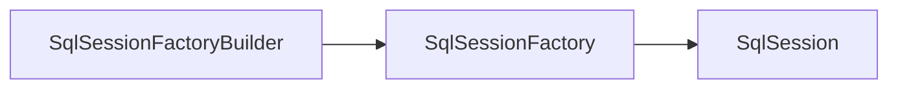

# Mybatis源码分析

源码基于：mybatis 3.3.0-SNAPSHOT


```mermaid
graph LR;
SqlSessionFactoryBuilder --> SqlSessionFactory 
SqlSessionFactory --> SqlSession
```


## SqlSessionFactoryBuilder
构建SqlSessionFactory的工厂

其核心在于通过ConfigXml文件构建SqlSessionFactory

```java
SqlSessionFactoryBuilder.class
  
public SqlSessionFactory build(InputStream inputStream, String environment, Properties properties) {
  try {
    //使用XMLConfigBuilder对ConfigXml进行解析，最后解析获的Configuration
    XMLConfigBuilder parser = new XMLConfigBuilder(inputStream, environment, properties);
    //通过Configuration构建SqlSessionFactory
    return build(parser.parse());
  } catch (Exception e) {
    throw ExceptionFactory.wrapException("Error building SqlSession.", e);
  } finally {
    ErrorContext.instance().reset();
    try {
      inputStream.close();
    } catch (IOException e) {
      // Intentionally ignore. Prefer previous error.
    }
  }
}
```

### XML解析

ConfigXml格式，具体参考：https://mybatis.org/mybatis-3/zh/configuration.html#properties

```xml
<?xml version="1.0" encoding="utf-8"?>
<!DOCTYPE configuration PUBLIC "-//mybatis.org//DTD Config 3.0//EN" "http://mybatis.org/dtd/mybatis-3-config.dtd">
<configuration> 
  <properties resource="org/mybatis/example/config.properties">
  	<property name="username" value="dev_user"/>
  	<property name="password" value="F2Fa3!33TYyg"/>
	</properties>
  <typeAliases>
  	<typeAlias alias="Author" type="domain.blog.Author"/>
  	<typeAlias alias="Blog" type="domain.blog.Blog"/>
	</typeAliases>
  <typeAliases>
  	<package name="domain.blog"/>
	</typeAliases>
  <environments default="development"> 
    <environment id="development"> 
      <transactionManager type="JDBC"/>  
      <dataSource type="POOLED"> 
        <property name="driver" value="${driver}"/>  
        <property name="url" value="${url}"/>  
        <property name="username" value="${username}"/>  
        <property name="password" value="${password}"/> 
      </dataSource> 
    </environment> 
  </environments>  
  <mappers> 
    <mapper resource="org/mybatis/example/BlogMapper.xml"/> 
  </mappers> 
</configuration>
```

```java
XMLConfigBuilder.class
  
public Configuration parse() {
    //如果已经解析过了，报错
    if (parsed) {
      throw new BuilderException("Each XMLConfigBuilder can only be used once.");
    }
    parsed = true;
    //根节点是configuration
    parseConfiguration(parser.evalNode("/configuration"));
    return configuration;
}

	//对configuration下的各个标签进行解析
  private void parseConfiguration(XNode root) {
    try {
      //分步骤解析
      //issue #117 read properties first
      //1.properties
      propertiesElement(root.evalNode("properties"));
      //2.类型别名
      typeAliasesElement(root.evalNode("typeAliases"));
      //3.插件
      pluginElement(root.evalNode("plugins"));
      //4.对象工厂
      objectFactoryElement(root.evalNode("objectFactory"));
      //5.对象包装工厂
      objectWrapperFactoryElement(root.evalNode("objectWrapperFactory"));
      //6.设置
      settingsElement(root.evalNode("settings"));
      // read it after objectFactory and objectWrapperFactory issue #631
      //7.环境
      environmentsElement(root.evalNode("environments"));
      //8.databaseIdProvider
      databaseIdProviderElement(root.evalNode("databaseIdProvider"));
      //9.类型处理器
      typeHandlerElement(root.evalNode("typeHandlers"));
      //10.映射器
      mapperElement(root.evalNode("mappers"));
    } catch (Exception e) {
      throw new BuilderException("Error parsing SQL Mapper Configuration. Cause: " + e, e);
    }
  }
```

#### 1.properties解析

```java
//<properties resource="org/mybatis/example/config.properties">
//    <property name="username" value="dev_user"/>
//    <property name="password" value="F2Fa3!33TYyg"/>
//</properties>
private void propertiesElement(XNode context) throws Exception {
  if (context != null) {
    //XNode.getChildrenAsProperties函数方便得到孩子所有Properties
    Properties defaults = context.getChildrenAsProperties();
    //然后查找resource或者url,加入前面的Properties
    String resource = context.getStringAttribute("resource");
    String url = context.getStringAttribute("url");
    //如果url和resource都存在则报错
    if (resource != null && url != null) {
      throw new BuilderException("The properties element cannot specify both a URL and a resource based property file reference.  Please specify one or the other.");
    }
    //记载resorce所指向的Properties，如果有配置key一致则覆盖之前的
    if (resource != null) {
      defaults.putAll(Resources.getResourceAsProperties(resource));
    } else if (url != null) {
      //加载url所指向的Propertiees，如果有配置key一致则覆盖之前的
      defaults.putAll(Resources.getUrlAsProperties(url));
    }
    //Variables也全部加入Properties，如果有配置key一致则覆盖之前的，这个Variables来源于SqlSessionFactoryBuilder build SqlSessionFactory时传入的Properties
    Properties vars = configuration.getVariables();
    if (vars != null) {
      defaults.putAll(vars);
    }
    //将Properties存入xml解析器，提供下文解析时使用
    parser.setVariables(defaults);
    //将Properties存入Configuration中
    configuration.setVariables(defaults);
  }
}
```

属性key冲突的时候：

1. configuration.getVariables层级最高
2. resource url指向的Properties其次
3. XML中定义的Properties等级最低

#### 2.typeAliases解析

typeAliases配置有两种：

```xml
<typeAliases>
  <typeAlias alias="Author" type="domain.blog.Author"/>
  <typeAlias alias="Blog" type="domain.blog.Blog"/>
</typeAliases>
```

```xml
<typeAliases>
  <package name="domain.blog"/>
</typeAliases> 
```

```java
private void typeAliasesElement(XNode parent) {
    if (parent != null) {
      for (XNode child : parent.getChildren()) {
        if ("package".equals(child.getName())) {
          //如果是package
          String typeAliasPackage = child.getStringAttribute("name");
          //（一）调用TypeAliasRegistry.registerAliases，去包下找所有类,然后注册别名(有@Alias注解则用，没有则取类的simpleName)
          configuration.getTypeAliasRegistry().registerAliases(typeAliasPackage);
        } else {
          //如果是typeAlias
          String alias = child.getStringAttribute("alias");
          String type = child.getStringAttribute("type");
          try {
            Class<?> clazz = Resources.classForName(type);
            //根据Class名字来注册类型别名
            //（二）调用TypeAliasRegistry.registerAlias
            if (alias == null) {
              //alias可以省略
              typeAliasRegistry.registerAlias(clazz);
            } else {
              typeAliasRegistry.registerAlias(alias, clazz);
            }
          } catch (ClassNotFoundException e) {
            throw new BuilderException("Error registering typeAlias for '" + alias + "'. Cause: " + e, e);
          }
        }
      }
    }
  }
```

1. 对于package的配置方式：

   调用TypeAliasRegistry registerAliases扫描package下的所有Class（Ignore inner classes and interfaces (including package-info.java) Skip also inner classes.）使用其Class.getSimpleName或是@Alias配置的Value作为别名

2. 对于typeAlias的配置方式：

   如果有指定alias则使用alias的值，否则使用Class.getSimpleName作为别名

解析结果由typeAliasRegistry中的Map：TYPE_ALIASES维护

```java
//key: 别名 value：class
private final Map<String, Class<?>> TYPE_ALIASES = new HashMap<String, Class<?>>();
```

typeAliasRegistry构造函数默认注册了系统内置的类型别名：

1. 基本包装类型： byte -> Byte.class long -> Long.class 等
2. 基本数组包装类型：byte[] -> Byte[].class long[] -> Long[].class 等
3. 基本类型：_byte -> byte.class _long -> long.class 等
4. 基本数组类型：_byte[] -> byte[].class _long[] -> long[].class 等
5. 日期、数字类型：date -> Date.class decimal -> BigDecimal.class date[] -> Date[].class
6. 集合类型：map -> Map.class hashmap -> HashMap.class list -> List.class iterator -> Iterator.class
7. ResultSet类型：ResultSet -> ResultSet.class

#### 3.plugins解析

```xml
<plugins>
  <plugin interceptor="org.mybatis.example.ExamplePlugin">
    <property name="someProperty" value="100"/>
  </plugin>
</plugins>
```

```java
private void pluginElement(XNode parent) throws Exception {
    if (parent != null) {
      for (XNode child : parent.getChildren()) {
        //获取interceptor描述的插件类名，进行实例话，并调用setProperties
        String interceptor = child.getStringAttribute("interceptor");
        Properties properties = child.getChildrenAsProperties();
        Interceptor interceptorInstance = (Interceptor) resolveClass(interceptor).newInstance();
        interceptorInstance.setProperties(properties);
        //调用InterceptorChain.addInterceptor将Interceptor交由interceptorChain维护
        configuration.addInterceptor(interceptorInstance);
      }
    }
  }
```

```java
InterceptorChain.class
//InterceptorChain.class使用list维护了所有的拦截器
private final List<Interceptor> interceptors = new ArrayList<Interceptor>();
```

#### 4.objectFactory解析

#### 5.objectWrapperFactory解析

#### 6.settings解析

#### 7.environments解析

#### 8.databaseIdProvider解析

#### 9.typeHandlers解析

#### 10.mappers解析

### MapperXml解析

