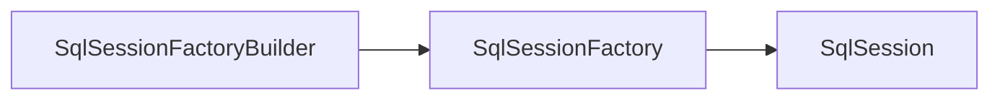

# Mybatis源码分析

源码基于：mybatis 3.3.0-SNAPSHOT


```mermaid
graph LR;
SqlSessionFactoryBuilder --> SqlSessionFactory 
SqlSessionFactory --> SqlSession
```


## SqlSessionFactoryBuilder
构建SqlSessionFactory的工厂

其核心在于通过ConfigXml文件构建SqlSessionFactory

```java
SqlSessionFactoryBuilder.class
  
public SqlSessionFactory build(InputStream inputStream, String environment, Properties properties) {
  try {
    //使用XMLConfigBuilder对ConfigXml进行解析，最后解析获的Configuration
    XMLConfigBuilder parser = new XMLConfigBuilder(inputStream, environment, properties);
    //通过Configuration构建SqlSessionFactory
    return build(parser.parse());
  } catch (Exception e) {
    throw ExceptionFactory.wrapException("Error building SqlSession.", e);
  } finally {
    ErrorContext.instance().reset();
    try {
      inputStream.close();
    } catch (IOException e) {
      // Intentionally ignore. Prefer previous error.
    }
  }
}
```

### XML解析

ConfigXml格式，具体参考：https://mybatis.org/mybatis-3/zh/configuration.html#properties

```xml
<?xml version="1.0" encoding="utf-8"?>
<!DOCTYPE configuration PUBLIC "-//mybatis.org//DTD Config 3.0//EN" "http://mybatis.org/dtd/mybatis-3-config.dtd">
<configuration> 
  <properties resource="org/mybatis/example/config.properties">
  	<property name="username" value="dev_user"/>
  	<property name="password" value="F2Fa3!33TYyg"/>
	</properties>
  <typeAliases>
  	<typeAlias alias="Author" type="domain.blog.Author"/>
  	<typeAlias alias="Blog" type="domain.blog.Blog"/>
	</typeAliases>
  <typeAliases>
  	<package name="domain.blog"/>
	</typeAliases>
  <environments default="development"> 
    <environment id="development"> 
      <transactionManager type="JDBC"/>  
      <dataSource type="POOLED"> 
        <property name="driver" value="${driver}"/>  
        <property name="url" value="${url}"/>  
        <property name="username" value="${username}"/>  
        <property name="password" value="${password}"/> 
      </dataSource> 
    </environment> 
  </environments>  
  <mappers> 
    <mapper resource="org/mybatis/example/BlogMapper.xml"/> 
  </mappers> 
</configuration>
```

```java
XMLConfigBuilder.class
  
public Configuration parse() {
    //如果已经解析过了，报错
    if (parsed) {
      throw new BuilderException("Each XMLConfigBuilder can only be used once.");
    }
    parsed = true;
    //根节点是configuration
    parseConfiguration(parser.evalNode("/configuration"));
    return configuration;
}

	//对configuration下的各个标签进行解析
  private void parseConfiguration(XNode root) {
    try {
      //分步骤解析
      //issue #117 read properties first
      //1.properties
      propertiesElement(root.evalNode("properties"));
      //2.类型别名
      typeAliasesElement(root.evalNode("typeAliases"));
      //3.插件
      pluginElement(root.evalNode("plugins"));
      //4.对象工厂
      objectFactoryElement(root.evalNode("objectFactory"));
      //5.对象包装工厂
      objectWrapperFactoryElement(root.evalNode("objectWrapperFactory"));
      //6.设置
      settingsElement(root.evalNode("settings"));
      // read it after objectFactory and objectWrapperFactory issue #631
      //7.环境
      environmentsElement(root.evalNode("environments"));
      //8.databaseIdProvider
      databaseIdProviderElement(root.evalNode("databaseIdProvider"));
      //9.类型处理器
      typeHandlerElement(root.evalNode("typeHandlers"));
      //10.映射器
      mapperElement(root.evalNode("mappers"));
    } catch (Exception e) {
      throw new BuilderException("Error parsing SQL Mapper Configuration. Cause: " + e, e);
    }
  }
```

#### 1.properties解析

```java
//<properties resource="org/mybatis/example/config.properties">
//    <property name="username" value="dev_user"/>
//    <property name="password" value="F2Fa3!33TYyg"/>
//</properties>
private void propertiesElement(XNode context) throws Exception {
  if (context != null) {
    //XNode.getChildrenAsProperties函数方便得到孩子所有Properties
    Properties defaults = context.getChildrenAsProperties();
    //然后查找resource或者url,加入前面的Properties
    String resource = context.getStringAttribute("resource");
    String url = context.getStringAttribute("url");
    //如果url和resource都存在则报错
    if (resource != null && url != null) {
      throw new BuilderException("The properties element cannot specify both a URL and a resource based property file reference.  Please specify one or the other.");
    }
    //记载resorce所指向的Properties，如果有配置key一致则覆盖之前的
    if (resource != null) {
      defaults.putAll(Resources.getResourceAsProperties(resource));
    } else if (url != null) {
      //加载url所指向的Propertiees，如果有配置key一致则覆盖之前的
      defaults.putAll(Resources.getUrlAsProperties(url));
    }
    //Variables也全部加入Properties，如果有配置key一致则覆盖之前的，这个Variables来源于SqlSessionFactoryBuilder build SqlSessionFactory时传入的Properties
    Properties vars = configuration.getVariables();
    if (vars != null) {
      defaults.putAll(vars);
    }
    //将Properties存入xml解析器，提供下文解析时使用
    parser.setVariables(defaults);
    //将Properties存入Configuration中
    configuration.setVariables(defaults);
  }
}
```

属性key冲突的时候：

1. configuration.getVariables层级最高
2. resource url指向的Properties其次
3. XML中定义的Properties等级最低

#### 2.typeAliases解析

typeAliases配置有两种：

```xml
<typeAliases>
  <typeAlias alias="Author" type="domain.blog.Author"/>
  <typeAlias alias="Blog" type="domain.blog.Blog"/>
</typeAliases>
```

```xml
<typeAliases>
  <package name="domain.blog"/>
</typeAliases> 
```

```java
private void typeAliasesElement(XNode parent) {
    if (parent != null) {
      for (XNode child : parent.getChildren()) {
        if ("package".equals(child.getName())) {
          //如果是package
          String typeAliasPackage = child.getStringAttribute("name");
          //（一）调用TypeAliasRegistry.registerAliases，去包下找所有类,然后注册别名(有@Alias注解则用，没有则取类的simpleName)
          configuration.getTypeAliasRegistry().registerAliases(typeAliasPackage);
        } else {
          //如果是typeAlias
          String alias = child.getStringAttribute("alias");
          String type = child.getStringAttribute("type");
          try {
            Class<?> clazz = Resources.classForName(type);
            //根据Class名字来注册类型别名
            //（二）调用TypeAliasRegistry.registerAlias
            if (alias == null) {
              //alias可以省略
              typeAliasRegistry.registerAlias(clazz);
            } else {
              typeAliasRegistry.registerAlias(alias, clazz);
            }
          } catch (ClassNotFoundException e) {
            throw new BuilderException("Error registering typeAlias for '" + alias + "'. Cause: " + e, e);
          }
        }
      }
    }
  }
```

1. 对于package的配置方式：

   调用TypeAliasRegistry registerAliases扫描package下的所有Class（Ignore inner classes and interfaces (including package-info.java) Skip also inner classes.）使用其Class.getSimpleName或是@Alias配置的Value作为别名

2. 对于typeAlias的配置方式：

   如果有指定alias则使用alias的值，否则使用Class.getSimpleName作为别名

解析结果由typeAliasRegistry中的Map：TYPE_ALIASES维护

```java
//key: 别名 value：class
private final Map<String, Class<?>> TYPE_ALIASES = new HashMap<String, Class<?>>();
```

typeAliasRegistry构造函数默认注册了系统内置的类型别名：

1. 基本包装类型： byte -> Byte.class long -> Long.class 等
2. 基本数组包装类型：byte[] -> Byte[].class long[] -> Long[].class 等
3. 基本类型：_byte -> byte.class _long -> long.class 等
4. 基本数组类型：_byte[] -> byte[].class _long[] -> long[].class 等
5. 日期、数字类型：date -> Date.class decimal -> BigDecimal.class date[] -> Date[].class
6. 集合类型：map -> Map.class hashmap -> HashMap.class list -> List.class iterator -> Iterator.class
7. ResultSet类型：ResultSet -> ResultSet.class

#### 3.plugins解析

```xml
<plugins>
  <plugin interceptor="org.mybatis.example.ExamplePlugin">
    <property name="someProperty" value="100"/>
  </plugin>
</plugins>
```

```java
private void pluginElement(XNode parent) throws Exception {
    if (parent != null) {
      for (XNode child : parent.getChildren()) {
        //获取interceptor描述的插件类名，进行实例话，并调用setProperties
        String interceptor = child.getStringAttribute("interceptor");
        Properties properties = child.getChildrenAsProperties();
        Interceptor interceptorInstance = (Interceptor) resolveClass(interceptor).newInstance();
        interceptorInstance.setProperties(properties);
        //调用InterceptorChain.addInterceptor将Interceptor交由interceptorChain维护
        configuration.addInterceptor(interceptorInstance);
      }
    }
  }
```

```java
InterceptorChain.class
//InterceptorChain.class使用list维护了所有的拦截器
private final List<Interceptor> interceptors = new ArrayList<Interceptor>();
```

#### 4.objectFactory解析

每次 MyBatis 创建结果对象的新实例时，它都会使用一个对象工厂（ObjectFactory）实例来完成实例化工作。 默认的对象工厂需要做的仅仅是实例化目标类，要么通过默认无参构造方法，要么通过存在的参数映射来调用带有参数的构造方法。 如果想覆盖对象工厂的默认行为，可以通过创建自己的对象工厂来实现。

```xml
<objectFactory type="org.mybatis.example.ExampleObjectFactory">
  <property name="someProperty" value="100"/>
</objectFactory>
```

```java
private void objectFactoryElement(XNode context) throws Exception {
  if (context != null) {
    String type = context.getStringAttribute("type");
    Properties properties = context.getChildrenAsProperties();
    ObjectFactory factory = (ObjectFactory) resolveClass(type).newInstance();
    factory.setProperties(properties);
    configuration.setObjectFactory(factory);
  }
}
```

#### 5.objectWrapperFactory解析

MyBatis 提供在构造对象的时候，objectWrapperFactory对于指定的对象进行特殊的加工。

```java
private void objectWrapperFactoryElement(XNode context) throws Exception {
  if (context != null) {
    String type = context.getStringAttribute("type");
    ObjectWrapperFactory factory = (ObjectWrapperFactory) resolveClass(type).newInstance();
    configuration.setObjectWrapperFactory(factory);
  }
}
```

#### 6.settings解析

用于解析一些配置：

cacheEnabled：全局性地开启或关闭所有映射器配置文件中已配置的任何缓存

lazyLoadingEnabled：延迟加载的全局开关。当开启时，所有关联对象都会延迟加载。 特定关联关系中可通过设置 `fetchType` 属性来覆盖该项的开关状态。

......

#### 7.environments解析

用于配置不同的环境

MyBatis 可以配置成适应多种环境，这种机制有助于将 SQL 映射应用于多种数据库之中， 现实情况下有多种理由需要这么做。例如，开发、测试和生产环境需要有不同的配置；或者想在具有相同 Schema 的多个生产数据库中使用相同的 SQL 映射。还有许多类似的使用场景。

**不过要记住：尽管可以配置多个环境，但每个 SqlSessionFactory 实例只能选择一种环境。**

所以，如果你想连接两个数据库，就需要创建两个 SqlSessionFactory 实例，每个数据库对应一个。而如果是三个数据库，就需要三个实例，依此类推，记起来很简单：

- **每个数据库对应一个 SqlSessionFactory 实例**

为了指定创建哪种环境，只要将它作为可选的参数传递给 SqlSessionFactoryBuilder 即可。可以接受环境配置的两个方法签名是：

```
SqlSessionFactory factory = new SqlSessionFactoryBuilder().build(reader, environment);
SqlSessionFactory factory = new SqlSessionFactoryBuilder().build(reader, environment, properties);
```

如果忽略了环境参数，那么将会加载默认环境，如下所示：

```
SqlSessionFactory factory = new SqlSessionFactoryBuilder().build(reader);
SqlSessionFactory factory = new SqlSessionFactoryBuilder().build(reader, properties);
```

```xml
<environments default="development">
  <environment id="development">
    <transactionManager type="JDBC">
      <property name="..." value="..."/>
    </transactionManager>
    <dataSource type="POOLED">
      <property name="driver" value="${driver}"/>
      <property name="url" value="${url}"/>
      <property name="username" value="${username}"/>
      <property name="password" value="${password}"/>
    </dataSource>
  </environment>
</environments>
```

#### 8.databaseIdProvider解析

可以根据不同数据库执行不同的SQL，sql要加databaseId属性

#### 9.typeHandlers解析

MyBatis 在设置预处理语句（PreparedStatement）中的参数或从结果集中取出一个值时， 都会用类型处理器将获取到的值以合适的方式转换成 Java 类型。

也能将Java类型转换为合适的数据库类型。

```xml
<typeHandlers>
  <typeHandler handler="org.mybatis.example.ExampleTypeHandler"/>
</typeHandlers>
<typeHandlers>
	<package name="org.mybatis.example"/>
</typeHandlers>
```

```java
XMLConfigBuilder.class
  
private void typeHandlerElement(XNode parent) throws Exception {
  if (parent != null) {
    for (XNode child : parent.getChildren()) {
      //如果是package
      if ("package".equals(child.getName())) {
        String typeHandlerPackage = child.getStringAttribute("name");
        //（一）调用TypeHandlerRegistry.register，去包下找所有类
        typeHandlerRegistry.register(typeHandlerPackage);
      } else {
        //如果是typeHandler
        String javaTypeName = child.getStringAttribute("javaType");
        String jdbcTypeName = child.getStringAttribute("jdbcType");
        String handlerTypeName = child.getStringAttribute("handler");
        Class<?> javaTypeClass = resolveClass(javaTypeName);
        JdbcType jdbcType = resolveJdbcType(jdbcTypeName);
        Class<?> typeHandlerClass = resolveClass(handlerTypeName);
        //（二）调用TypeHandlerRegistry.register(以下是3种不同的参数形式)
        if (javaTypeClass != null) {
          if (jdbcType == null) {
            typeHandlerRegistry.register(javaTypeClass, typeHandlerClass);
          } else {
            typeHandlerRegistry.register(javaTypeClass, jdbcType, typeHandlerClass);
          }
        } else {
          typeHandlerRegistry.register(typeHandlerClass);
        }
      }
    }
  }
}
```

所有的TypeHandler由TypeHandlerRegistry进行管理，TypeHandlerRegistry构造方法中加入了一些默认的类型处理器来处理默认的类型转换，比如Date 基本数据类型 包装类型的转换

```java
TypeHandlerRegistry.class

  private final Map<JdbcType, TypeHandler<?>> JDBC_TYPE_HANDLER_MAP = new EnumMap<JdbcType, TypeHandler<?>>(JdbcType.class);
  private final Map<Type, Map<JdbcType, TypeHandler<?>>> TYPE_HANDLER_MAP = new HashMap<Type, Map<JdbcType, TypeHandler<?>>>();
  private final TypeHandler<Object> UNKNOWN_TYPE_HANDLER = new UnknownTypeHandler(this);
	private final Map<Class<?>, TypeHandler<?>> ALL_TYPE_HANDLERS_MAP = new HashMap<Class<?>, TypeHandler<?>>();
```

#### 10.mappers解析

```xml
<mappers>
  <mapper resource="org/mybatis/builder/AuthorMapper.xml"/>
  <mapper resource="org/mybatis/builder/BlogMapper.xml"/>
  <mapper resource="org/mybatis/builder/PostMapper.xml"/>
</mappers>

<mappers>
  <mapper url="file:///var/mappers/AuthorMapper.xml"/>
  <mapper url="file:///var/mappers/BlogMapper.xml"/>
  <mapper url="file:///var/mappers/PostMapper.xml"/>
</mappers>

<mappers>
  <mapper class="org.mybatis.builder.AuthorMapper"/>
  <mapper class="org.mybatis.builder.BlogMapper"/>
  <mapper class="org.mybatis.builder.PostMapper"/>
</mappers>

<mappers>
  <package name="org.mybatis.builder"/>
</mappers>
```

```java
private void mapperElement(XNode parent) throws Exception {
  if (parent != null) {
    for (XNode child : parent.getChildren()) {
      if ("package".equals(child.getName())) {
        //自动扫描包下所有映射器
        String mapperPackage = child.getStringAttribute("name");
        configuration.addMappers(mapperPackage);
      } else {
        String resource = child.getStringAttribute("resource");
        String url = child.getStringAttribute("url");
        String mapperClass = child.getStringAttribute("class");
        if (resource != null && url == null && mapperClass == null) {
          //使用类路径
          ErrorContext.instance().resource(resource);
          InputStream inputStream = Resources.getResourceAsStream(resource);
          //映射器比较复杂，调用XMLMapperBuilder
          //注意在for循环里每个mapper都重新new一个XMLMapperBuilder，来解析
          XMLMapperBuilder mapperParser = new XMLMapperBuilder(inputStream, configuration, resource, configuration.getSqlFragments());
          mapperParser.parse();
        } else if (resource == null && url != null && mapperClass == null) {
          //使用绝对url路径
          ErrorContext.instance().resource(url);
          InputStream inputStream = Resources.getUrlAsStream(url);
          //映射器比较复杂，调用XMLMapperBuilder
          XMLMapperBuilder mapperParser = new XMLMapperBuilder(inputStream, configuration, url, configuration.getSqlFragments());
          mapperParser.parse();
        } else if (resource == null && url == null && mapperClass != null) {
          //使用java类名
          Class<?> mapperInterface = Resources.classForName(mapperClass);
          //直接把这个映射加入配置
          configuration.addMapper(mapperInterface);
        } else {
          throw new BuilderException("A mapper element may only specify a url, resource or class, but not more than one.");
        }
      }
    }
  }
}
```

以上其实对于4种定义方式可以分为两种：

1. 定义的class
2. 定义的xml

对于class需要MapperAnnotationBuilder进行解析

对于xml需要XMLMapperBuilder进行解析

### MapperXml解析

#### MapperAnnotationBuilder解析MapperClass

```java
MapperAnnotationBuilder.class
  
public void parse() {
  String resource = type.toString();
  //判断是否已经被加载过
  if (!configuration.isResourceLoaded(resource)) {
    //加载对应的MapperXml文件，如果没有被加载过则使用XMLMapperBuilder进行解析加载
    loadXmlResource();
    //加入到LoadedResource当中，下次就不会再加载了
    configuration.addLoadedResource(resource);
    assistant.setCurrentNamespace(type.getName());
    //解析Cache：处理CacheNamespace注解 构建Cache并加入到configuration中
    parseCache();
    //解析CacheRef：处理CacheNamespaceRef注解,
    parseCacheRef();
    //获取类中的所有方法，一次对方法上的注解（@Select @Insert 等等）进行解析
    Method[] methods = type.getMethods();
    for (Method method : methods) {
      try {
        // issue #237
        if (!method.isBridge()) {
          //解析方法上的注解，以及方法返参等，最终目的构建一个MappedStatement加入到configuration，由configuration的mappedStatements这个map来保存
          parseStatement(method);
        }
      } catch (IncompleteElementException e) {
        configuration.addIncompleteMethod(new MethodResolver(this, method));
      }
    }
  }
  parsePendingMethods();
}
```

```java
MapperAnnotationBuilder.class
//解析方法上的注解
void parseStatement(Method method) {
  //1.获取Method入参的参数类型
  //实际该方法会返回方法入参的最后一个参数的Class，并且忽略RowBounds和ResultHandler以及其子类
  //如果方法没有入参或是除去RowBounds和ResultHandler以及其子类之后没有入参，则返回ParamMap.class
  Class<?> parameterTypeClass = getParameterType(method);
  //处理@Lang注解，获取语言驱动
  LanguageDriver languageDriver = getLanguageDriver(method);
  //2.SqlSource处理
  //解析@Select @Insert @Update @Delete 如果存在多个按照上面的顺序解析第一个注解
  //解析@SelectProvider @InsertProvider @UpdateProvider @DeleteProvider 如果存在多个按照上面的顺序解析第一个注解
  //@Select类型注解和@SelectProvider不能同时存在，否则报错
  SqlSource sqlSource = getSqlSourceFromAnnotations(method, parameterTypeClass, languageDriver);
  if (sqlSource != null) {
    Options options = method.getAnnotation(Options.class);
    final String mappedStatementId = type.getName() + "." + method.getName();
    Integer fetchSize = null;
    Integer timeout = null;
    StatementType statementType = StatementType.PREPARED;
    ResultSetType resultSetType = ResultSetType.FORWARD_ONLY;
    SqlCommandType sqlCommandType = getSqlCommandType(method);
    boolean isSelect = sqlCommandType == SqlCommandType.SELECT;
    boolean flushCache = !isSelect;
    boolean useCache = isSelect;

    KeyGenerator keyGenerator;
    String keyProperty = "id";
    String keyColumn = null;
    if (SqlCommandType.INSERT.equals(sqlCommandType) || SqlCommandType.UPDATE.equals(sqlCommandType)) {
      // first check for SelectKey annotation - that overrides everything else
      SelectKey selectKey = method.getAnnotation(SelectKey.class);
      if (selectKey != null) {
        keyGenerator = handleSelectKeyAnnotation(selectKey, mappedStatementId, getParameterType(method), languageDriver);
        keyProperty = selectKey.keyProperty();
      } else if (options == null) {
        keyGenerator = configuration.isUseGeneratedKeys() ? new Jdbc3KeyGenerator() : new NoKeyGenerator();
      } else {
        keyGenerator = options.useGeneratedKeys() ? new Jdbc3KeyGenerator() : new NoKeyGenerator();
        keyProperty = options.keyProperty();
        keyColumn = options.keyColumn();
      }
    } else {
      keyGenerator = new NoKeyGenerator();
    }

    if (options != null) {
      flushCache = options.flushCache();
      useCache = options.useCache();
      fetchSize = options.fetchSize() > -1 || options.fetchSize() == Integer.MIN_VALUE ? options.fetchSize() : null; //issue #348
      timeout = options.timeout() > -1 ? options.timeout() : null;
      statementType = options.statementType();
      resultSetType = options.resultSetType();
    }

    String resultMapId = null;
    ResultMap resultMapAnnotation = method.getAnnotation(ResultMap.class);
    if (resultMapAnnotation != null) {
      String[] resultMaps = resultMapAnnotation.value();
      StringBuilder sb = new StringBuilder();
      for (String resultMap : resultMaps) {
        if (sb.length() > 0) {
          sb.append(",");
        }
        sb.append(resultMap);
      }
      resultMapId = sb.toString();
    } else if (isSelect) {
      resultMapId = parseResultMap(method);
    }

    assistant.addMappedStatement(
        mappedStatementId,
        sqlSource,
        statementType,
        sqlCommandType,
        fetchSize,
        timeout,
        // ParameterMapID
        null,
        parameterTypeClass,
        resultMapId,
        getReturnType(method),
        resultSetType,
        flushCache,
        useCache,
        // TODO issue #577
        false,
        keyGenerator,
        keyProperty,
        keyColumn,
        // DatabaseID
        null,
        languageDriver,
        // ResultSets
        null);
  }
}
```

##### 1.getParameterType

```java
MapperAnnotationBuilder.class
//其实我不太懂，为什么要返回最后一个入参的参数类型，为啥不是所有，而是最后一个？？？
private Class<?> getParameterType(Method method) {
  Class<?> parameterType = null;
  //获取method所有入参类型
  Class<?>[] parameterTypes = method.getParameterTypes();
  for (int i = 0; i < parameterTypes.length; i++) {
    //遍历所有入参Type，并过滤RowBounds和ResultHandler以及其子类，返回最后一个类型，如果null则返回默认的ParamMap.class
    if (!RowBounds.class.isAssignableFrom(parameterTypes[i]) && !ResultHandler.class.isAssignableFrom(parameterTypes[i])) {
      if (parameterType == null) {
        parameterType = parameterTypes[i];
      } else {
        // issue #135
        parameterType = ParamMap.class;
      }
    }
  }
  return parameterType;
}
```

##### 2. SqlSource处理

```java
MapperAnnotationBuilder.class
  
private SqlSource getSqlSourceFromAnnotations(Method method, Class<?> parameterType, LanguageDriver languageDriver) {
  try {
    //获取普通注解类型
    Class<? extends Annotation> sqlAnnotationType = getSqlAnnotationType(method);
    //获取Provider注解类型
    Class<? extends Annotation> sqlProviderAnnotationType = getSqlProviderAnnotationType(method);
    if (sqlAnnotationType != null) {
      //对普通注解类型做处理
      if (sqlProviderAnnotationType != null) {
        //普通注解类型 Provider注解类型不能同时存在 否则报错
        throw new BindingException("You cannot supply both a static SQL and SqlProvider to method named " + method.getName());
      }
      Annotation sqlAnnotation = method.getAnnotation(sqlAnnotationType);
      //获取注解的values[]值
      final String[] strings = (String[]) sqlAnnotation.getClass().getMethod("value").invoke(sqlAnnotation);
      //构建SqlSource
      //根据sql中是否有${}来判断是否是动态sql，如果是动态则返回DynamicSqlSource否则返回RawSqlSource
      return buildSqlSourceFromStrings(strings, parameterType, languageDriver);
    } else if (sqlProviderAnnotationType != null) {
      //对Provider注解类型做处理
      
      Annotation sqlProviderAnnotation = method.getAnnotation(sqlProviderAnnotationType);
      return new ProviderSqlSource(assistant.getConfiguration(), sqlProviderAnnotation);
    }
    return null;
  } catch (Exception e) {
    throw new BuilderException("Could not find value method on SQL annotation.  Cause: " + e, e);
  }
}
```

```java
MapperAnnotationBuilder.class
  
private SqlSource buildSqlSourceFromStrings(String[] strings, Class<?> parameterTypeClass, LanguageDriver languageDriver) {
  //将注解中的values[]中的string全部拼接好，最后还加了个空格
  final StringBuilder sql = new StringBuilder();
  for (String fragment : strings) {
    sql.append(fragment);
    sql.append(" ");
  }
  //通过languageDriver构建SqlSource
  return languageDriver.createSqlSource(configuration, sql.toString(), parameterTypeClass);
}
```

```java
XMLLanguageDriver.class
//注解方式构建mapper
@Override
public SqlSource createSqlSource(Configuration configuration, String script, Class<?> parameterType) {
  // issue #3
  if (script.startsWith("<script>")) {
    //如果sql内容是<script>开始的，做处理
    //<script>还能这么写？？？没搞过不懂
    XPathParser parser = new XPathParser(script, false, configuration.getVariables(), new XMLMapperEntityResolver());
    return createSqlSource(configuration, parser.evalNode("/script"), parameterType);
  } else {
    //非<script>开头的sql处理
    // issue #127
   	//通过VariableTokenHandler对sql做处理
    //目的在与替换掉${}的内容，替换为configuration.getVariables中的值，如果Variables不存在则保持原样${token}
    script = PropertyParser.parse(script, configuration.getVariables());
    TextSqlNode textSqlNode = new TextSqlNode(script);
    //判断sql是否是动态的，上面已经处理过一遍${token}，正常来说已经不包含${token}了，除非Variables不存在token
    //何为动态：包含${}(不是#{}!!!)则为动态的
    //动态返回DynamicSqlSource，否则返回RawSqlSource
    if (textSqlNode.isDynamic()) {
      //如果是动态的，说明还存在${token}未知的token值，看这个DynamicSqlSource对这个怎么处理
      return new DynamicSqlSource(configuration, textSqlNode);
    } else {
      //看下文RawSqlSource怎么对#{token}做处理
      return new RawSqlSource(configuration, script, parameterType);
    }
  }
}
```


#### XMLMapperBuilder解析MapperXml

#### SqlSource

##### RawSqlSource

```java
RawSqlSource.class
  
private final SqlSource sqlSource;
public RawSqlSource(Configuration configuration, String sql, Class<?> parameterType) {
  SqlSourceBuilder sqlSourceParser = new SqlSourceBuilder(configuration);
  Class<?> clazz = parameterType == null ? Object.class : parameterType;
  //通过sqlSourceParser来处理sql
  sqlSource = sqlSourceParser来处理sql.parse(sql, clazz, new HashMap<String, Object>());
}
```

```java
SqlSourceBuilder.class
//构建StaticSqlSource，主要就是将原先sql中的#{token}替换为问号(?)
public SqlSource parse(String originalSql, Class<?> parameterType, Map<String, Object> additionalParameters) {
  ParameterMappingTokenHandler handler = new ParameterMappingTokenHandler(configuration, parameterType, additionalParameters);
  //替换#{}中间的部分,如何替换，逻辑在ParameterMappingTokenHandler
  GenericTokenParser parser = new GenericTokenParser("#{", "}", handler);
  String sql = parser.parse(originalSql);
  //返回静态SQL源码
  return new StaticSqlSource(configuration, sql, handler.getParameterMappings());
}
```

#### MappedStatement构建

