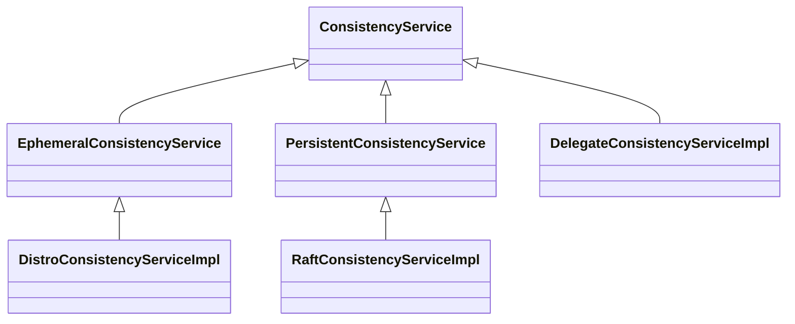
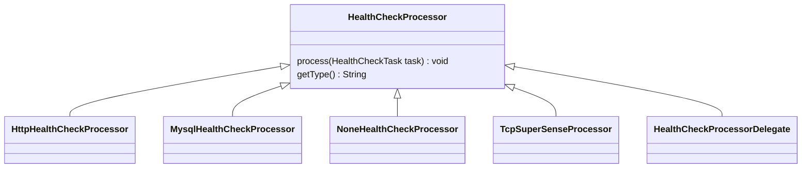

# Nacos Server

## Naming Server

service —> cluster —> instance


service: 代表服务提供者

cluster: 代表服务提供者的集群分组

instance：代表服务提供者的各个实例

### 服务注册

#### 接口流程

```sequence
InstanceController（register） -> InstanceController（register）: create Instance from http request
InstanceController（register） -> ServiceManager: registerInstance 
ServiceManager -> ServiceManager: create empty Service
ServiceManager -> Service: init
Service -> HealthCheckTask: start task \n ClientBeatCheckTask(监测服务是否变动push到客户端) \n HeathCheckTask (向Client发送心跳进行监控检查)
HealthCheckTask -> HealthCheckProcessor: process \n HealthCheckProcessor(通过ip+端口+http协议) \n TcpSuperSenseProcessor(通过ip+端口+TCP协议) \n ...
HealthCheckProcessor -> Nacos Clinets 服务注册者: 执行健康检查
ServiceManager -> ServiceManager: create new Instances
ServiceManager -> ConsistencyService: put()

```

#### ConsistencyService

ConsistencyService接口继承关系图：


PersistentConsistencyService：持久化的一致性服务

EphemeralConsistencyService：短暂的一致性服务

RaftConsistencyServiceImpl：负责在Raft集群内保持数据持久的一致性

DistroConsistencyServiceImpl：负责在内存Map中保存数据，维持数据短暂的一致性

DelegateConsistencyServiceImpl：代理服务，负责将数据交由以上2种服务来处理

##### RaftConsistencyServiceImpl的put实现

```sequence
title: RaftConsistencyServiceImpl的put实现
ServiceManager -> RaftConsistencyServiceImpl: put()
RaftConsistencyServiceImpl -> RaftCore: signalPublish() \n save to RaftStore(File Cache) and publish
```

说明：通过Raft协议进行广播，具体Raft协议将有另一份md来说明

##### DistroConsistencyServiceImpl的put实现

```sequence
title: DistroConsistencyServiceImpl的put实现
ServiceManager -> DistroConsistencyServiceImpl: put()
DistroConsistencyServiceImpl -> DistroConsistencyServiceImpl: onPut()\n create Datum and save to dataStore(MAP)
DistroConsistencyServiceImpl -> Notifier: addTask()\n tasks(BlockingQueue)offer
Notifier -> Notifier: tasks take and handle
Notifier -> Notifier: run(): call RecordListener onChange or onDelete method
DistroConsistencyServiceImpl -> TaskDispatcher: addTask()\n tasks(BlockingQueue)offer
TaskDispatcher -> TaskDispatcher: run(): 
TaskDispatcher -> DataSyncer: create SyncTask and submit by dataSyncer

```

说明：

1. 构建Datum并添加到DataStore，DataStore是通过Map实现的
2. 往Notifier添加“任务”，Notifier线程会不断取出“任务”，通知到各个RecordListener。Service实现了RecordListener，会在服务新增时构建以上所说的service —> cluster —> instance三级关系
3. 往TaskDispatcher添加“任务”，TaskScheduler线程会不断取出“任务”，封装成SyncTask，将数据同步给集群中的各个Member

综上所述：不管注册上来的服务是短暂的或是非短暂的（短暂的服务是通过DistroConsistencyServiceImpl来进行一致性存储，存储在集群节点内存中；非短暂的服务是通过RaftConsistencyServiceImpl来进行一致性存储）都需要进行集群内的广播同步数据，实现数据一致性

### 服务修改
#### 接口流程

```sequence
InstanceController（update） -> InstanceController（update）: create Instance from http request
InstanceController（update） -> ServiceManager: updateInstance 
```

ServiceManager updateInstance方法将调用addInstance方法，在这里之后和服务注册逻辑就一样了

### HealthCheck

两个关键Task：

1. HealthCheckTask：通过一些TCP、HTTP等心跳手段(HealthCheckProcessor)，监测Nacos Client服务状态是否健康，并通过PushService UDP推送数据到相应Nacos Client
2. ClientBeatCheckTask：监测短暂的instance状态，如果过期则删除instance并通过PushService UDP推送到相应Nacos Client

#### HealthCheckProcessor

接口继承关系图：



HttpHealthCheckProcessor：通过HTTP协议调用Instance对应IP端口方式判断Instance是否健康
MysqlHealthCheckProcessor：如果Instance是Mysql实例则通过该Processor进行健康检查：获取jdbc连接，执行sql，判断返回值
NoneHealthCheckProcessor：不做实际的健康判断，do nothing
TcpSuperSenseProcessor：通过TCP协议(使用了NIO)调用Instance对应IP端口的方式判断Instance是否健康
HealthCheckProcessorDelegate：HttpHealthCheckProcessor的代理，通过该代理来具体使用以上某个Processor来进行监控检查

#### HealthCheckTask

HealthCheckTask执行流程（ HttpHealthCheckProcessor）

```sequence
title:HealthCheckTask HttpHealthCheckProcessor例子
HealthCheckTask -> HealthCheckTask: run()
HealthCheckTask -> HealthCheckProcessor: process()
HealthCheckProcessor -> HealthCheckProcessor: get cluster all instances
HealthCheckProcessor -> AsyncHttpClient.BoundRequestBuilder: execute http
AsyncHttpClient.BoundRequestBuilder -> HttpHealthCheckCallback: handler http response
HttpHealthCheckCallback -> HealthCheckCommon: checkOK() or checkFail()
HealthCheckCommon -> PushService: serviceChanged() \n publishEvent(ServiceChangeEvent)
PushService -> PushService: listener ServiceChangeEvent \n and udpPush to Nacos Clients
```

HttpHealthCheckProcessor使用HTTP协议访问Instances接口，根据HTTP返回码，判断Instance是否健康，然后通过UDP推送至Nacos Client

