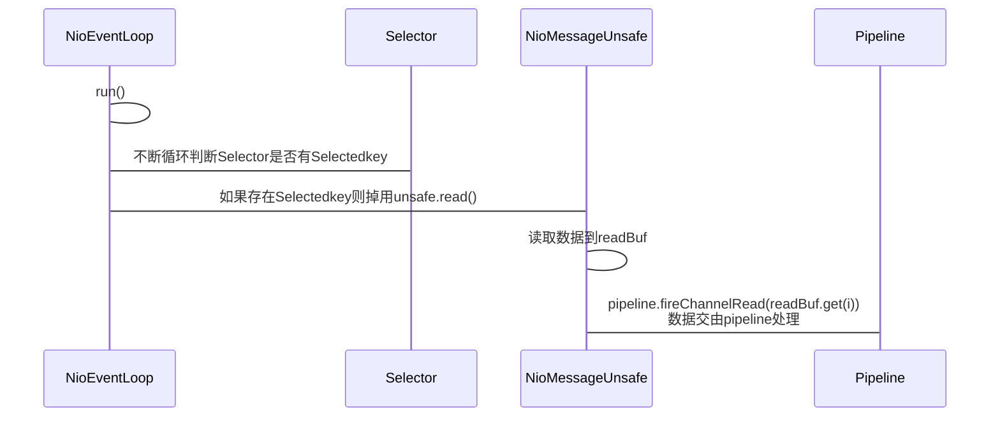

# Netty事件处理

源码参考：4.1.57.Final-SNAPSHOT

## NioEventLoop run

```java
NioEventLoop.class
//NioEventLoop的run方法循环尝试处理nio事件
//ParentGroup的NioEventLoop在启动的时候设置的InterestOps是SelectionKey.OP_ACCEPT
@Override
protected void run() {
    int selectCnt = 0;
    for (;;) {
        try {
            int strategy;
            try {
                strategy = selectStrategy.calculateStrategy(selectNowSupplier, hasTasks());
                switch (strategy) {
                case SelectStrategy.CONTINUE:
                    continue;
                case SelectStrategy.BUSY_WAIT:
                    // fall-through to SELECT since the busy-wait is not supported with NIO
                case SelectStrategy.SELECT:
                    long curDeadlineNanos = nextScheduledTaskDeadlineNanos();
                    if (curDeadlineNanos == -1L) {
                        curDeadlineNanos = NONE; // nothing on the calendar
                    }
                    nextWakeupNanos.set(curDeadlineNanos);
                    try {
                        if (!hasTasks()) {
                            strategy = select(curDeadlineNanos);
                        }
                    } finally {
                        // This update is just to help block unnecessary selector wakeups
                        // so use of lazySet is ok (no race condition)
                        nextWakeupNanos.lazySet(AWAKE);
                    }
                    // fall through
                default:
                }
            } catch (IOException e) {
                // If we receive an IOException here its because the Selector is messed up. Let's rebuild
                // the selector and retry. https://github.com/netty/netty/issues/8566
                rebuildSelector0();
                selectCnt = 0;
                handleLoopException(e);
                continue;
            }
            selectCnt++;
            cancelledKeys = 0;
            needsToSelectAgain = false;
            final int ioRatio = this.ioRatio;
            boolean ranTasks;
            if (ioRatio == 100) {
                try {
                    if (strategy > 0) {
                        processSelectedKeys();
                    }
                } finally {
                    // Ensure we always run tasks.
                    ranTasks = runAllTasks();
                }
            } else if (strategy > 0) {
                final long ioStartTime = System.nanoTime();
                try {
                    processSelectedKeys();
                } finally {
                    // Ensure we always run tasks.
                    final long ioTime = System.nanoTime() - ioStartTime;
                    ranTasks = runAllTasks(ioTime * (100 - ioRatio) / ioRatio);
                }
            } else {
                ranTasks = runAllTasks(0); // This will run the minimum number of tasks
            }
            if (ranTasks || strategy > 0) {
                if (selectCnt > MIN_PREMATURE_SELECTOR_RETURNS && logger.isDebugEnabled()) {
                    logger.debug("Selector.select() returned prematurely {} times in a row for Selector {}.",
                            selectCnt - 1, selector);
                }
                selectCnt = 0;
            } else if (unexpectedSelectorWakeup(selectCnt)) { // Unexpected wakeup (unusual case)
                selectCnt = 0;
            }
        } catch (CancelledKeyException e) {
            // Harmless exception - log anyway
            if (logger.isDebugEnabled()) {
                logger.debug(CancelledKeyException.class.getSimpleName() + " raised by a Selector {} - JDK bug?",
                        selector, e);
            }
        } catch (Error e) {
            throw (Error) e;
        } catch (Throwable t) {
            handleLoopException(t);
        } finally {
            // Always handle shutdown even if the loop processing threw an exception.
            try {
                if (isShuttingDown()) {
                    closeAll();
                    if (confirmShutdown()) {
                        return;
                    }
                }
            } catch (Error e) {
                throw (Error) e;
            } catch (Throwable t) {
                handleLoopException(t);
            }
        }
    }
```

1. NioEventLoop的run方法循环尝试处理nio事件
2. ParentGroup的NioEventLoop在启动的时候设置的InterestOps是SelectionKey.OP_ACCEPT

## processSelectedKeys

## 大体流程



## 总结：

1. NioEventLoop线程run方法，不断循环从selector中判断是否有未处理的Selectedkey
2. 如果存在则调用unsafe.read进行读取，unsafe的实现是：NioMessageUnsafe
3. NioMessageUnsafe的read方法，将数据读取写到readBuf（List<Object>）
4. 然后调用pipeline.fireChannelRead(readBuf.get(i));将数据交由pipeline管道进行处理

## 拆包

对于粘包问题，Netty通过拆包器来进行分包，拆包器有：

1. 固定长度的拆包器 FixedLengthFrameDecoder

   每个应用层数据包的都拆分成都是固定长度的大小，比如 1024字节。

2. 行拆包器 LineBasedFrameDecoder

   每个应用层数据包，都以换行符作为分隔符，进行分割拆分。

3. 分隔符拆包器 DelimiterBasedFrameDecoder

   每个应用层数据包，都通过自定义的分隔符，进行分割拆分。

4. 基于数据包长度的拆包器 LengthFieldBasedFrameDecoder

   将应用层数据包的长度，作为接收端应用层数据包的拆分依据。按照应用层数据包的大小，拆包。这个拆包器，有一个要求，就是应用层协议中包含数据包的长度。