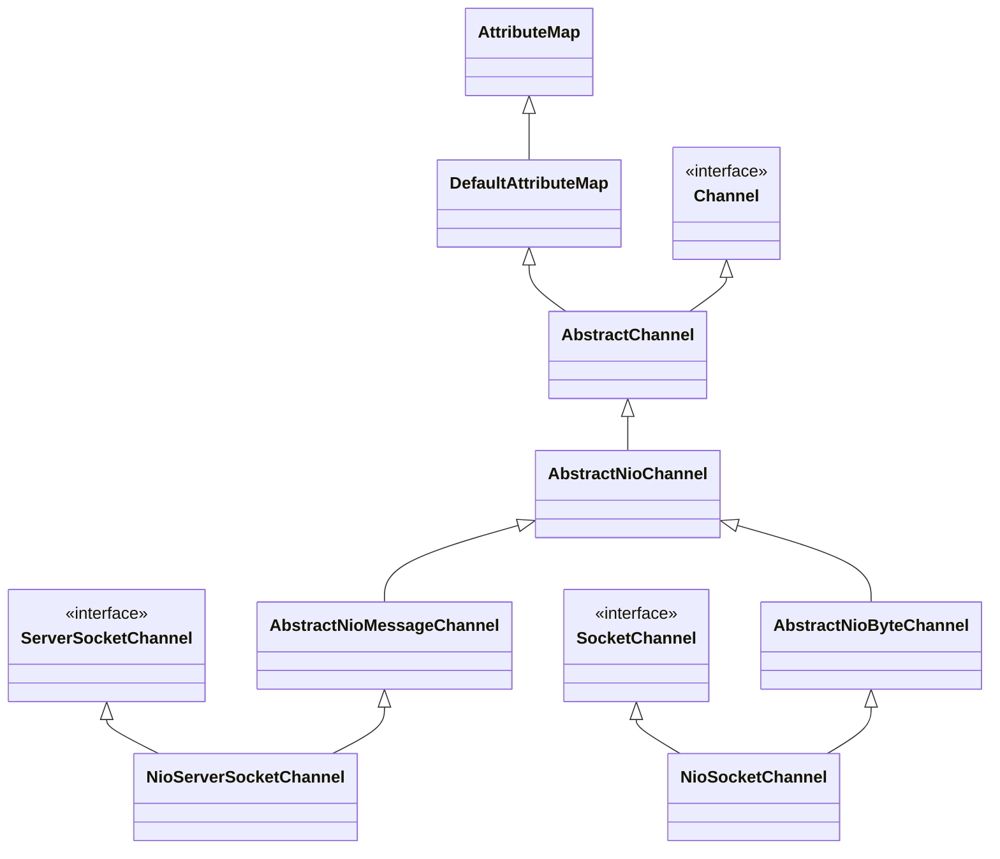

# Netty OP_Accept And OP_Read

源码参考：4.1.57.Final-SNAPSHOT

## NioEventLoop run

```java
NioEventLoop.class
//NioEventLoop的run方法循环尝试处理nio事件
//ParentGroup的NioEventLoop在启动的时候设置的InterestOps是SelectionKey.OP_ACCEPT
//NioEventLoop不仅需要处理nio select还需要执行task
@Override
protected void run() {
    int selectCnt = 0;
    for (;;) {
        try {
            int strategy;
            try {
                //使用selectStrategy判断当前循环的策略(读取Nio select还是执行task)
                //strategy > 0 的时候表示读取NIO select否则执行task任务
                strategy = selectStrategy.calculateStrategy(selectNowSupplier, hasTasks());
                switch (strategy) {
                case SelectStrategy.CONTINUE:
                    continue;
                case SelectStrategy.BUSY_WAIT:
                    // fall-through to SELECT since the busy-wait is not supported with NIO
                case SelectStrategy.SELECT:
                    long curDeadlineNanos = nextScheduledTaskDeadlineNanos();
                    if (curDeadlineNanos == -1L) {
                        curDeadlineNanos = NONE; // nothing on the calendar
                    }
                    nextWakeupNanos.set(curDeadlineNanos);
                    try {
                        if (!hasTasks()) {
                            strategy = select(curDeadlineNanos);
                        }
                    } finally {
                        // This update is just to help block unnecessary selector wakeups
                        // so use of lazySet is ok (no race condition)
                        nextWakeupNanos.lazySet(AWAKE);
                    }
                    // fall through
                default:
                }
            } catch (IOException e) {
                // If we receive an IOException here its because the Selector is messed up. Let's rebuild
                // the selector and retry. https://github.com/netty/netty/issues/8566
                rebuildSelector0();
                selectCnt = 0;
                handleLoopException(e);
                continue;
            }
            selectCnt++;
            cancelledKeys = 0;
            needsToSelectAgain = false;
            final int ioRatio = this.ioRatio;
            boolean ranTasks;
            //ioRatio表示执行task的比率，100的话表示select之后执行所有task
            //ioRatio 默认50
            if (ioRatio == 100) {
                try {
                    //strategy > 0 表示存在nio事件
                    if (strategy > 0) {
                        //处理selectionKeys
                        processSelectedKeys();
                    }
                } finally {
                    // Ensure we always run tasks.
                    //ioRatio == 100执行所有有Task
                    ranTasks = runAllTasks();
                }
            } else if (strategy > 0) {
                final long ioStartTime = System.nanoTime();
                try {
                    processSelectedKeys();
                } finally {
                    // Ensure we always run tasks.
                    // 执行Task但是指定了deadline
                    final long ioTime = System.nanoTime() - ioStartTime;
                    ranTasks = runAllTasks(ioTime * (100 - ioRatio) / ioRatio);
                }
            } else {
                ranTasks = runAllTasks(0); // This will run the minimum number of tasks
            }
            if (ranTasks || strategy > 0) {
                if (selectCnt > MIN_PREMATURE_SELECTOR_RETURNS && logger.isDebugEnabled()) {
                    logger.debug("Selector.select() returned prematurely {} times in a row for Selector {}.",
                            selectCnt - 1, selector);
                }
                selectCnt = 0;
            } else if (unexpectedSelectorWakeup(selectCnt)) { // Unexpected wakeup (unusual case)
                selectCnt = 0;
            }
        } catch (CancelledKeyException e) {
            // Harmless exception - log anyway
            if (logger.isDebugEnabled()) {
                logger.debug(CancelledKeyException.class.getSimpleName() + " raised by a Selector {} - JDK bug?",
                        selector, e);
            }
        } catch (Error e) {
            throw (Error) e;
        } catch (Throwable t) {
            handleLoopException(t);
        } finally {
            // Always handle shutdown even if the loop processing threw an exception.
            try {
                if (isShuttingDown()) {
                    closeAll();
                    if (confirmShutdown()) {
                        return;
                    }
                }
            } catch (Error e) {
                throw (Error) e;
            } catch (Throwable t) {
                handleLoopException(t);
            }
        }
    }
```

NioEventLoop线程不仅仅需要处理NIO事件，也同时兼顾处理一些Runnable Task，所以在for循环中每次执行完processSelectedKeys都需要尝试执行runAllTasks进行任务处理。

###　selectStrategy

```java
DefaultSelectStrategy.class
//select策略
@Override
public int calculateStrategy(IntSupplier selectSupplier, boolean hasTasks) throws Exception {
    //如果当前存在Task需要处理，则看下nio selector是否有事件(task的处理都在nio事件处理完成之后再处理)
    //如果不存在Task,则直接返回0
    return hasTasks ? selectSupplier.get() : SelectStrategy.SELECT;
}
```

如果当前存在Task需要处理，则看下nio selector是否有事件(task的处理都在nio事件处理完成之后再处理)，如果不存在Task,则直接返回0

### ioRatio

ioRatio表示执行task的比率，100的话表示select之后执行所有task，默认50

1. NioEventLoop的run方法循环尝试处理nio事件
2. ParentGroup的NioEventLoop在启动的时候设置的InterestOps是SelectionKey.OP_ACCEPT
3. NioEventLoop不仅需要处理nio select还需要执行task

### processSelectedKeys

```java
NioEventLoop.class.
    
private void processSelectedKey(SelectionKey k, AbstractNioChannel ch) {
        final AbstractNioChannel.NioUnsafe unsafe = ch.unsafe();
    	//selectionKey合规性检测
        if (!k.isValid()) {
            final EventLoop eventLoop;
            try {
                eventLoop = ch.eventLoop();
            } catch (Throwable ignored) {
                // If the channel implementation throws an exception because there is no event loop, we ignore this
                // because we are only trying to determine if ch is registered to this event loop and thus has authority
                // to close ch.
                return;
            }
            // Only close ch if ch is still registered to this EventLoop. ch could have deregistered from the event loop
            // and thus the SelectionKey could be cancelled as part of the deregistration process, but the channel is
            // still healthy and should not be closed.
            // See https://github.com/netty/netty/issues/5125
            if (eventLoop == this) {
                // close the channel if the key is not valid anymore
                unsafe.close(unsafe.voidPromise());
            }
            return;
        }

        try {
            int readyOps = k.readyOps();
            // We first need to call finishConnect() before try to trigger a read(...) or write(...) as otherwise
            // the NIO JDK channel implementation may throw a NotYetConnectedException.
            //处理SelectionKey.OP_CONNECT事件
            if ((readyOps & SelectionKey.OP_CONNECT) != 0) {
                // remove OP_CONNECT as otherwise Selector.select(..) will always return without blocking
                // See https://github.com/netty/netty/issues/924
                int ops = k.interestOps();
                ops &= ~SelectionKey.OP_CONNECT;
                k.interestOps(ops);

                unsafe.finishConnect();
            }

            // Process OP_WRITE first as we may be able to write some queued buffers and so free memory.
            //处理SelectionKey.OP_WRITE事件
            if ((readyOps & SelectionKey.OP_WRITE) != 0) {
                // Call forceFlush which will also take care of clear the OP_WRITE once there is nothing left to write
                ch.unsafe().forceFlush();
            }

            // Also check for readOps of 0 to workaround possible JDK bug which may otherwise lead
            // to a spin loop
            //处理SelectionKey.OP_READ 和 SelectionKey.OP_ACCEPT事件
            if ((readyOps & (SelectionKey.OP_READ | SelectionKey.OP_ACCEPT)) != 0 || readyOps == 0) {
                //使用Unsafe进行读取
                unsafe.read();
            }
        } catch (CancelledKeyException ignored) {
            unsafe.close(unsafe.voidPromise());
        }
    }
```

## Unsafe Read(NioMessageUnsafe)

NioMessageUnsafe的read主要就是处理Accept, Read数据的话是NioSocketChannel的NioSocketChannelUnsafe来处理

```java
NioMessageUnsafe.class
    
@Override
public void read() {
    assert eventLoop().inEventLoop();
    final ChannelConfig config = config();
    final ChannelPipeline pipeline = pipeline();
    final RecvByteBufAllocator.Handle allocHandle = unsafe().recvBufAllocHandle();
    allocHandle.reset(config);
    boolean closed = false;
    Throwable exception = null;
    try {
        try {
            do {
                //“读取”消息，将消息加入到readBuf中
                //其实这个“读取”仅仅只是Accept了一下请求，将nio SocketChannel封装成NioSocketChannel加入到readBuf
                int localRead = doReadMessages(readBuf);
                if (localRead == 0) {
                    break;
                }
                if (localRead < 0) {
                    closed = true;
                    break;
                }
                allocHandle.incMessagesRead(localRead);
            } while (allocHandle.continueReading());
        } catch (Throwable t) {
            exception = t;
        }
        int size = readBuf.size();
        for (int i = 0; i < size; i ++) {
            readPending = false;
            //调用pipeline fireChannelRead开始读取数据
            pipeline.fireChannelRead(readBuf.get(i));
        }
        readBuf.clear();
        allocHandle.readComplete();
        //调用pipeline fireChannelReadComplete处理读取结束逻辑
        pipeline.fireChannelReadComplete();
        if (exception != null) {
            closed = closeOnReadError(exception);
            pipeline.fireExceptionCaught(exception);
        }
        if (closed) {
            inputShutdown = true;
            if (isOpen()) {
                close(voidPromise());
            }
        }
    } finally {
        // Check if there is a readPending which was not processed yet.
        // This could be for two reasons:
        // * The user called Channel.read() or ChannelHandlerContext.read() in channelRead(...) method
        // * The user called Channel.read() or ChannelHandlerContext.read() in channelReadComplete(...) method
        //
        // See https://github.com/netty/netty/issues/2254
        if (!readPending && !config.isAutoRead()) {
            removeReadOp();
        }
    }
}
```

### doReadMessages

```java
NioServerSocketChannel.class
    
@Override
protected int doReadMessages(List<Object> buf) throws Exception {
    //通过java channel accept connection,并获取到SocketChannel
    SocketChannel ch = SocketUtils.accept(javaChannel());
    try {
        if (ch != null) {
            //将SocketChannel封装成NioSocketChannel并加入到buf
            buf.add(new NioSocketChannel(this, ch));
            return 1;
        }
    } catch (Throwable t) {
        logger.warn("Failed to create a new channel from an accepted socket.", t);
        try {
            ch.close();
        } catch (Throwable t2) {
            logger.warn("Failed to close a socket.", t2);
        }
    }
    return 0;
}
```

**doReadMessages方法名称包括“read”其实并不是真实的读取，而是accept请求，封装NioSocketChannel而已**

构建NioSocketChannel之后，调用pipeline fireChannelRead并传入NioSocketChannel。

### pipeline.fireChannelRead

```java
ServerBootstrap$ServerBootstrapAcceptor
//这是pipeline其中的一个环节，由AbstractBootstrap在init channel的时候添加到pipeline当中
public void channelRead(ChannelHandlerContext ctx, Object msg) {
    //这个msg就是NioSocketChannel
    final Channel child = (Channel) msg;
    child.pipeline().addLast(childHandler);
    setChannelOptions(child, childOptions, logger);
    setAttributes(child, childAttrs);
    try {
        //将NioSocketChannel注册到ChildGroup当中去
        childGroup.register(child).addListener(new ChannelFutureListener() {
            @Override
            public void operationComplete(ChannelFuture future) throws Exception {
                if (!future.isSuccess()) {
                    forceClose(child, future.cause());
                }
            }
        });
    } catch (Throwable t) {
        forceClose(child, t);
    }
}
```

ServerBootstrap$ServerBootstrapAcceptor是pipeline其中的一个环节，由AbstractBootstrap在init channel的时候添加到pipeline当中，用于处理Accept事件，主要就是将构建好的NioSocketChannel注册到ChildGroup当中。

这里的register流程和NioServerSocketChannel的register流程是一致的，注册NioSocketChannel到EventLoop之后，EventLoop将启动开始监听SelectionKey.OP_READ事件。

当ChildGroup的EventLoop接受到Read事件之后，同样进入pipeline处理，但是唯一同步的是ChildGroup的EventLoop中的pipeline没有ServerBootstrapAcceptor

## NioSocketChannel

NioServerSocketChannel doReadMessages方法中Accept connection然后构建NioSocketChannel，这里看下NioSocketChannel的构建

### 继承关系(对比NioServerSocketChannel)



从基础关系可以看到NioSocketChannel和NioServerSocketChannel非常类似，都是AbstractNioChannel的之类。

差别在于NioSocketChannel继承于AbstractNioByteChannel，而NioServerSocketChannel继承于AbstractNioMessageChannel

然后来看下AbstractNioByteChannel和AbstractNioMessageChannel的一些差异：

AbstractNioByteChannel：

```java
AbstractNioByteChannel.class
    
protected AbstractNioByteChannel(Channel parent, SelectableChannel ch) {
    //这里指定了readInterestOp为SelectionKey.OP_READ
        super(parent, ch, SelectionKey.OP_READ);
    }
```
AbstractNioMessageChannel:

```java
AbstractNioMessageChannel.class
    
protected AbstractNioMessageChannel(Channel parent, SelectableChannel ch, int readInterestOp) {
    //这里没有指定readInterestOp而是由子类处理，其子类NioServerSocketChannel指定的readInterestOp是SelectionKey.ACCEPT
    super(parent, ch, readInterestOp);
}
```

由此可见：NioServerSocketChannel主要就是处理Accept事件，而NioSocketChannel就是处理Read事件

这里还需要注意一下：NioSocketChannel的unsafe的实现并不是NioMessageUnsafe而是NioSocketChannelUnsafe

## Unsafe Read(NioSocketChannelUnsafe)

NioSocketChannelUnsafe read主要处理Read事件而不是Accept

```java
AbstractNioByteChannel&NioByteUnsafe
NioByteUnsafe(NioSocketChannelUnsafe的父类)
    
@Override
public final void read() {
    final ChannelConfig config = config();
    if (shouldBreakReadReady(config)) {
        clearReadPending();
        return;
    }
    final ChannelPipeline pipeline = pipeline();
    final ByteBufAllocator allocator = config.getAllocator();
    final RecvByteBufAllocator.Handle allocHandle = recvBufAllocHandle();
    allocHandle.reset(config);
    ByteBuf byteBuf = null;
    boolean close = false;
    try {
        do {
            byteBuf = allocHandle.allocate(allocator);
            allocHandle.lastBytesRead(doReadBytes(byteBuf));
            if (allocHandle.lastBytesRead() <= 0) {
                // nothing was read. release the buffer.
                byteBuf.release();
                byteBuf = null;
                close = allocHandle.lastBytesRead() < 0;
                if (close) {
                    // There is nothing left to read as we received an EOF.
                    readPending = false;
                }
                break;
            }
            allocHandle.incMessagesRead(1);
            readPending = false;
            pipeline.fireChannelRead(byteBuf);
            byteBuf = null;
        } while (allocHandle.continueReading());
        allocHandle.readComplete();
        pipeline.fireChannelReadComplete();
        if (close) {
            closeOnRead(pipeline);
        }
    } catch (Throwable t) {
        handleReadException(pipeline, byteBuf, t, close, allocHandle);
    } finally {
        // Check if there is a readPending which was not processed yet.
        // This could be for two reasons:
        // * The user called Channel.read() or ChannelHandlerContext.read() in channelRead(...) method
        // * The user called Channel.read() or ChannelHandlerContext.read() in channelReadComplete(...) method
        //
        // See https://github.com/netty/netty/issues/2254
        if (!readPending && !config.isAutoRead()) {
            removeReadOp();
        }
    }
}
```

## 总结：

1. ParentGroup NioEventLoop线程run方法，不断循环从selector中判断是否有未处理的 Accept Selectedkey
2. 如果存在则调用unsafe.read进行读取，unsafe的实现是：NioMessageUnsafe
3. NioMessageUnsafe的read方法，通过java channel accept connect并构建NioSocketChannel,将数据读取写到readBuf（List<Object> 这个Object其实就是NioSocketChannel）
4. 然后调用pipeline.fireChannelRead(readBuf.get(i));将数据交由pipeline管道进行处理
5. 管道中的ServerBootstrapAcceptor将NioSocketChannel注册到ChildGroup
6. ChildGourp EventLoop启动，开始监听Read事件
7. 如果存在事件则调用unsafe.read进行读取，unsafe的实现是：NioSocketChannelUnsafe
8. NioSocketChannelUnsafe的read方法，将数据读入到ByteBuf
9. 然后调用pipeline.fireChannelRead，将数据交由pipeline管道进行处理

## 拆包

对于粘包问题，Netty通过拆包器来进行分包，拆包器有：

1. 固定长度的拆包器 FixedLengthFrameDecoder

   每个应用层数据包的都拆分成都是固定长度的大小，比如 1024字节。

2. 行拆包器 LineBasedFrameDecoder

   每个应用层数据包，都以换行符作为分隔符，进行分割拆分。

3. 分隔符拆包器 DelimiterBasedFrameDecoder

   每个应用层数据包，都通过自定义的分隔符，进行分割拆分。

4. 基于数据包长度的拆包器 LengthFieldBasedFrameDecoder

   将应用层数据包的长度，作为接收端应用层数据包的拆分依据。按照应用层数据包的大小，拆包。这个拆包器，有一个要求，就是应用层协议中包含数据包的长度。