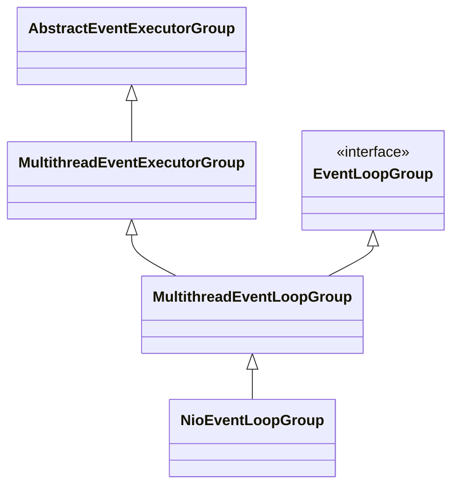
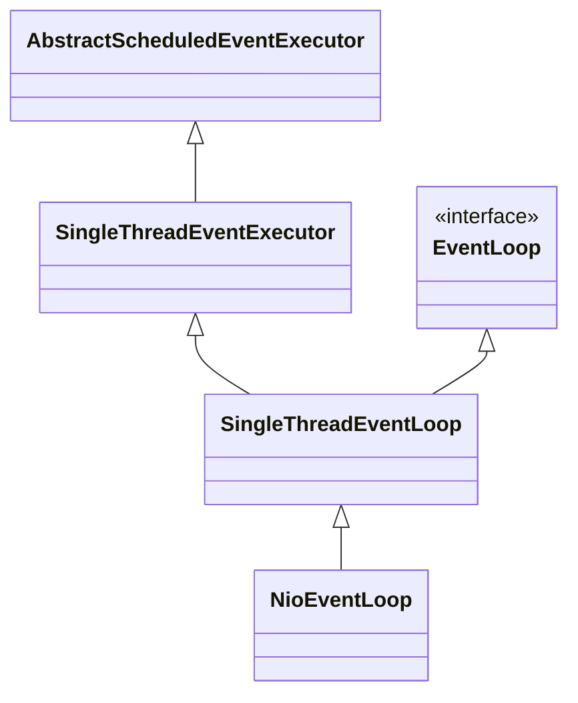
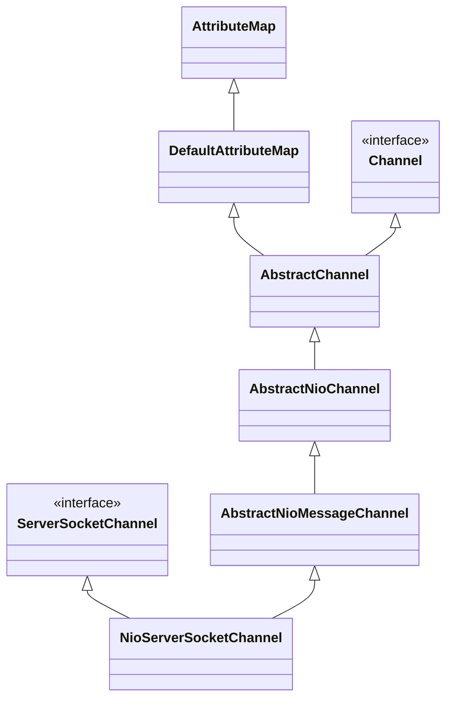

# Netty初始化构建过程

源码参考：4.1.57.Final-SNAPSHOT

## NioEventLoopGroup

### 继承关系



### 构建

```java
MultithreadEventExecutorGroup.class
//核心构建流程
protected MultithreadEventExecutorGroup(int nThreads, Executor executor,
                                            EventExecutorChooserFactory chooserFactory, Object... args) {
        if (nThreads <= 0) {
            throw new IllegalArgumentException(String.format("nThreads: %d (expected: > 0)", nThreads));
        }
    	//通过默认的ThreadFactory构建Executor
        if (executor == null) {
            executor = new ThreadPerTaskExecutor(newDefaultThreadFactory());
        }
    	//构建EventExecutor数组，数量默认为CPU核心数*2
        children = new EventExecutor[nThreads];

        for (int i = 0; i < nThreads; i ++) {
            boolean success = false;
            try {
                //依次创建线程，创建的过程由NioEventLoopGroup具体实现
                children[i] = newChild(executor, args);
                success = true;
            } catch (Exception e) {
                // TODO: Think about if this is a good exception type
                throw new IllegalStateException("failed to create a child event loop", e);
            } finally {
                //如果创建过程中发生错误，则依次关闭创建好的线程
                if (!success) {
                    for (int j = 0; j < i; j ++) {
                        children[j].shutdownGracefully();
                    }

                    for (int j = 0; j < i; j ++) {
                        EventExecutor e = children[j];
                        try {
                            while (!e.isTerminated()) {
                                e.awaitTermination(Integer.MAX_VALUE, TimeUnit.SECONDS);
                            }
                        } catch (InterruptedException interrupted) {
                            // Let the caller handle the interruption.
                            Thread.currentThread().interrupt();
                            break;
                        }
                    }
                }
            }
        }
    	//通过children创建EventExecutorChooser
    	//EventExecutorChooser使用某种算法选择对应children中的EventExecutor
        chooser = chooserFactory.newChooser(children);

        final FutureListener<Object> terminationListener = new FutureListener<Object>() {
            @Override
            public void operationComplete(Future<Object> future) throws Exception {
                if (terminatedChildren.incrementAndGet() == children.length) {
                    terminationFuture.setSuccess(null);
                }
            }
        };
    	//为EventExecutor注册销毁回调
        for (EventExecutor e: children) {
            e.terminationFuture().addListener(terminationListener);
        }

        Set<EventExecutor> childrenSet = new LinkedHashSet<EventExecutor>(children.length);
        Collections.addAll(childrenSet, children);
        readonlyChildren = Collections.unmodifiableSet(childrenSet);
    }
```

主要其实就是

1. 构建EventExecutor数组，不指定长度默认为CPU核心数*2
2. 构建EventExecutorChooser用于选择EventExecutor，EventExecutorChooser根据长度是否是2的n次幂选择不同的选择策略

## NioEventLoop

以我理解，NioEventLoop就是每一个工作线程用于从select获取selectKey并进行进一步处理，NioEventLoop由NioEventLoopGroup进行维护
### 继承关系



### 构建

```java
NioEventLoop.class
//NioEventLoop的构建由上文NioEventLoopGroup children[i] = newChild(executor, args);触发
NioEventLoop(NioEventLoopGroup parent, Executor executor, SelectorProvider selectorProvider,
             SelectStrategy strategy, RejectedExecutionHandler rejectedExecutionHandler,
             EventLoopTaskQueueFactory queueFactory) {
    //super主要是复制
    super(parent, executor, false, newTaskQueue(queueFactory), newTaskQueue(queueFactory),
            rejectedExecutionHandler);
    this.provider = ObjectUtil.checkNotNull(selectorProvider, "selectorProvider");
    this.selectStrategy = ObjectUtil.checkNotNull(strategy, "selectStrategy");
    //通过SelectorProvider获取Selector并通过SelectorTuple进行封装
    final SelectorTuple selectorTuple = openSelector();
    this.selector = selectorTuple.selector;
    this.unwrappedSelector = selectorTuple.unwrappedSelector;
}
```

NioEventLoop最主要就是获取到了NIO的selector

## DefaultChannelPipeline

DefaultChannelPipeline由NioServerSocketChannel进行维护，也由NioServerSocketChannel在创建过程中进行创建。

DefaultChannelPipeline构建的时候默认有2个固定节点，一个HeadContext一个TailContext

DefaultChannelPipeline管道中其实维护的是Context，Context中维护着Handler，Context其实可以看作Pipeline和Handler的桥梁

### addLast方法：

```java
@Override
public final ChannelPipeline addLast(EventExecutorGroup group, String name, ChannelHandler handler) {
    final AbstractChannelHandlerContext newCtx;
    synchronized (this) {
        checkMultiplicity(handler);
      	//将handler封装成Context
        newCtx = newContext(group, filterName(name, handler), handler);
				//将context加入到pipeline节点中
        addLast0(newCtx);

        // If the registered is false it means that the channel was not registered on an eventLoop yet.
        // In this case we add the context to the pipeline and add a task that will call
        // ChannelHandler.handlerAdded(...) once the channel is registered.
      	//如果channel没有registered则将该context加入PendingHandlerCallback链
      if (!registered) {
            newCtx.setAddPending();
            callHandlerCallbackLater(newCtx, true);
            return this;
        }

        EventExecutor executor = newCtx.executor();
        if (!executor.inEventLoop()) {
          //调用handler的callHandlerAdded方法
            callHandlerAddedInEventLoop(newCtx, executor);
            return this;
        }
    }
  //调用handler的callHandlerAdded方法
    callHandlerAdded0(newCtx);
    return this;
}
```

## Unsafe

提供：

1. register
2. bind
3. connect
4. write

等实现

## NioServerSocketChannel

### 继承关系



### 构建

NioServerSocketChannel构造方法：

```java
NioServerSocketChannel.class
    
public NioServerSocketChannel() {
    //通过SelectorProvider获取java nio ServerSocketChannel
    this(newSocket(DEFAULT_SELECTOR_PROVIDER));
}

public NioServerSocketChannel(ServerSocketChannel channel) {
    	//super主要就是赋值，保存了java channel和interestOp
        super(null, channel, SelectionKey.OP_ACCEPT);
        config = new NioServerSocketChannelConfig(this, javaChannel().socket());
}

//通过SelectorProvider获取java nio ServerSocketChannel
private static ServerSocketChannel newSocket(SelectorProvider provider) {
        try {
            /**
             *  Use the {@link SelectorProvider} to open {@link SocketChannel} and so remove condition in
             *  {@link SelectorProvider#provider()} which is called by each ServerSocketChannel.open() otherwise.
             *
             *  See <a href="https://github.com/netty/netty/issues/2308">#2308</a>.
             */
            return provider.openServerSocketChannel();
        } catch (IOException e) {
            throw new ChannelException(
                    "Failed to open a server socket.", e);
        }
    }
```

AbstractNioChannel构造方法：设置ServerSocketChannel configureBlocking(false)设置成非阻塞式模式

```java
protected AbstractNioChannel(Channel parent, SelectableChannel ch, int readInterestOp) {
    super(parent);
    this.ch = ch;
    this.readInterestOp = readInterestOp;
    try {
        ch.configureBlocking(false);
    } catch (IOException e) {
        try {
            ch.close();
        } catch (IOException e2) {
            logger.warn(
                        "Failed to close a partially initialized socket.", e2);
        }

        throw new ChannelException("Failed to enter non-blocking mode.", e);
    }
}
```

AbstractChannel构造方法：初始化ChannelId、NioMessageUnsafe、**DefaultChannelPipeline**

```java
protected AbstractChannel(Channel parent) {
    this.parent = parent;
    id = newId();
    unsafe = newUnsafe();
    pipeline = newChannelPipeline();
}
```

### 初始化

```java
ServerBootstrap.class
  
void init(Channel channel) {
    	//为channel设置option
        setChannelOptions(channel, newOptionsArray(), logger);
    	//为channel设置attribute
        setAttributes(channel, attrs0().entrySet().toArray(EMPTY_ATTRIBUTE_ARRAY));

        ChannelPipeline p = channel.pipeline();

        final EventLoopGroup currentChildGroup = childGroup;
        final ChannelHandler currentChildHandler = childHandler;
        final Entry<ChannelOption<?>, Object>[] currentChildOptions;
        synchronized (childOptions) {
            currentChildOptions = childOptions.entrySet().toArray(EMPTY_OPTION_ARRAY);
        }
        final Entry<AttributeKey<?>, Object>[] currentChildAttrs = childAttrs.entrySet().toArray(EMPTY_ATTRIBUTE_ARRAY);
    	//新增ChannelInitializer主要对ChannelPipeline增加自定义的handler
        p.addLast(new ChannelInitializer<Channel>() {
            @Override
            public void initChannel(final Channel ch) {
                final ChannelPipeline pipeline = ch.pipeline();
                ChannelHandler handler = config.handler();
                if (handler != null) {
                    pipeline.addLast(handler);
                }

                ch.eventLoop().execute(new Runnable() {
                    @Override
                    public void run() {
                        pipeline.addLast(new ServerBootstrapAcceptor(
                                ch, currentChildGroup, currentChildHandler, currentChildOptions, currentChildAttrs));
                    }
                });
            }
        });
    }
```

1. setChannelOptions
2. setAttributes
3. pipeline addLast config handler
4. pipeline addLast ServerBootstrapAcceptor

## 总结

1. 首先创建2个 EventLoopGroup 线程池数组。数组默认大小CPU*2，方便chooser选择线程池时提高性能。
2. BootStrap 将 boss 设置为 group属性，将 worker 设置为 childer 属性。
3. 通过 bind 方法启动，内部重要方法为 initAndRegister 和 dobind 方法。
4. initAndRegister 方法会反射创建 NioServerSocketChannel 及其相关的 NIO 的对象， pipeline ， unsafe，同时也为 pipeline 初始了 head 节点和 tail 节点。同时也含有 NioServerSocketChannelConfig 对象。然后向 pipeline 添加自定义的处理器和 ServerBootstrapAcceptor 处理器。这个处理器用于分配接受的 请求给 worker 线程池。每次添加处理器都会创建一个相对应的 Context 作为 pipeline 的节点并包装 handler 对象。注册过程中会调用 NioServerSocketChannel 的 doRegister 方法注册读事件。
5. 在register0 方法成功以后调用在 dobind 方法中调用 doBind0 方法，该方法会 调用 NioServerSocketChannel 的 doBind 方法对 JDK 的 channel 和端口进行绑定，之后在调用 pipeline 的fireChannelActive 最后会调用 NioServerSocketChannel 的 doBeginRead 方法，将感兴趣的事件设置为Accept，完成 Netty 服务器的所有启动，并开始监听连接事件。

NioEventLoop维护着Selector，NioServerSocketChannel维护着Java channel，接下来需要通过register将selector和java channel进行关联，并设置interestOp