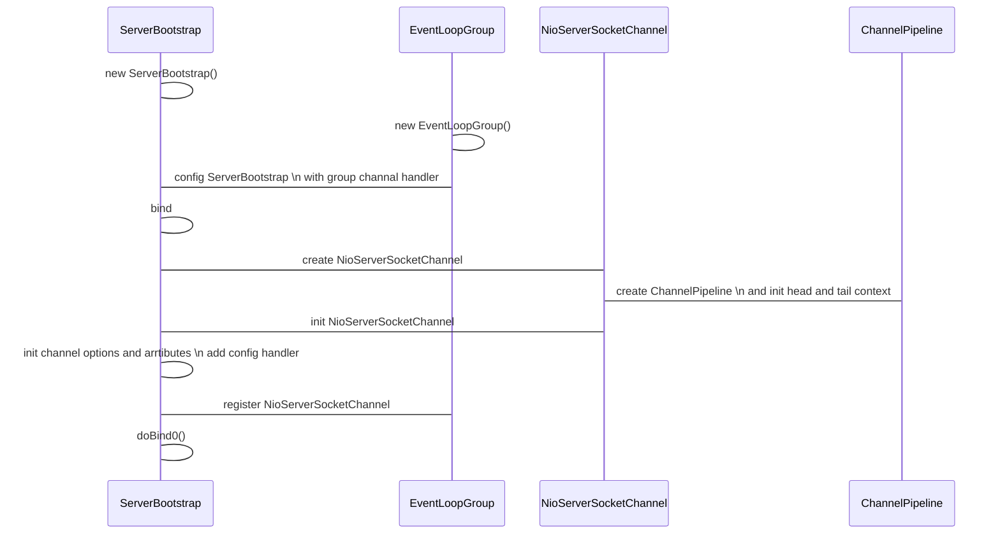
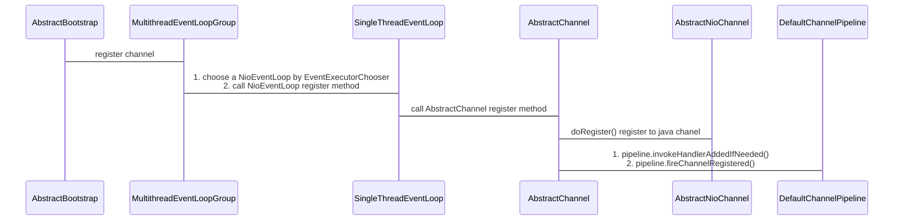

# Netty启动过程

源码参考：4.1.57.Final-SNAPSHOT

## Echo Example:

```java
EventLoopGroup bossGroup = new NioEventLoopGroup(1);
EventLoopGroup workerGroup = new NioEventLoopGroup();
final EchoServerHandler serverHandler = new EchoServerHandler();
try {
    ServerBootstrap b = new ServerBootstrap();
    b.group(bossGroup, workerGroup)
     .channel(NioServerSocketChannel.class)
     .option(ChannelOption.SO_BACKLOG, 100)
     .handler(new LoggingHandler(LogLevel.INFO))
     .childHandler(new ChannelInitializer<SocketChannel>() {
         @Override
         public void initChannel(SocketChannel ch) throws Exception {
             ChannelPipeline p = ch.pipeline();
             if (sslCtx != null) {
                 p.addLast(sslCtx.newHandler(ch.alloc()));
             }
             //p.addLast(new LoggingHandler(LogLevel.INFO));
             p.addLast(serverHandler);
         }
     });

    // Start the server.
    ChannelFuture f = b.bind(PORT).sync();
```



1. 构建ServerBootstrap并为其设置group（NioEventLoopGroup） channel（NioServerSocketChannel） handler（LoggingHandler） childHanlder（ChannelInitializer）等参数
2. 调用ServerBootstrap的bind方法绑定端口
3. bind方法主要构件NioServerSocketChannel并对其进行初始化
4. NioServerSocketChannel构建过程中会获取ServerSocketChannel，并初始化ChannelPipeline
5. ChannelPipeline（双向链表）初始化的时候会固定2个context：TailContext HeadContext
6. NioServerSocketChannel构建之后，对其进行初始化，设置options、arrtibutes以及ServerBootstrap设置的handler
7. 将NioServerSocketChannel注册到NioEventLoopGroup
8. 调用doBind0()，通过javaChanel（ServerSocketChannel）进行端口绑定

## 注册register




```java
AbstractBootstrap.class
    
final ChannelFuture initAndRegister() {
        Channel channel = null;
        try {
            //通过channelFactory构建channel即NioServerSocketChannel
            channel = channelFactory.newChannel();
            //初始化channel
            init(channel);
        } catch (Throwable t) {
            if (channel != null) {
                // channel can be null if newChannel crashed (eg SocketException("too many open files"))
                channel.unsafe().closeForcibly();
                // as the Channel is not registered yet we need to force the usage of the GlobalEventExecutor
                return new DefaultChannelPromise(channel, GlobalEventExecutor.INSTANCE).setFailure(t);
            }
            // as the Channel is not registered yet we need to force the usage of the GlobalEventExecutor
            return new DefaultChannelPromise(new FailedChannel(), GlobalEventExecutor.INSTANCE).setFailure(t);
        }
    	//注册channel到parentGroup
        ChannelFuture regFuture = config().group().register(channel);
        if (regFuture.cause() != null) {
            if (channel.isRegistered()) {
                channel.close();
            } else {
                channel.unsafe().closeForcibly();
            }
        }
        return regFuture;
    }
```
**注意这里注册的时候是注册到ParentGroup而不是ChildGroup**

```java

MultithreadEventLoopGroup.class
    
@Override
public ChannelFuture register(Channel channel) {
    //通过EventExecutorChooser获取一个NioEventLoop并调用其register方法,将channel注册到EventLoop中
    //这个channel就是指定的NioServerSocketChannel
    return next().register(channel);
}
```

```java
SingleThreadEventLoop.class

@Override
public ChannelFuture register(Channel channel) {
	//封装成DefaultChannelPromise
    return register(new DefaultChannelPromise(channel, this));
}

@Override
public ChannelFuture register(final ChannelPromise promise) {
    ObjectUtil.checkNotNull(promise, "promise");
    //通过channel的unsafe来进行注册
    promise.channel().unsafe().register(this, promise);
    return promise;
}
```
```java
AbstractUnsafe.class
    
@Override
public final void register(EventLoop eventLoop, final ChannelPromise promise) {
    //一些前置判断
    ObjectUtil.checkNotNull(eventLoop, "eventLoop");
    if (isRegistered()) {
        promise.setFailure(new IllegalStateException("registered to an event loop already"));
        return;
    }
    if (!isCompatible(eventLoop)) {
        promise.setFailure(
                new IllegalStateException("incompatible event loop type: " + eventLoop.getClass().getName()));
        return;
    }
    AbstractChannel.this.eventLoop = eventLoop;
    //判断是否在EventLoop线程中
    if (eventLoop.inEventLoop()) {
        //如果是则直接调用register0
        register0(promise);
    } else {
        //如果不是，则交由eventLoop来执行
        //这里eventLoop.execute有个重要操作就是启动eventLoop thread
        try {
            eventLoop.execute(new Runnable() {
                @Override
                public void run() {
                    register0(promise);
                }
            });
        } catch (Throwable t) {
            logger.warn(
                    "Force-closing a channel whose registration task was not accepted by an event loop: {}",
                    AbstractChannel.this, t);
            closeForcibly();
            closeFuture.setClosed();
            safeSetFailure(promise, t);
        }
    }
}
```
```java
AbstractNioChannel.class

@Override
protected void doRegister() throws Exception {
    boolean selected = false;
    for (;;) {
        try {
            //在这里将java nio channel和selector进行关联，并注册事件0，这里0其实没有任何意义，主要注册事件在doBeginRead中处理
            selectionKey = javaChannel().register(eventLoop().unwrappedSelector(), 0, this);
            return;
        } catch (CancelledKeyException e) {
            if (!selected) {
                // Force the Selector to select now as the "canceled" SelectionKey may still be
                // cached and not removed because no Select.select(..) operation was called yet.
                eventLoop().selectNow();
                selected = true;
            } else {
                // We forced a select operation on the selector before but the SelectionKey is still cached
                // for whatever reason. JDK bug ?
                throw e;
            }
        }
    }
}
```

在doRegister之后，两个关键方法：

1. pipeline.invokeHandlerAddedIfNeeded();
2. pipeline.fireChannelRegistered();
3. beginRead

#### 1.pipeline.invokeHandlerAddedIfNeeded()
```java
DefaultChannelPipeline.class
 
//核心逻辑就是调用PendingHandlerCallback所有节点的execute方法
private void callHandlerAddedForAllHandlers() {
        final PendingHandlerCallback pendingHandlerCallbackHead;
        synchronized (this) {
            assert !registered;

            // This Channel itself was registered.
            registered = true;

            pendingHandlerCallbackHead = this.pendingHandlerCallbackHead;
            // Null out so it can be GC'ed.
            this.pendingHandlerCallbackHead = null;
        }

        // This must happen outside of the synchronized(...) block as otherwise handlerAdded(...) may be called while
        // holding the lock and so produce a deadlock if handlerAdded(...) will try to add another handler from outside
        // the EventLoop.
        PendingHandlerCallback task = pendingHandlerCallbackHead;
        while (task != null) {
            task.execute();
            task = task.next;
        }
    }
```

PendingHandlerCallback的添加：在init channel的时候往调用ChannelPipeline addLast方法添加了一个ChannelInitializer，该ChannelInitializer就是PendingHandlerCallback或是添加在PendingHandlerCallback尾部

```java
ServerBootstrap.class
  
@Override
void init(Channel channel) {
    ......
    //此时调用addLast channel还没有register 所以ChannelInitializer将被作为PendingHandlerCallback或是添加到PendingHandlerCallback尾部节点，等待channel register之后进行调用
    p.addLast(new ChannelInitializer<Channel>() {
        @Override
        public void initChannel(final Channel ch) {
            final ChannelPipeline pipeline = ch.pipeline();
            ChannelHandler handler = config.handler();
            if (handler != null) {
                pipeline.addLast(handler);
            }

            ch.eventLoop().execute(new Runnable() {
                @Override
                public void run() {
                    pipeline.addLast(new ServerBootstrapAcceptor(
                            ch, currentChildGroup, currentChildHandler, currentChildOptions, currentChildAttrs));
                }
            });
        }
    });
}
```

#### 2.pipeline.fireChannelRegistered()

从pipeLine的头部HeadContext开始执行每个Context的channelRegistered方法（通过findContextInbound获取下一个Context）

例如LoggingHandler

```java
LoggingHandler.class
  
@Override
public void channelRegistered(ChannelHandlerContext ctx) throws Exception {
  //channelRegistered主要负责日志打印
    if (logger.isEnabled(internalLevel)) {
        logger.log(internalLevel, format(ctx, "REGISTERED"));
    }
  //fireChannelRegistered方法会通过findContextInbound获取下一个节点，并最终再次调用该节点的channelRegistered方法
    ctx.fireChannelRegistered();
}
```


## 绑定doBind0

在以上环节结束之后，channel构建初始化并注册完毕之后，执行doBind0方法

**doBind0核心在于调用pipleline的bind方法，会从pipeline的TailContext开始往头部方向，依次调用Context的bind方法，最终调用的是该Context包装的Handler的bind方法**

比如LoggingHandler还是对bind进行日志打印

**最终执行到头部HeadContext的bind方法，该bind方法又调用unsafe的bind方法**

unsafe bind主要两个步骤：

1. 调用channel的doBind方法，也就是我们之前设置的NioServerSocketChannel的doBind方法

```java
NioServerSocketChannel.class
  
@SuppressJava6Requirement(reason = "Usage guarded by java version check")
   @Override
   protected void doBind(SocketAddress localAddress) throws Exception {
       if (PlatformDependent.javaVersion() >= 7) {
           javaChannel().bind(localAddress, config.getBacklog());
       } else {
           javaChannel().socket().bind(localAddress, config.getBacklog());
       }
   }
```

2. 调用pipeline.fireChannelActive();从头部节点开始，告知pipeline中的所有节点，channel已经激活

LoggingHandler的channelActive依旧是进行日志打印

**HeadContext的channelActive将最终调用pipleline的read方法，从尾部节点开始向前调用所有节点的read方法**

**HeadContext的read方法又调用unsafe的beginRead方法最终：selectionKey.interestOps(interestOps | readInterestOp);将selectionKey的事件设置成最初设置的ACCPET事件**

## beginRead

```java
AbstractNioChannel.class
//之前在doRegister中关联java channel和selector的时候注册的事件是无意义的0，这里进行实际的interestOps设置
@Override
protected void doBeginRead() throws Exception {
    // Channel.read() or ChannelHandlerContext.read() was called
    final SelectionKey selectionKey = this.selectionKey;
    if (!selectionKey.isValid()) {
        return;
    }

    readPending = true;

    final int interestOps = selectionKey.interestOps();
    if ((interestOps & readInterestOp) == 0) {
        //设置interestOp，这里的readInterestOp是之前NioServerSocketChannel构建的时候设置的SelectionKey.OP_ACCEPT，如下所示。
        selectionKey.interestOps(interestOps | readInterestOp);
    }
}

NioServerSocketChannel.class
public NioServerSocketChannel(ServerSocketChannel channel) {
    	//super主要就是赋值，保存了java channel和interestOp
        super(null, channel, SelectionKey.OP_ACCEPT);
        config = new NioServerSocketChannelConfig(this, javaChannel().socket());
}
```

## EventLoop线程启动

上文在注册过程中，执行register0时会判断是否inEventLoop(是否在EventLoop线程中调用)，如果不是则封装成Runnable交由EventLoop处理，在EventLoop的execute方法中，会启动EventLoop线程

```java
SingleThreadEventExecutor.class(NioEventLoop的父类)
    
private void execute(Runnable task, boolean immediate) {
    boolean inEventLoop = inEventLoop();
    addTask(task);
    if (!inEventLoop) {
        //启动线程
        startThread();
        if (isShutdown()) {
            boolean reject = false;
            try {
                if (removeTask(task)) {
                    reject = true;
                }
            } catch (UnsupportedOperationException e) {
                // The task queue does not support removal so the best thing we can do is to just move on and
                // hope we will be able to pick-up the task before its completely terminated.
                // In worst case we will log on termination.
            }
            if (reject) {
                reject();
            }
        }
    }

    if (!addTaskWakesUp && immediate) {
        wakeup(inEventLoop);
    }
}

//启动线程 做一些状态处理
private void startThread() {
        if (state == ST_NOT_STARTED) {
            if (STATE_UPDATER.compareAndSet(this, ST_NOT_STARTED, ST_STARTED)) {
                boolean success = false;
                try {
                    doStartThread();
                    success = true;
                } finally {
                    if (!success) {
                        STATE_UPDATER.compareAndSet(this, ST_STARTED, ST_NOT_STARTED);
                    }
                }
            }
        }
    }
```


```java
SingleThreadEventExecutor.class(NioEventLoop的父类)
    
private void doStartThread() {
    assert thread == null;
    //启动线程
    executor.execute(new Runnable() {
        @Override
        public void run() {
            thread = Thread.currentThread();
            if (interrupted) {
                thread.interrupt();
            }

            boolean success = false;
            updateLastExecutionTime();
            try {
                //直接调用SingleThreadEventExecutor.this.run();执行具体逻辑
                SingleThreadEventExecutor.this.run();
                success = true;
            } catch (Throwable t) {
                logger.warn("Unexpected exception from an event executor: ", t);
            } finally {
                ......
            }
        }
    });
}
```

```java
NioEventLoop.class
//NioEventLoop的run方法循环尝试处理nio事件,具体怎么处理见其他md说明
@Override
protected void run() {
    int selectCnt = 0;
    for (;;) {
        try {
            int strategy;
            try {
                strategy = selectStrategy.calculateStrategy(selectNowSupplier, hasTasks());
                switch (strategy) {
                case SelectStrategy.CONTINUE:
                    continue;
                case SelectStrategy.BUSY_WAIT:
                    // fall-through to SELECT since the busy-wait is not supported with NIO
                case SelectStrategy.SELECT:
                    long curDeadlineNanos = nextScheduledTaskDeadlineNanos();
                    if (curDeadlineNanos == -1L) {
                        curDeadlineNanos = NONE; // nothing on the calendar
                    }
                    nextWakeupNanos.set(curDeadlineNanos);
                    try {
                        if (!hasTasks()) {
                            strategy = select(curDeadlineNanos);
                        }
                    } finally {
                        // This update is just to help block unnecessary selector wakeups
                        // so use of lazySet is ok (no race condition)
                        nextWakeupNanos.lazySet(AWAKE);
                    }
                    // fall through
                default:
                }
            } catch (IOException e) {
                // If we receive an IOException here its because the Selector is messed up. Let's rebuild
                // the selector and retry. https://github.com/netty/netty/issues/8566
                rebuildSelector0();
                selectCnt = 0;
                handleLoopException(e);
                continue;
            }
            selectCnt++;
            cancelledKeys = 0;
            needsToSelectAgain = false;
            final int ioRatio = this.ioRatio;
            boolean ranTasks;
            if (ioRatio == 100) {
                try {
                    if (strategy > 0) {
                        processSelectedKeys();
                    }
                } finally {
                    // Ensure we always run tasks.
                    ranTasks = runAllTasks();
                }
            } else if (strategy > 0) {
                final long ioStartTime = System.nanoTime();
                try {
                    processSelectedKeys();
                } finally {
                    // Ensure we always run tasks.
                    final long ioTime = System.nanoTime() - ioStartTime;
                    ranTasks = runAllTasks(ioTime * (100 - ioRatio) / ioRatio);
                }
            } else {
                ranTasks = runAllTasks(0); // This will run the minimum number of tasks
            }
            if (ranTasks || strategy > 0) {
                if (selectCnt > MIN_PREMATURE_SELECTOR_RETURNS && logger.isDebugEnabled()) {
                    logger.debug("Selector.select() returned prematurely {} times in a row for Selector {}.",
                            selectCnt - 1, selector);
                }
                selectCnt = 0;
            } else if (unexpectedSelectorWakeup(selectCnt)) { // Unexpected wakeup (unusual case)
                selectCnt = 0;
            }
        } catch (CancelledKeyException e) {
            // Harmless exception - log anyway
            if (logger.isDebugEnabled()) {
                logger.debug(CancelledKeyException.class.getSimpleName() + " raised by a Selector {} - JDK bug?",
                        selector, e);
            }
        } catch (Error e) {
            throw (Error) e;
        } catch (Throwable t) {
            handleLoopException(t);
        } finally {
            // Always handle shutdown even if the loop processing threw an exception.
            try {
                if (isShuttingDown()) {
                    closeAll();
                    if (confirmShutdown()) {
                        return;
                    }
                }
            } catch (Error e) {
                throw (Error) e;
            } catch (Throwable t) {
                handleLoopException(t);
            }
        }
    }
```

## 总结

1. 首先创建2个 EventLoopGroup 线程池数组。数组默认大小CPU*2，方便chooser选择线程池时提高性能。
2. BootStrap 将 boss 设置为 group属性，将 worker 设置为 childer 属性。
3. 通过 bind 方法启动，内部重要方法为 initAndRegister 和 dobind 方法。
4. initAndRegister 方法会反射创建 NioServerSocketChannel 及其相关的 NIO 的对象， pipeline ， unsafe，同时也为 pipeline 初始了 head 节点和 tail 节点。同时也含有 NioServerSocketChannelConfig 对象。然后向 pipeline 添加自定义的处理器和 ServerBootstrapAcceptor 处理器。这个处理器用于分配接受的 请求给 worker 线程池。每次添加处理器都会创建一个相对应的 Context 作为 pipeline 的节点并包装 handler 对象。注册过程中会调用 NioServerSocketChannel 的 doRegister 方法注册读事件。
5. 在register0 方法成功以后调用在 dobind 方法中调用 doBind0 方法，该方法会 调用 NioServerSocketChannel 的 doBind 方法对 JDK 的 channel 和端口进行绑定，之后在调用 pipeline 的fireChannelActive 最后会调用 NioServerSocketChannel 的 doBeginRead 方法，将感兴趣的事件设置为Accept，完成 Netty 服务器的所有启动，并开始监听连接事件。