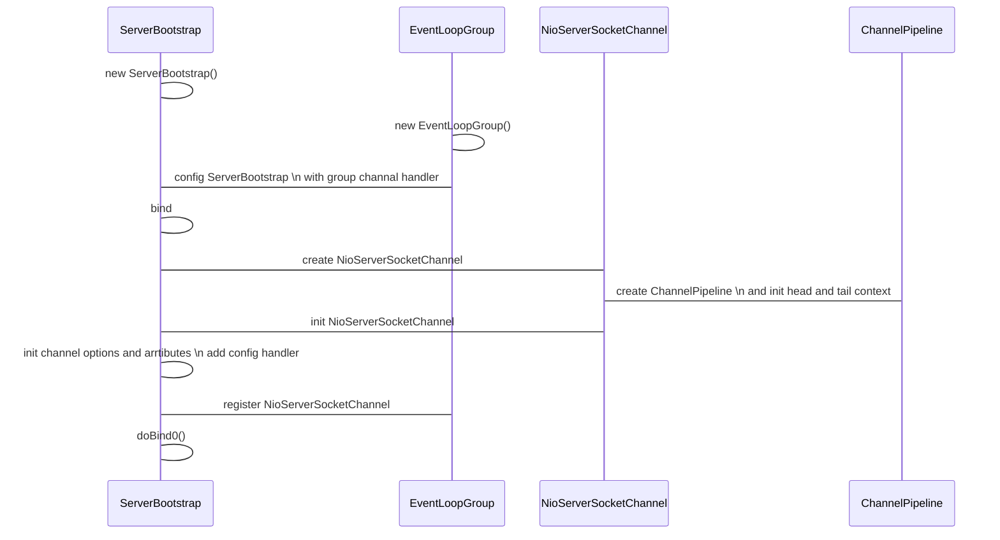
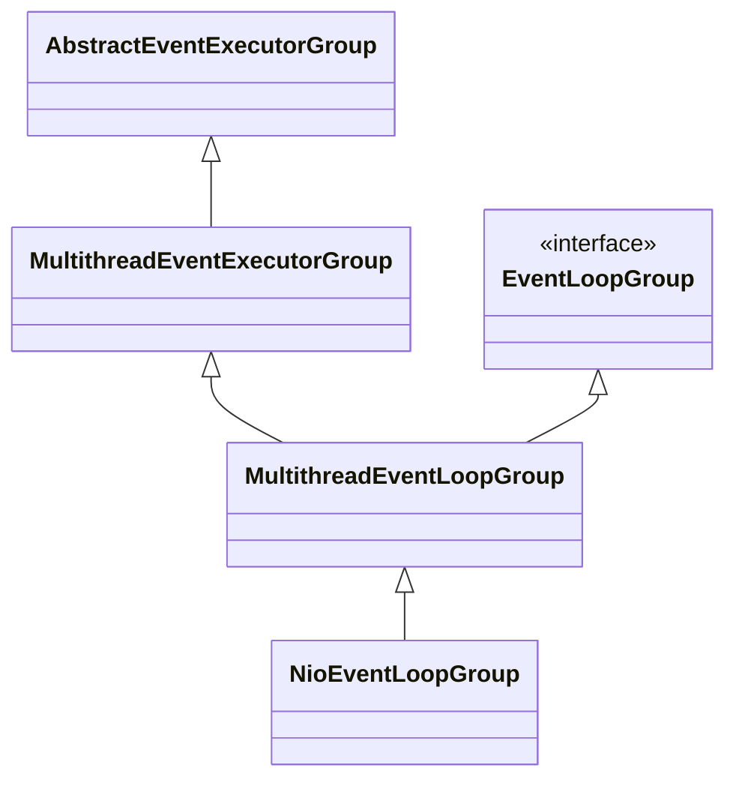
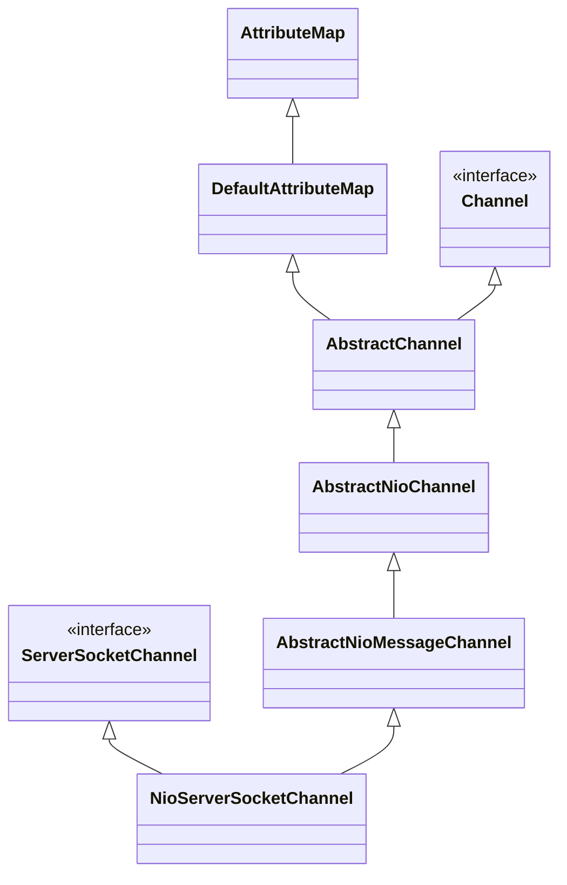
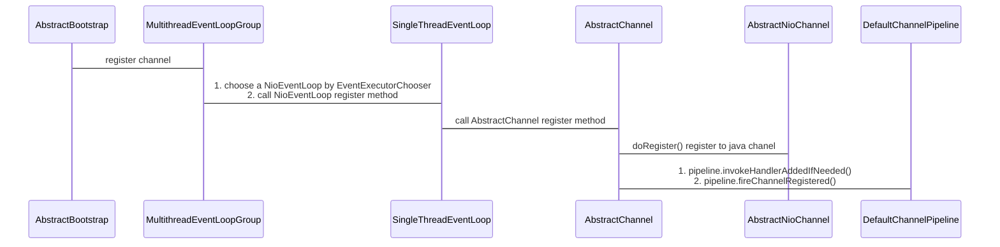

# Netty启动过程


```mermaid
sequenceDiagram
ServerBootstrap -> ServerBootstrap:new ServerBootstrap()
EventLoopGroup -> EventLoopGroup:new EventLoopGroup()
EventLoopGroup -> ServerBootstrap: config ServerBootstrap \n with group channal handler
ServerBootstrap -> ServerBootstrap: bind
ServerBootstrap -> NioServerSocketChannel: create NioServerSocketChannel
NioServerSocketChannel -> ChannelPipeline: create ChannelPipeline \n and init head and tail context
NioServerSocketChannel -> ServerBootstrap: init NioServerSocketChannel
ServerBootstrap -> ServerBootstrap: init channel options and arrtibutes \n add config handler
ServerBootstrap -> EventLoopGroup: register NioServerSocketChannel
ServerBootstrap -> ServerBootstrap: doBind0()
```

1. 构建ServerBootstrap并为其设置group（NioEventLoopGroup） channel（NioServerSocketChannel） handler（LoggingHandler） childHanlder（ChannelInitializer）等参数
2. 调用ServerBootstrap的bind方法绑定端口
3. bind方法主要构件NioServerSocketChannel并对其进行初始化
4. NioServerSocketChannel构建过程中会获取ServerSocketChannel，并初始化ChannelPipeline
5. ChannelPipeline（双向链表）初始化的时候会固定2个context：TailContext HeadContext
6. NioServerSocketChannel构建之后，对其进行初始化，设置options、arrtibutes以及ServerBootstrap设置的handler
7. 将NioServerSocketChannel注册到NioEventLoopGroup
8. 调用doBind0()，通过javaChanel（ServerSocketChannel）进行端口绑定

## NioEventLoopGroup

### 继承关系


```mermaid
classDiagram
AbstractEventExecutorGroup <|-- MultithreadEventExecutorGroup
MultithreadEventExecutorGroup <|-- MultithreadEventLoopGroup
EventLoopGroup <|-- MultithreadEventLoopGroup
<<interface>> EventLoopGroup
MultithreadEventLoopGroup <|-- NioEventLoopGroup
```

### 构建

```java
MultithreadEventExecutorGroup.class
//核心构建流程
protected MultithreadEventExecutorGroup(int nThreads, Executor executor,
                                            EventExecutorChooserFactory chooserFactory, Object... args) {
        if (nThreads <= 0) {
            throw new IllegalArgumentException(String.format("nThreads: %d (expected: > 0)", nThreads));
        }
    	//通过默认的ThreadFactory构建Executor
        if (executor == null) {
            executor = new ThreadPerTaskExecutor(newDefaultThreadFactory());
        }
    	//构建EventExecutor数组，数量默认为CPU核心数*2
        children = new EventExecutor[nThreads];

        for (int i = 0; i < nThreads; i ++) {
            boolean success = false;
            try {
                //依次创建线程，创建的过程由NioEventLoopGroup具体实现
                children[i] = newChild(executor, args);
                success = true;
            } catch (Exception e) {
                // TODO: Think about if this is a good exception type
                throw new IllegalStateException("failed to create a child event loop", e);
            } finally {
                //如果创建过程中发生错误，则依次关闭创建好的线程
                if (!success) {
                    for (int j = 0; j < i; j ++) {
                        children[j].shutdownGracefully();
                    }

                    for (int j = 0; j < i; j ++) {
                        EventExecutor e = children[j];
                        try {
                            while (!e.isTerminated()) {
                                e.awaitTermination(Integer.MAX_VALUE, TimeUnit.SECONDS);
                            }
                        } catch (InterruptedException interrupted) {
                            // Let the caller handle the interruption.
                            Thread.currentThread().interrupt();
                            break;
                        }
                    }
                }
            }
        }
    	//通过children创建EventExecutorChooser
    	//EventExecutorChooser使用某种算法选择对应children中的EventExecutor
        chooser = chooserFactory.newChooser(children);

        final FutureListener<Object> terminationListener = new FutureListener<Object>() {
            @Override
            public void operationComplete(Future<Object> future) throws Exception {
                if (terminatedChildren.incrementAndGet() == children.length) {
                    terminationFuture.setSuccess(null);
                }
            }
        };
    	//为EventExecutor注册销毁回调
        for (EventExecutor e: children) {
            e.terminationFuture().addListener(terminationListener);
        }

        Set<EventExecutor> childrenSet = new LinkedHashSet<EventExecutor>(children.length);
        Collections.addAll(childrenSet, children);
        readonlyChildren = Collections.unmodifiableSet(childrenSet);
    }
```

主要其实就是

1. 构建EventExecutor数组，长度为CPU核心数*2

2. 构建EventExecutorChooser用于选择EventExecutor

## NioEventLoop

以我理解，NioEventLoop就是每一个工作线程用于从select获取selectKey并进行进一步处理，NioEventLoop由NioEventLoopGroup进行维护

todo......

## DefaultChannelPipeline

DefaultChannelPipeline由NioServerSocketChannel进行维护，也由NioServerSocketChannel在创建过程中进行创建。

DefaultChannelPipeline构建的时候默认有2个固定节点，一个HeadContext一个TailContext

DefaultChannelPipeline管道中其实维护的是Context，Context中维护着Handler，Context其实可以看作Pipeline和Handler的桥梁

### addLast方法：

```java
@Override
public final ChannelPipeline addLast(EventExecutorGroup group, String name, ChannelHandler handler) {
    final AbstractChannelHandlerContext newCtx;
    synchronized (this) {
        checkMultiplicity(handler);
      	//将handler封装成Context
        newCtx = newContext(group, filterName(name, handler), handler);
				//将context加入到pipeline节点中
        addLast0(newCtx);

        // If the registered is false it means that the channel was not registered on an eventLoop yet.
        // In this case we add the context to the pipeline and add a task that will call
        // ChannelHandler.handlerAdded(...) once the channel is registered.
      	//如果channel没有registered则将该context加入PendingHandlerCallback链
      if (!registered) {
            newCtx.setAddPending();
            callHandlerCallbackLater(newCtx, true);
            return this;
        }

        EventExecutor executor = newCtx.executor();
        if (!executor.inEventLoop()) {
          //调用handler的callHandlerAdded方法
            callHandlerAddedInEventLoop(newCtx, executor);
            return this;
        }
    }
  //调用handler的callHandlerAdded方法
    callHandlerAdded0(newCtx);
    return this;
}
```

## NioServerSocketChannel

### 继承关系


```mermaid
classDiagram
AttributeMap <|-- DefaultAttributeMap
DefaultAttributeMap <|-- AbstractChannel
Channel <|-- AbstractChannel
<<interface>> Channel
AbstractChannel <|-- AbstractNioChannel
AbstractNioChannel <|-- AbstractNioMessageChannel
ServerSocketChannel <|-- NioServerSocketChannel
<<interface>> ServerSocketChannel
AbstractNioMessageChannel <|-- NioServerSocketChannel
```

### 构建

NioServerSocketChannel构造方法：create ServerSocketChannel（NioServerSocketChannel包装了JDK的ServerSocketChannel设置事件为ACCEPT） and NioServerSocketChannelConfig

```java
public NioServerSocketChannel() {
    this(newSocket(DEFAULT_SELECTOR_PROVIDER));
}

public NioServerSocketChannel(ServerSocketChannel channel) {
        super(null, channel, SelectionKey.OP_ACCEPT);
        config = new NioServerSocketChannelConfig(this, javaChannel().socket());
}

private static ServerSocketChannel newSocket(SelectorProvider provider) {
        try {
            /**
             *  Use the {@link SelectorProvider} to open {@link SocketChannel} and so remove condition in
             *  {@link SelectorProvider#provider()} which is called by each ServerSocketChannel.open() otherwise.
             *
             *  See <a href="https://github.com/netty/netty/issues/2308">#2308</a>.
             */
            return provider.openServerSocketChannel();
        } catch (IOException e) {
            throw new ChannelException(
                    "Failed to open a server socket.", e);
        }
    }
```

AbstractNioChannel构造方法：设置ServerSocketChannel configureBlocking(false)设置成非阻塞式模式

```java
protected AbstractNioChannel(Channel parent, SelectableChannel ch, int readInterestOp) {
    super(parent);
    this.ch = ch;
    this.readInterestOp = readInterestOp;
    try {
        ch.configureBlocking(false);
    } catch (IOException e) {
        try {
            ch.close();
        } catch (IOException e2) {
            logger.warn(
                        "Failed to close a partially initialized socket.", e2);
        }

        throw new ChannelException("Failed to enter non-blocking mode.", e);
    }
}
```

AbstractChannel构造方法：初始化ChannelId、NioMessageUnsafe、**DefaultChannelPipeline**

```java
protected AbstractChannel(Channel parent) {
    this.parent = parent;
    id = newId();
    unsafe = newUnsafe();
    pipeline = newChannelPipeline();
}
```

### 初始化

```java
ServerBootstrap.class
  
void init(Channel channel) {
    	//为channel设置option
        setChannelOptions(channel, newOptionsArray(), logger);
    	//为channel设置attribute
        setAttributes(channel, attrs0().entrySet().toArray(EMPTY_ATTRIBUTE_ARRAY));

        ChannelPipeline p = channel.pipeline();

        final EventLoopGroup currentChildGroup = childGroup;
        final ChannelHandler currentChildHandler = childHandler;
        final Entry<ChannelOption<?>, Object>[] currentChildOptions;
        synchronized (childOptions) {
            currentChildOptions = childOptions.entrySet().toArray(EMPTY_OPTION_ARRAY);
        }
        final Entry<AttributeKey<?>, Object>[] currentChildAttrs = childAttrs.entrySet().toArray(EMPTY_ATTRIBUTE_ARRAY);
    	//新增ChannelInitializer主要对ChannelPipeline增加自定义的handler
        p.addLast(new ChannelInitializer<Channel>() {
            @Override
            public void initChannel(final Channel ch) {
                final ChannelPipeline pipeline = ch.pipeline();
                ChannelHandler handler = config.handler();
                if (handler != null) {
                    pipeline.addLast(handler);
                }

                ch.eventLoop().execute(new Runnable() {
                    @Override
                    public void run() {
                        pipeline.addLast(new ServerBootstrapAcceptor(
                                ch, currentChildGroup, currentChildHandler, currentChildOptions, currentChildAttrs));
                    }
                });
            }
        });
    }
```

1. setChannelOptions
2. setAttributes
3. pipeline addLast config handler
4. pipeline addLast ServerBootstrapAcceptor

### 注册


```mermaid
sequenceDiagram
AbstractBootstrap -> MultithreadEventLoopGroup: register channel
MultithreadEventLoopGroup -> SingleThreadEventLoop: 1. choose a NioEventLoop by EventExecutorChooser <br> 2. call NioEventLoop register method
SingleThreadEventLoop -> AbstractChannel: call AbstractChannel register method
AbstractChannel -> AbstractNioChannel: doRegister() register to java chanel;
AbstractChannel -> DefaultChannelPipeline: 1. pipeline.invokeHandlerAddedIfNeeded() <br> 2. pipeline.fireChannelRegistered();
```
#### 核心代码

```java
MultithreadEventLoopGroup.class
    
@Override
public ChannelFuture register(Channel channel) {
    //通过EventExecutorChooser获取一个NioEventLoop并调用其register方法
    return next().register(channel);
}
```

```
SingleThreadEventLoop.class

@Override
public ChannelFuture register(Channel channel) {
    return register(new DefaultChannelPromise(channel, this));
}

@Override
public ChannelFuture register(final ChannelPromise promise) {
    ObjectUtil.checkNotNull(promise, "promise");
    promise.channel().unsafe().register(this, promise);
    return promise;
}
```

```java
AbstractNioChannel.class
    
@Override
protected void doRegister() throws Exception {
    boolean selected = false;
    for (;;) {
        try {
            selectionKey = javaChannel().register(eventLoop().unwrappedSelector(), 0, this);
            return;
        } catch (CancelledKeyException e) {
            if (!selected) {
                // Force the Selector to select now as the "canceled" SelectionKey may still be
                // cached and not removed because no Select.select(..) operation was called yet.
                eventLoop().selectNow();
                selected = true;
            } else {
                // We forced a select operation on the selector before but the SelectionKey is still cached
                // for whatever reason. JDK bug ?
                throw e;
            }
        }
    }
}
```

在doRegister之后，两个关键方法：

1. pipeline.invokeHandlerAddedIfNeeded();
2. pipeline.fireChannelRegistered();

#### pipeline.invokeHandlerAddedIfNeeded()
```java
DefaultChannelPipeline.class
 
//核心逻辑就是调用PendingHandlerCallback所有节点的execute方法
private void callHandlerAddedForAllHandlers() {
        final PendingHandlerCallback pendingHandlerCallbackHead;
        synchronized (this) {
            assert !registered;

            // This Channel itself was registered.
            registered = true;

            pendingHandlerCallbackHead = this.pendingHandlerCallbackHead;
            // Null out so it can be GC'ed.
            this.pendingHandlerCallbackHead = null;
        }

        // This must happen outside of the synchronized(...) block as otherwise handlerAdded(...) may be called while
        // holding the lock and so produce a deadlock if handlerAdded(...) will try to add another handler from outside
        // the EventLoop.
        PendingHandlerCallback task = pendingHandlerCallbackHead;
        while (task != null) {
            task.execute();
            task = task.next;
        }
    }
```

PendingHandlerCallback的添加：在init channel的时候往调用ChannelPipeline addLast方法添加了一个ChannelInitializer，该ChannelInitializer就是PendingHandlerCallback或是添加在PendingHandlerCallback尾部

```java
ServerBootstrap.class
  
@Override
void init(Channel channel) {
    ......
    //此时调用addLast channel还没有register 所以ChannelInitializer将被作为PendingHandlerCallback或是添加到PendingHandlerCallback尾部节点，等待channel register之后进行调用
    p.addLast(new ChannelInitializer<Channel>() {
        @Override
        public void initChannel(final Channel ch) {
            final ChannelPipeline pipeline = ch.pipeline();
            ChannelHandler handler = config.handler();
            if (handler != null) {
                pipeline.addLast(handler);
            }

            ch.eventLoop().execute(new Runnable() {
                @Override
                public void run() {
                    pipeline.addLast(new ServerBootstrapAcceptor(
                            ch, currentChildGroup, currentChildHandler, currentChildOptions, currentChildAttrs));
                }
            });
        }
    });
}
```

#### pipeline.fireChannelRegistered()

从pipeLine的头部HeadContext开始执行每个Context的channelRegistered方法（通过findContextInbound获取下一个Context）

例如LoggingHandler

```java
LoggingHandler.class
  
@Override
public void channelRegistered(ChannelHandlerContext ctx) throws Exception {
  //channelRegistered主要负责日志打印
    if (logger.isEnabled(internalLevel)) {
        logger.log(internalLevel, format(ctx, "REGISTERED"));
    }
  //fireChannelRegistered方法会通过findContextInbound获取下一个节点，并最终再次调用该节点的channelRegistered方法
    ctx.fireChannelRegistered();
}
```

## doBind0

在以上环节结束之后，channel构建初始化并注册完毕之后，执行doBind0方法

doBind0核心在于调用pipleline的bind方法，会从pipeline的TailContext开始往头部方向，依次调用Context的bind方法，最终调用的是该Context包装的Handler的bind方法

比如LoggingHandler还是对bind进行日志打印

最终执行到头部HeadContext的bind方法，该bind方法又调用unsafe的bind方法

unsafe bind主要2步骤：

1. 调用channel的doBind方法，也就是我们之前设置的NioServerSocketChannel的doBind方法

```java
NioServerSocketChannel.class
  
@SuppressJava6Requirement(reason = "Usage guarded by java version check")
   @Override
   protected void doBind(SocketAddress localAddress) throws Exception {
       if (PlatformDependent.javaVersion() >= 7) {
           javaChannel().bind(localAddress, config.getBacklog());
       } else {
           javaChannel().socket().bind(localAddress, config.getBacklog());
       }
   }
```

2. 调用pipeline.fireChannelActive();从头部节点开始，告知pipeline中的所有节点，channel已经激活

LoggingHandler的channelActive依旧是进行日志打印

HeadContext的channelActive将最终调用pipleline的read方法，从尾部节点开始向前调用所有节点的read方法

HeadContext的read方法又调用unsafe的beginRead方法最终：selectionKey.interestOps(interestOps | readInterestOp);将selectionKey的事件设置成最初设置的ACCPET事件

## 总结

1. 首先创建2个 EventLoopGroup 线程池数组。数组默认大小CPU*2，方便chooser选择线程池时提高性能。
2. BootStrap 将 boss 设置为 group属性，将 worker 设置为 childer 属性。
3. 通过 bind 方法启动，内部重要方法为 initAndRegister 和 dobind 方法。
4. initAndRegister 方法会反射创建 NioServerSocketChannel 及其相关的 NIO 的对象， pipeline ， unsafe，同时也为 pipeline 初始了 head 节点和 tail 节点。同时也含有 NioServerSocketChannelConfig 对象。然后向 pipeline 添加自定义的处理器和 ServerBootstrapAcceptor 处理器。这个处理器用于分配接受的 请求给 worker 线程池。每次添加处理器都会创建一个相对应的 Context 作为 pipeline 的节点并包装 handler 对象。注册过程中会调用 NioServerSocketChannel 的 doRegister 方法注册读事件。
5. 在register0 方法成功以后调用在 dobind 方法中调用 doBind0 方法，该方法会 调用 NioServerSocketChannel 的 doBind 方法对 JDK 的 channel 和端口进行绑定，之后在调用 pipeline 的fireChannelActive 最后会调用 NioServerSocketChannel 的 doBeginRead 方法，将感兴趣的事件设置为Accept，完成 Netty 服务器的所有启动，并开始监听连接事件。