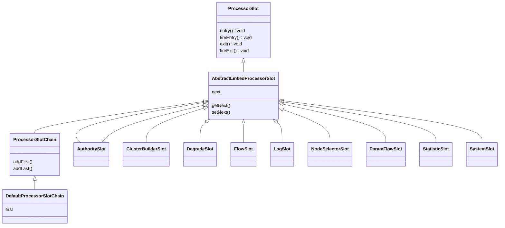

# Sentinel滑动窗口

sentinel记录QPS等数据时为了提高系统性能使用滑动窗口机制来进行处理

sentinel采用责任链模式对流量进行处理，每个链路节点实现于ProcessorSlot

## ProcessorSlot依赖关系



每个ProcessorSlot都有不同的责任对应不同的处理逻辑，每次处理完都调用next ProcessorSlot进行处理

1. StatisticSlot：对流量静态数据进行收集，便于计算线程数、QPS等
2. AuthoritySlot：对流量进行认证处理
3. ......

## PassRequestCount

```java
StatisticSlot.calss
  
@Override
public void entry(Context context, ResourceWrapper resourceWrapper, DefaultNode node, int count,
                  boolean prioritized, Object... args) throws Throwable {
   			......
        //增加线程数
        node.increaseThreadNum();
  			//增加　请求数量
        node.addPassRequest(count);
  			......
}

@Override
    public void exit(Context context, ResourceWrapper resourceWrapper, int count, Object... args) {
     				......
            //减少线程数
            node.decreaseThreadNum();
      			......
    }
```

```java
DefaultNode.class
  
@Override
public void addPassRequest(int count) {
      super.addPassRequest(count);
      this.clusterNode.addPassRequest(count);
}
```

```java
//StatisticNode会实例化2个计数器：

//秒级滚轮计数器
//入参：SampleCountProperty.SAMPLE_COUNT：2；IntervalProperty.INTERVAL：1000ms
//表示1秒记录2段
private transient volatile Metric rollingCounterInSecond = new ArrayMetric(SampleCountProperty.SAMPLE_COUNT,
    IntervalProperty.INTERVAL);

//分钟级滚轮计数器
//表示1分钟记录60段
private transient Metric rollingCounterInMinute = new ArrayMetric(60, 60 * 1000, false);
```

## Metric.addPass(count)

```java
@Override
public void addPass(int count) {
  	//获取当前的时间窗口
    WindowWrap<MetricBucket> wrap = data.currentWindow();
  	//将数据记录到当前的时间窗口中
    wrap.value().addPass(count);
}
```

```java
public WindowWrap<T> currentWindow(long timeMillis) {
    if (timeMillis < 0) {
        return null;
    }
  	//根据时间计算idx
    int idx = calculateTimeIdx(timeMillis);
    // Calculate current bucket start time.
  	//根据时间计算当前时间窗口应该的起始时间
    long windowStart = calculateWindowStart(timeMillis);

    /*
     * Get bucket item at given time from the array.
     *
     * (1) Bucket is absent, then just create a new bucket and CAS update to circular array.
     * 如果bucket是空的则新建一个
     * (2) Bucket is up-to-date, then just return the bucket.
     * 如果bucket是最新的了，则直接返回
     * (3) Bucket is deprecated, then reset current bucket and clean all deprecated buckets.
     * 如果bucekt以及过期，则进行reset重用
     */
    while (true) {
      	//获取时间窗口
        WindowWrap<T> old = array.get(idx);
        if (old == null) {
          	//如果时间窗口为null则进行初始化
            WindowWrap<T> window = new WindowWrap<T>(windowLengthInMs, windowStart, newEmptyBucket(timeMillis));
            if (array.compareAndSet(idx, null, window)) {
                // Successfully updated, return the created bucket.
                return window;
            } else {
                // Contention failed, the thread will yield its time slice to wait for bucket available.
                Thread.yield();
            }
        } else if (windowStart == old.windowStart()) {
          	//如果时间窗口不为null，且时间窗口的开始时间相等，则说明取得的时间窗口就是当前的时间窗口
            return old;
        } else if (windowStart > old.windowStart()) {
          	//如果当前的时间窗口的起始时间大于取得的时间窗口的开始时间，则说明取得时间窗口是老的，需要reset
            if (updateLock.tryLock()) {
                try {
                    // Successfully get the update lock, now we reset the bucket.
                    return resetWindowTo(old, windowStart);
                } finally {
                    updateLock.unlock();
                }
            } else {
                // Contention failed, the thread will yield its time slice to wait for bucket available.
                Thread.yield();
            }
        } else if (windowStart < old.windowStart()) {
            // Should not go through here, as the provided time is already behind.
          	//如果当前窗口的起始时间小于取得的时间窗口的起始时间。。。这个不太可能，除非调整了系统时间
            return new WindowWrap<T>(windowLengthInMs, windowStart, newEmptyBucket(timeMillis));
        }
    }
}
```

