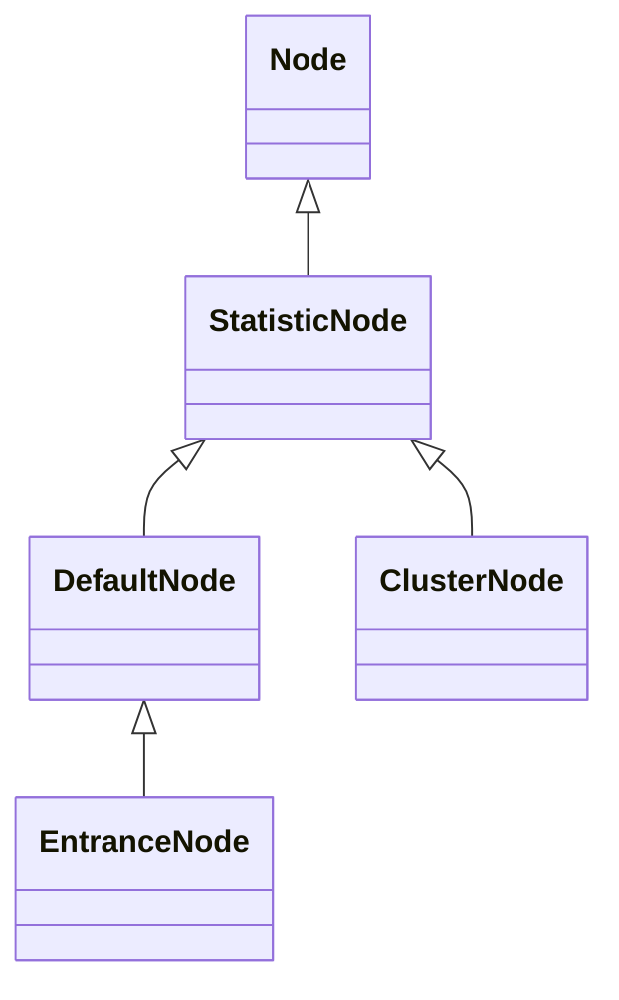
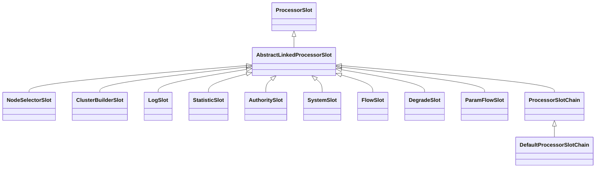
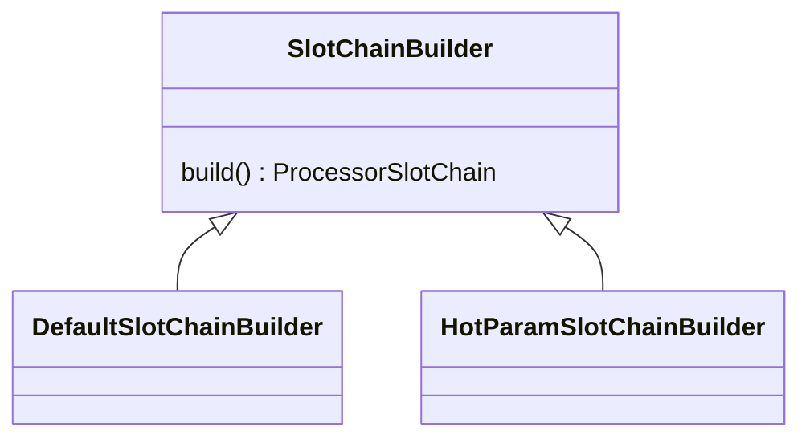
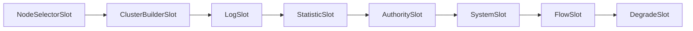
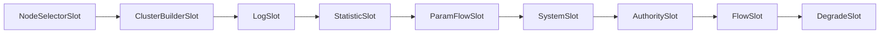
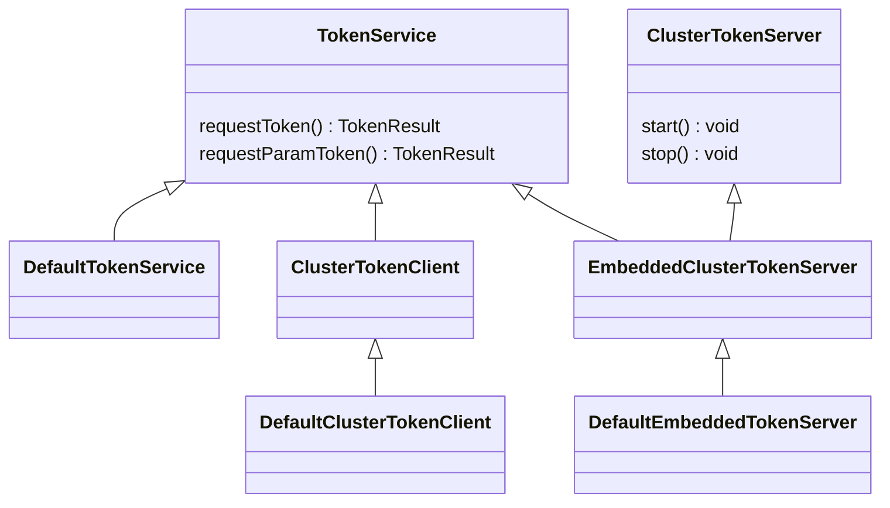
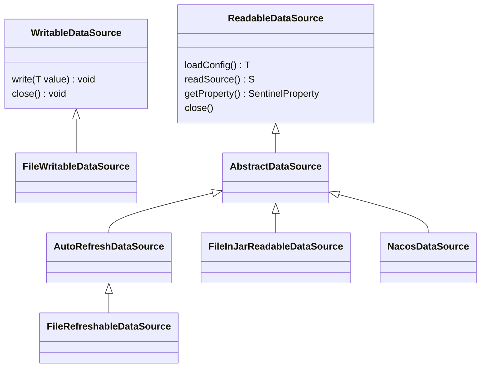

# Sentinel

## 大体流程

1. 启动后开启Netty服务，提供配置查询（比如QPS、权限黑白名单等），服务器状态查询，接收Dashboard下发配置
2. 通过SentinelResourceAspect对@SentinelResource进行拦截，进行SphU.entry调用并try catch BlockException
3. 通过责任链模式一个ProcessorSlot一个ProcessorSlot对流量进行处理，处理过程中涉及到对应的RuleManager，如果符合拦截要求则抛出对应异常
4. SentinelResourceAspect捕获到异常则尝试调用降级方法
5. MetricTimerListener定时1秒，尝试从ClusterBuilderSlot获取容器数据，写入到Log日志提供Dashboard查询

## Context

Sentinel的Context由ContextUtil中的ThreadLocal进行维护，ContextUtil提供操作方法

Context产生于AbstractSentinelInterceptor拦截器的preHandle方法，为每个请求（Thread）构建Context，Context维护了entranceNode（DefaultNode）以及curEntry（Entry）

拦截器拦截请求，构建Context：

```java
AbstractSentinelInterceptor.class
    
@Override
public boolean preHandle(HttpServletRequest request, HttpServletResponse response, Object handler)
    throws Exception {
    try {
        String resourceName = getResourceName(request);

        if (StringUtil.isNotEmpty(resourceName)) {
            // Parse the request origin using registered origin parser.
            String origin = parseOrigin(request);
            //通过ContextUtil构建Context
            ContextUtil.enter(SENTINEL_SPRING_WEB_CONTEXT_NAME, origin);
            Entry entry = SphU.entry(resourceName, ResourceTypeConstants.COMMON_WEB, EntryType.IN);

            setEntryInRequest(request, baseWebMvcConfig.getRequestAttributeName(), entry);
        }
        return true;
    } catch (BlockException e) {
        handleBlockException(request, response, e);
        return false;
    }
}
```

具体Context构建：

```java
ContextUtil.class
    
protected static Context trueEnter(String name, String origin) {
    //先从ThreadLocal中获取Context，如果Context不存在则进行构建
    Context context = contextHolder.get();
    if (context == null) {
        //尝试从缓存中获取entranceNode(DefaultNode)
        Map<String, DefaultNode> localCacheNameMap = contextNameNodeMap;
        DefaultNode node = localCacheNameMap.get(name);
        if (node == null) {
            if (localCacheNameMap.size() > Constants.MAX_CONTEXT_NAME_SIZE) {
                setNullContext();
                return NULL_CONTEXT;
            } else {
                try {
                    LOCK.lock();
                    node = contextNameNodeMap.get(name);
                    if (node == null) {
                        if (contextNameNodeMap.size() > Constants.MAX_CONTEXT_NAME_SIZE) {
                            setNullContext();
                            return NULL_CONTEXT;
                        } else {
                            //构建EntranceNode
                            node = new EntranceNode(new StringResourceWrapper(name, EntryType.IN), null);
                            // Add entrance node.
                            Constants.ROOT.addChild(node);
                            //添加到缓存
                            Map<String, DefaultNode> newMap = new HashMap<>(contextNameNodeMap.size() + 1);
                            newMap.putAll(contextNameNodeMap);
                            newMap.put(name, node);
                            contextNameNodeMap = newMap;
                        }
                    }
                } finally {
                    LOCK.unlock();
                }
            }
        }
        //构建Context
        context = new Context(node, name);
        context.setOrigin(origin);
        contextHolder.set(context);
    }

    return context;
}
```

## Node

继承关系：



Node：定义了real-time 统计信息的获取方法

StatisticNode：实现了Node，实现了对各个real-time参数的统计逻辑

DefaultNode：为每个Context和ResourceName来保存real-time统计数据（为每个资源的每个请求保存统计信息）

ClusterNode：为每个ResourceName来保存real-time统计数据（为每个资源保存总的统计信息）

EntranceNode：维护着DefaultNodeList可以根据所有DefaultNode来统计real-time数据

## ProcessorSlot

### 继承关系：



1. ProcessorSlot（接口）：定义Slot entry fireEntry exit rireExist方法
2. AbstractLinkedProcessorSlot：维护一个next对象，提供调用下一个节点Slot的能力
3. NodeSelectorSlot：为Context构建DefaultNode
4. ClusterBuilderSlot：为Context构建ClusterNode
5. LogSlot：使用EagleEyeLogUtil记录日志
6. StatisticSlot：记录ThreadNum以及PassRequest，用于计算ThreadNum和QPS，调用ProcessorSlotEntryCallback
7. AuthoritySlot：通过AuthorityRuleManager处理黑白名单
8. SystemSlot：通过SystemRuleManager判断QPS、thread num、rt、cpu usage等是否满足降级条件
9. FlowSlot：通过FlowRuleChecker控制流控规则（单机流控和集群流控）：流控模式（直接、关联、链路），流控效果（快速失败、Warm Up、排队等待）
10. DegradeSlot：通过DegradeRuleManager控制降级规则：RT、异常比例、异常数
11. ParamFlowSlot：通过ParamFlowRuleManager控制热点规则
12. ProcessorSlotChain（接口）：提供addFirst addLast方法，提供了整合构建Slot责任链的能力定义
13. DefaultProcessorSlotChain：实现了ProcessorSlotChain，实现了整合构建Slot责任链的能力

## SlotChainBuilder

### 继承关系



1. SlotChainBuilder（接口）：定义了构建Slot Chain的能力
2. DefaultSlotChainBuilder：构建DefaultSlotChain，调用路径为：



3. HotParamSlotChainBuilder：构建HotParamSlotChain，调用路径为：



HotParamSlotChainBuilder与DefaultSlotChainBuilder的不同在于HotParamSlotChainBuilder构建的ProcessorSlotChain增加了ParamFlowSlot，提供了热点规则的控制能力

相同资源的SlotChain是一样的

SlotChainBuilder的构建（SlotChainProvider）：

```java
SlotChainProvider.class
    
public static ProcessorSlotChain newSlotChain() {
    if (slotChainBuilder != null) {
        return slotChainBuilder.build();
    }

    // Resolve the slot chain builder SPI.
    slotChainBuilder = SpiLoader.loadFirstInstanceOrDefault(SlotChainBuilder.class, DefaultSlotChainBuilder.class);

    if (slotChainBuilder == null) {
        // Should not go through here.
        RecordLog.warn("[SlotChainProvider] Wrong state when resolving slot chain builder, using default");
        slotChainBuilder = new DefaultSlotChainBuilder();
    } else {
        RecordLog.info("[SlotChainProvider] Global slot chain builder resolved: "
            + slotChainBuilder.getClass().getCanonicalName());
    }
    return slotChainBuilder.build();
}
```

## TokenServer集群限流

流控规则由FlowSlot负责，FlowSlot使用FlowRuleChecker（FlowRuleChecker维护了FlowRuleManager）进行控制。

流控可分为：

1. 单机流控
2. 集群流控

流控提供接口TokenService，来获取Token，以Token来判断流量是否可以通过

TokenService继承关系：



对于TokenService的实现大致可以分为3类：

1. Default：本地单机模式
2. Cluster：集群模式，访问外部Token服务器
3. EmbeddedCluster：集群模式，访问内嵌的Token服务器

## Rule Config持久化 

Netty ModifyRulesCommandHandler接受到Rule修改、设置的请求，生成对应的Rule，交由各个RuleManager之后对Rule进行持久化处理

```java
ModifyRulesCommandHandler.class
@Override
public CommandResponse<String> handle(CommandRequest request) {
  	......
    if (FLOW_RULE_TYPE.equalsIgnoreCase(type)) {
        //对数据进行解析，获取到对应的Rule对象
        List<FlowRule> flowRules = JSONArray.parseArray(data, FlowRule.class);
        //将Rule对象交由对应的RuleManager处理
        FlowRuleManager.loadRules(flowRules);
        //进行Rule的持久化处理
        if (!writeToDataSource(getFlowDataSource(), flowRules)) {
            result = WRITE_DS_FAILURE_MSG;
        }
        return CommandResponse.ofSuccess(result);
    } else if
        ......
    return CommandResponse.ofFailure(new IllegalArgumentException("invalid type"));
}

//持久化处理
private <T> boolean writeToDataSource(WritableDataSource<T> dataSource, T value) {
        if (dataSource != null) {
            try {
                //调用WritableDataSource对象进行数据持久化
                dataSource.write(value);
            } catch (Exception e) {
                RecordLog.warn("Write data source failed", e);
                return false;
            }
        }
        return true;
    }
```

持久化以及配置读取相关接口继承关系：



WritableDataSource(接口)：提供Rule配置写入的能力定义

FileWritableDataSource：提供Rule配置写入到文件的能力

ReadableDataSource(接口)：提供配置读取的能力定义

AbstractDataSource：ReadableDataSource的基本实现，额外提供配置的解析能力

AutoRefreshDataSource：提供定时刷新配置的能力

FileRefreshableDataSource：提供从文件获取配置的能力

FileInJarReadableDataSource：提供从Jar文件中的配置文件获取配置的能力

NacosDataSource：提供与Nacos配置中心整合的能力，类似Nacos，Sentinel还提供其他Eureka等组件的整合能力，需要引入对应的依赖

## Metrix Log

Metrix日志用户提供DashBoard查询节点的Real-Time信息，比如QPS等等

FlowRuleManager的静态初始化块开启Task，每隔1S执行MetricTimerListener

```java
FlowRuleManager.class

public class FlowRuleManager {
	static {
    	currentProperty.addListener(LISTENER);
    	SCHEDULER.scheduleAtFixedRate(new MetricTimerListener(), 0, 1, TimeUnit.SECONDS);
	}
    ......
}
```

MetricTimerListener会将所有ClusterNode中MetricNode的信息（passQps、blockQps、successQps、exceptionQps、rt、occupiedPassQps等）写入到文件，写入操作由MetricWriter来执行，MetricWriter会对记录写入记录文件并为其生产索引，写入索引文件

```java
MetricTimerListener.class
    
@Override
public void run() {
    Map<Long, List<MetricNode>> maps = new TreeMap<>();
    for (Entry<ResourceWrapper, ClusterNode> e : ClusterBuilderSlot.getClusterNodeMap().entrySet()) {
        ClusterNode node = e.getValue();
        Map<Long, MetricNode> metrics = node.metrics();
        aggregate(maps, metrics, node);
    }
    aggregate(maps, Constants.ENTRY_NODE.metrics(), Constants.ENTRY_NODE);
    if (!maps.isEmpty()) {
        for (Entry<Long, List<MetricNode>> entry : maps.entrySet()) {
            try {
                metricWriter.write(entry.getKey(), entry.getValue());
            } catch (Exception e) {
                RecordLog.warn("[MetricTimerListener] Write metric error", e);
            }
        }
    }
}
```

