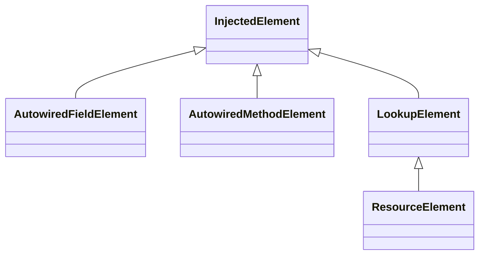

# Spring Bean Inject

## AbstractAnnotationBeanPostProcessor

对于Bean属性等的注入是通过：AbstractAnnotationBeanPostProcessor来进行处理

```sequence
AbstractAnnotationBeanPostProcessor -> InjectionMetadata: postProcessPropertyValues() \n metadata.inject(bean, beanName, pvs);
InjectionMetadata -> InjectedElement: element.inject(target, beanName, pvs)
```

1. AbstractAnnotationBeanPostProcessor的postProcessPropertyValues对Bean进行属性的依赖的注入
2. 获取InjectionMetadata，通过InjectionMetadata进行inject
3. 获取InjectedElement，使用InjectedElement对Bean进行处理

##  InjectedElement

### 继承关系



1. AutowiredFieldElement通过beanFactory resolveDependency方法获取依赖对象对field进行设置：field.set(bean, value)
2. AutowiredMethodElement通过beanFactory resolveDependency方法获取依赖对象对method进行设置：method.invoke(bean, arguments)

## BeanFactory resolveDependency

```java
DefaultListableBeanFactory.class
    
public Object resolveDependency(DependencyDescriptor descriptor, @Nullable String requestingBeanName,
			@Nullable Set<String> autowiredBeanNames, @Nullable TypeConverter typeConverter) throws BeansException {

		descriptor.initParameterNameDiscovery(getParameterNameDiscoverer());
		if (Optional.class == descriptor.getDependencyType()) {
			return createOptionalDependency(descriptor, requestingBeanName);
		}
		else if (ObjectFactory.class == descriptor.getDependencyType() ||
				ObjectProvider.class == descriptor.getDependencyType()) {
			return new DependencyObjectProvider(descriptor, requestingBeanName);
		}
		else if (javaxInjectProviderClass == descriptor.getDependencyType()) {
			return new Jsr330Factory().createDependencyProvider(descriptor, requestingBeanName);
		}
		else {
			Object result = getAutowireCandidateResolver().getLazyResolutionProxyIfNecessary(
					descriptor, requestingBeanName);
			if (result == null) {
				result = doResolveDependency(descriptor, requestingBeanName, autowiredBeanNames, typeConverter);
			}
			return result;
		}
	}
```

```java
DefaultListableBeanFactory.class

public Object doResolveDependency(DependencyDescriptor descriptor, @Nullable String beanName,
      @Nullable Set<String> autowiredBeanNames, @Nullable TypeConverter typeConverter) throws BeansException {

   InjectionPoint previousInjectionPoint = ConstructorResolver.setCurrentInjectionPoint(descriptor);
   try {
      Object shortcut = descriptor.resolveShortcut(this);
      if (shortcut != null) {
         return shortcut;
      }

      Class<?> type = descriptor.getDependencyType();
      Object value = getAutowireCandidateResolver().getSuggestedValue(descriptor);
      if (value != null) {
         if (value instanceof String) {
            String strVal = resolveEmbeddedValue((String) value);
            BeanDefinition bd = (beanName != null && containsBean(beanName) ?
                  getMergedBeanDefinition(beanName) : null);
            value = evaluateBeanDefinitionString(strVal, bd);
         }
         TypeConverter converter = (typeConverter != null ? typeConverter : getTypeConverter());
         try {
            return converter.convertIfNecessary(value, type, descriptor.getTypeDescriptor());
         }
         catch (UnsupportedOperationException ex) {
            // A custom TypeConverter which does not support TypeDescriptor resolution...
            return (descriptor.getField() != null ?
                  converter.convertIfNecessary(value, type, descriptor.getField()) :
                  converter.convertIfNecessary(value, type, descriptor.getMethodParameter()));
         }
      }

      Object multipleBeans = resolveMultipleBeans(descriptor, beanName, autowiredBeanNames, typeConverter);
      if (multipleBeans != null) {
         return multipleBeans;
      }

      Map<String, Object> matchingBeans = findAutowireCandidates(beanName, type, descriptor);
      if (matchingBeans.isEmpty()) {
         if (isRequired(descriptor)) {
            raiseNoMatchingBeanFound(type, descriptor.getResolvableType(), descriptor);
         }
         return null;
      }

      String autowiredBeanName;
      Object instanceCandidate;

      if (matchingBeans.size() > 1) {
         autowiredBeanName = determineAutowireCandidate(matchingBeans, descriptor);
         if (autowiredBeanName == null) {
            if (isRequired(descriptor) || !indicatesMultipleBeans(type)) {
               return descriptor.resolveNotUnique(descriptor.getResolvableType(), matchingBeans);
            }
            else {
               // In case of an optional Collection/Map, silently ignore a non-unique case:
               // possibly it was meant to be an empty collection of multiple regular beans
               // (before 4.3 in particular when we didn't even look for collection beans).
               return null;
            }
         }
         instanceCandidate = matchingBeans.get(autowiredBeanName);
      }
      else {
         // We have exactly one match.
         Map.Entry<String, Object> entry = matchingBeans.entrySet().iterator().next();
         autowiredBeanName = entry.getKey();
         instanceCandidate = entry.getValue();
      }

      if (autowiredBeanNames != null) {
         autowiredBeanNames.add(autowiredBeanName);
      }
      if (instanceCandidate instanceof Class) {
         instanceCandidate = descriptor.resolveCandidate(autowiredBeanName, type, this);
      }
      Object result = instanceCandidate;
      if (result instanceof NullBean) {
         if (isRequired(descriptor)) {
            raiseNoMatchingBeanFound(type, descriptor.getResolvableType(), descriptor);
         }
         result = null;
      }
      if (!ClassUtils.isAssignableValue(type, result)) {
         throw new BeanNotOfRequiredTypeException(autowiredBeanName, type, instanceCandidate.getClass());
      }
      return result;
   }
   finally {
      ConstructorResolver.setCurrentInjectionPoint(previousInjectionPoint);
   }
}
```