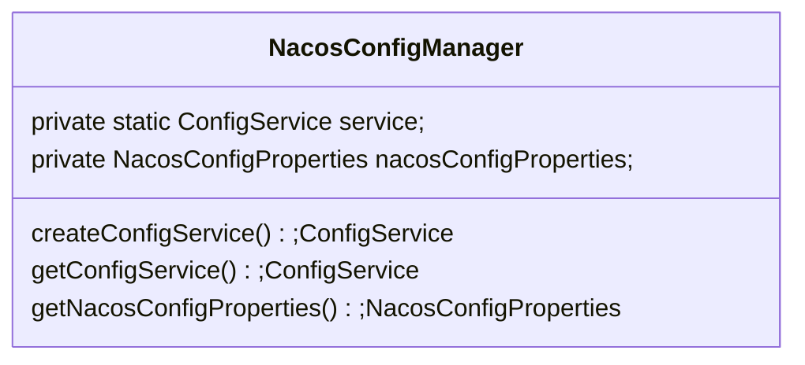
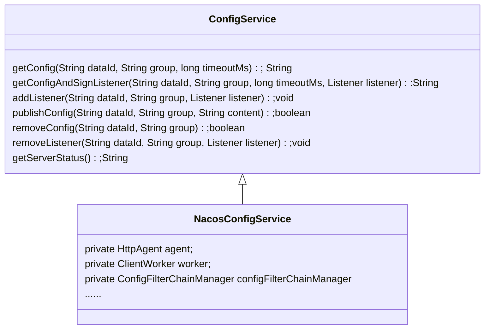
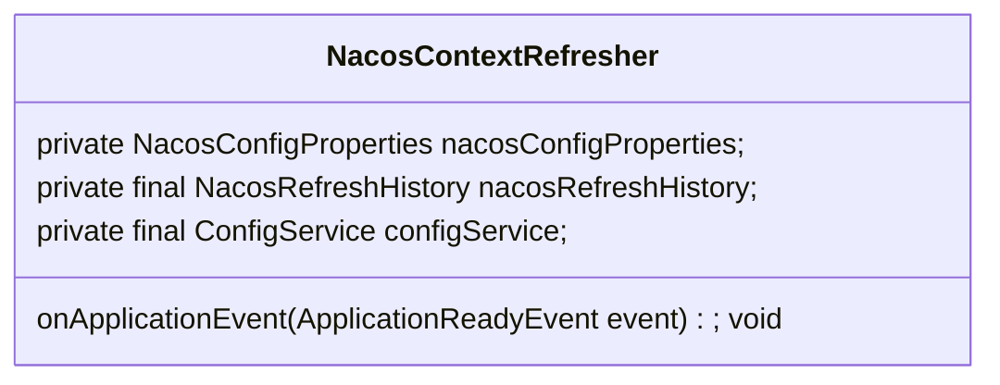
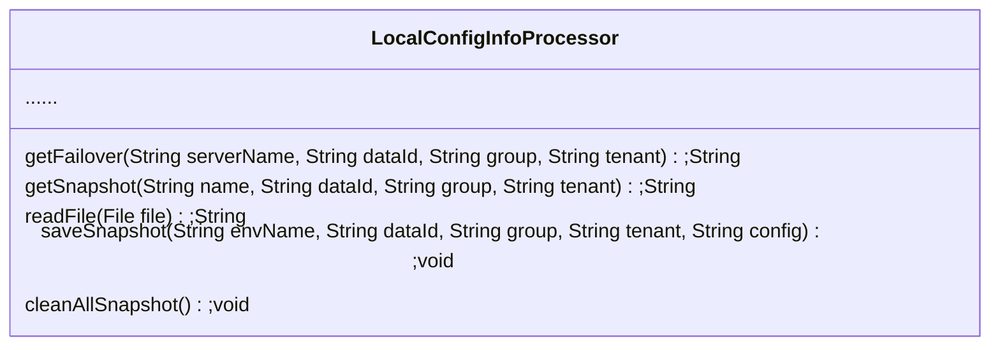

# Spring Cloud Config With Nacos

## 总体流程

1. NacosPropertySourceLocator解析配置，从服务端拉取配置信息存入NacosPropertySourceRepository由NacosPropertySourceRepository维护，拉取配置时优先从本地文件读取，然后在从服务拉取
2. NacosContextRefresher监听ApplicationReadyEvent事件，从NacosPropertySourceRepository中获取所有配置信息，构建Listener注册到NacosConfigService
3. NacosConfigService采用长轮询机制从服务端刷新变更的配置数据，并回调Listener
4. Listener接收到回调，记录到NacosRefreshHistory，发送RefreshEvent事件
5. RefreshEventListener（Spring Cloud 相关类）接收到RefreshEvent事件，执行Environment环境刷新工作，会重新回到1的步骤

## NacosConfigManager



NacosConfigManager对象由NacosConfigAutoConfiguration进行构建，NacosConfigManager通过ConfigFactory创建并维护了NacosConfigService

## NacosConfigService

### 继承关系：



ConfigService（接口）：抽象了配置服务，定义了与配置服务交互的能力，比如：getConfig获取配置，publishConfig发布配置等

NacosConfigService：实现了ConfigService，通过HttpAgent与ClientWorker实现了与配置服务交互的能力

### NacosConfigService 构造方法

```java
public NacosConfigService(Properties properties) throws NacosException {
    String encodeTmp = properties.getProperty(PropertyKeyConst.ENCODE);
    if (StringUtils.isBlank(encodeTmp)) {
        encode = Constants.ENCODE;
    } else {
        encode = encodeTmp.trim();
    }
    initNamespace(properties);
    //启动HttpAgent
    agent = new MetricsHttpAgent(new ServerHttpAgent(properties));
    agent.start();
    //构建ClientWorker
    worker = new ClientWorker(agent, configFilterChainManager, properties);
}
```

**HttpAgent**

```sequence
NacosConfigService -> ServerHttpAgent: new ServerHttpAgent(properties)
ServerHttpAgent -> ServerHttpAgent: new ServerListManager(properties)
ServerHttpAgent -> ServerHttpAgent: new SecurityProxy(properties)
ServerHttpAgent -> SecurityProxy: securityProxy.login \n (serverListMgr.getServerUrls());
SecurityProxy -> SecurityProxy: send login http \n to nacos config server
NacosConfigService -> MetricsHttpAgent: new MetricsHttpAgent(ServerHttpAgent).start
MetricsHttpAgent -> MetricsHttpAgent: create GetServerListTask() and run \n try to get server list pre 30 second
```

1. 通过properties构建ServerHttpAgent对象
2. ServerHttpAgent解析properties构建对应的ServerListManager维护配置服务信息以及SecurityProxy用于访问配置服务
3. 通过SecurityProxy向所有配置服务器发送login请求（如果username配置了的话发送请求，否则不发送）
4. 启动定时任务默认每隔5秒钟再次发送login请求
5. 通过ServerHttpAgent构建MetricsHttpAgent并调用start方法启动
6. 构建GetServerListTask任务，每隔30秒获取最新的配置服务器列表

**ClientWorker**

```sequence
NacosConfigService -> ClientWorker: new ClientWorker(properties)
ClientWorker -> ClientWorker: Initialize the timeout parameter
ClientWorker -> ClientWorker: create executor Executor whitch core poll size is 1
ClientWorker -> ClientWorker: create executorService Executor whitch core poll size equals cpu num
ClientWorker -> ClientWorker: schedule Runnable to checkConfigInfo with executor
ClientWorker -> LongPollingRunnable: execute LongPollingRunnable to checkConfigInfo with executorService
LongPollingRunnable -> LongPollingRunnable: try to get config from nacos server
```

1. 构建ClientWorker对象
2. ClientWorker构造方法解析properties获取timeout等配置
3. 创建core poll size为1的Executor：executor，创建core poll size为cpu数量的Executor：executorService
4. 通过executor（core poll size 1）不间断的(相隔10毫秒)执行checkConfigInfo()方法
5. checkConfigInfo()方法分批次执行LongPollingRunnable，向Nacos Server进行长轮询
6. LongPollingRunnable获取ClientWorker维护的CacheData向配置服务器请求修改项，然后依次去拉取最新的数据进行更新

## NacosContextRefresher

NacosContextRefresher对象由NacosConfigAutoConfiguration进行构建

NacosContextRefresher监听ApplicationReadyEvent事件，当收到该事件时，获取NacosPropertySource构建Listener并注册到ConfigServer



流程图：

```sequence
NacosContextRefresher -> NacosContextRefresher: Listen ApplicationReadyEvent
NacosContextRefresher -> NacosPropertySourceRepository: get NacosPropertySource
NacosPropertySourceRepository -> NacosContextRefresher: return NacosPropertySource
NacosContextRefresher -> NacosContextRefresher: create Listener
NacosContextRefresher -> ConfigService: add Listener to ConfigerService
```

## NacosPropertySourceLocator

从NacosConfigProperties获取配置，构建PropertySource

1. 构建NacosPropertySourceBuilder，用于下文构建NacosPropertySource
2. 构建CompositePropertySource，用于下文往里添加PropertySource
3. 从NacosConfigProperties中解析shared-configs配置的Config（维护了dataId和group以及refresh），构建NacosPropertySource，并通过refresh判定是否去服务端拉取对应的配置并构建NacosPropertySource加入到CompositePropertySource
4. 从NacosConfigProperties中解析extension-configs配置的Config（维护了dataId和group以及refresh），构建NacosPropertySource，并通过refresh判定是否去服务端拉取对应的配置并构建NacosPropertySource加入到CompositePropertySource
5. 从NacosConfigProperties中解析配置（dataId=dataIdPrefix），构建NacosPropertySource，并去服务端拉取对应的配置并构建NacosPropertySource加入到CompositePropertySource
6. 从NacosConfigProperties中解析配置（dataId=dataIdPrefix.fileExtension），构建NacosPropertySource，并去服务端拉取对应的配置并构建NacosPropertySource加入到CompositePropertySource
7. 从profile中解析配置（dataId=dataIdPrefix-profile.fileExtension），构建NacosPropertySource，并通过refresh判定是否去服务端拉取对应的配置并构建NacosPropertySource加入到CompositePropertySource

**NacosPropertySourceBuilder构建NacosPropertySource时从服务端拉取配置信息构建NacosPropertySource并将该NacosPropertySource存入NacosPropertySourceRepository**

## 配置持久化LocalConfigInfoProcessor



LocalConfigInfoProcessor提供了配置持久化能力

保存：

```java
ClientWorker.class
  
public String[] getServerConfig(String dataId, String group, String tenant, long readTimeout)
    throws NacosException {
    ......
    switch (result.code) {
        case HttpURLConnection.HTTP_OK:
        		//从服务端获取配置信息时，如果返回码为200则，保存到文件
            LocalConfigInfoProcessor.saveSnapshot(agent.getName(), dataId, group, tenant, result.content);
            ct[0] = result.content;
            if (result.headers.containsKey(CONFIG_TYPE)) {
                ct[1] = result.headers.get(CONFIG_TYPE).get(0);
            } else {
                ct[1] = ConfigType.TEXT.getType();
            }
            return ct;
        case HttpURLConnection.HTTP_NOT_FOUND:
        		//从服务端获取配置信息时，如果返回码为404则，用null覆盖到文件
            LocalConfigInfoProcessor.saveSnapshot(agent.getName(), dataId, group, tenant, null);
            return ct;
        ......
    }
}
```

读取：

```java
NacosConfigService.class
  
private String getConfigInner(String tenant, String dataId, String group, long timeoutMs) throws NacosException {
    group = null2defaultGroup(group);
    ParamUtils.checkKeyParam(dataId, group);
    ConfigResponse cr = new ConfigResponse();

    cr.setDataId(dataId);
    cr.setTenant(tenant);
    cr.setGroup(group);

    // 优先使用本地配置
    String content = LocalConfigInfoProcessor.getFailover(agent.getName(), dataId, group, tenant);
    if (content != null) {
        LOGGER.warn("[{}] [get-config] get failover ok, dataId={}, group={}, tenant={}, config={}", agent.getName(),
            dataId, group, tenant, ContentUtils.truncateContent(content));
        cr.setContent(content);
        configFilterChainManager.doFilter(null, cr);
        content = cr.getContent();
        return content;
    }
  //从服务端获取配置
    try {
        String[] ct = worker.getServerConfig(dataId, group, tenant, timeoutMs);
        cr.setContent(ct[0]);

        configFilterChainManager.doFilter(null, cr);
        content = cr.getContent();

        return content;
    } catch (NacosException ioe) {
        if (NacosException.NO_RIGHT == ioe.getErrCode()) {
            throw ioe;
        }
        LOGGER.warn("[{}] [get-config] get from server error, dataId={}, group={}, tenant={}, msg={}",
            agent.getName(), dataId, group, tenant, ioe.toString());
    }

    LOGGER.warn("[{}] [get-config] get snapshot ok, dataId={}, group={}, tenant={}, config={}", agent.getName(),
        dataId, group, tenant, ContentUtils.truncateContent(content));
  	//如果请求服务端获取配置失败，则使用本地缓存中的配置信息
    content = LocalConfigInfoProcessor.getSnapshot(agent.getName(), dataId, group, tenant);
    cr.setContent(content);
    configFilterChainManager.doFilter(null, cr);
    content = cr.getContent();
    return content;
}
```