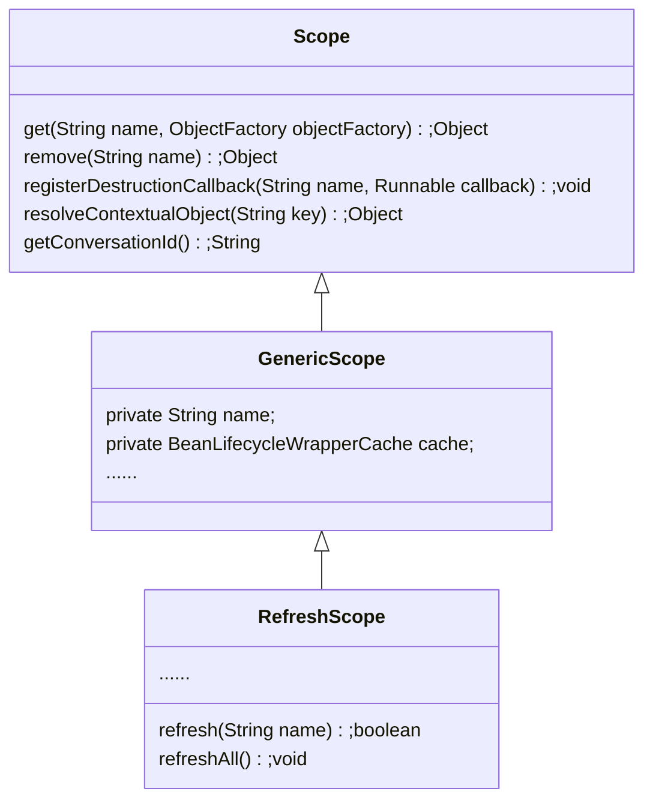

# Spring Cloud RefreshScope

## AbstractBeanFactory create bean instance

1. AbstractBeanFactory doGetBean通过BeanDefinition判断对象的Scope
2. 针对Singleton和Prototype做单独处理
3. 针对其他的Scope通过@Scope注解名称获取对应的Scope，比如@RefreshScope对应RefreshScope
4. 调用Scope get方法获取scopedInstance
5. Get Object For Bean Instance

对于以上的第4部分：

```java
AbstractBeanFactory.class
    
//调用对应的scope的get方法，传入beanName以及ObjectFactory，进行对象获取
Object scopedInstance = scope.get(beanName, () -> {
		beforePrototypeCreation(beanName);
		try {
            //通过createBean方法构建scopedInstance
			return createBean(beanName, mbd, args);
			}
		finally {
			afterPrototypeCreation(beanName);
			}
});
```

```java
GenericScope.class
    
@Override
public Object get(String name, ObjectFactory<?> objectFactory) {
   //构建BeanLifecycleWrapper并放入缓存进行维护
   BeanLifecycleWrapper value = this.cache.put(name,
         new BeanLifecycleWrapper(name, objectFactory));
   this.locks.putIfAbsent(name, new ReentrantReadWriteLock());
   try {
      return value.getBean();
   }
   catch (RuntimeException e) {
      this.errors.put(name, e);
      throw e;
   }
}

//返回bean如果bean为null则通过objectFactory进行创建
public Object getBean() {
	if (this.bean == null) {
		synchronized (this.name) {
			if (this.bean == null) {
				this.bean = this.objectFactory.getObject();
			}
		}
	}
	return this.bean;
}
```

**可以看出Scope其实最主要的就是维护了一个Cache，实际的构建Bean的过程还是由BeanFactory的createBean来创建**

## RefreshScope

### 继承关系


```java
RefreshScope.class
    
//RefreshScope刷新
public boolean refresh(String name) {
   if (!name.startsWith(SCOPED_TARGET_PREFIX)) {
      // User wants to refresh the bean with this name but that isn't the one in the
      // cache...
      name = SCOPED_TARGET_PREFIX + name;
   }
   // Ensure lifecycle is finished if bean was disposable
   //调用父类GenericScope destroy方法传入对应的bean名称来销毁对应的bean
   if (super.destroy(name)) {
      this.context.publishEvent(new RefreshScopeRefreshedEvent(name));
      return true;
   }
   return false;
}
```

```java
GenericScope.class

protected boolean destroy(String name) {
    //从cache获取对应的BeanLifecycleWrapper
   BeanLifecycleWrapper wrapper = this.cache.remove(name);
   if (wrapper != null) {
      Lock lock = this.locks.get(wrapper.getName()).writeLock();
      lock.lock();
      try {
          //调用destroy方法
         wrapper.destroy();
      }
      finally {
         lock.unlock();
      }
      this.errors.remove(name);
      return true;
   }
   return false;
}
```

```java
BeanLifecycleWrapper.class

public void destroy() {
   if (this.callback == null) {
      return;
   }
   synchronized (this.name) {
      //通过BeanLifecycleWrapper的callback来进行实际的bean的销毁工作
      //该callback其实就是DisposableBeanAdapter
      Runnable callback = this.callback;
      if (callback != null) {
         callback.run();
      }
      this.callback = null;
      this.bean = null;
   }
}
```

### Bean刷新总结

1. RefreshScope的refresh方法调用其父类GenericScope的destroy
2. GenericScope destroy从cache中获取对应bean name的BeanLifecycleWrapper，并调用其destroy方法
3. BeanLifecycleWrapper destroy方法通过callback来进行实际的对象销毁工作
4. 对象销毁之后，如果再次需要该对象则会再次通过BeanFactory进行重新构建，以此达到Bean的刷新

## 什么时候进行Bean刷新

1. RefreshEndpoint触发

```sequence
RefreshEndpoint -> ContextRefresher:contextRefresher.refresh()
ContextRefresher -> RefreshScope: scope.refreshAll()
RefreshScope -> GenericScope: destroy()
```

2.RefreshEvent事件触发

```sequence
RefreshEventListener -> RefreshEventListener: listener RefreshEvent
RefreshEventListener -> RefreshEventListener: handle
RefreshEventListener -> ContextRefresher: refresh.refresh()
ContextRefresher -> RefreshScope: scope.refreshAll()
RefreshScope -> GenericScope: destroy()
```

通常配置中心类似NacosConfig都会在更新PropertySources之后发送RefreshEvent进行Bean刷新

```java
NacosContextRefresher.class
    
private void registerNacosListener(final String groupKey, final String dataKey) {
   String key = NacosPropertySourceRepository.getMapKey(dataKey, groupKey);
   Listener listener = listenerMap.computeIfAbsent(key,
         lst -> new AbstractSharedListener() {
            @Override
            public void innerReceive(String dataId, String group,
                  String configInfo) {
               refreshCountIncrement();
               nacosRefreshHistory.addRefreshRecord(dataId, group, configInfo);
               // todo feature: support single refresh for listening
               // 发送RefreshEvent事件触发bean刷新
               applicationContext.publishEvent(
                     new RefreshEvent(this, null, "Refresh Nacos config"));
               if (log.isDebugEnabled()) {
                  log.debug(String.format(
                        "Refresh Nacos config group=%s,dataId=%s,configInfo=%s",
                        group, dataId, configInfo));
               }
            }
         });
   try {
      configService.addListener(dataKey, groupKey, listener);
   }
   catch (NacosException e) {
      log.warn(String.format(
            "register fail for nacos listener ,dataId=[%s],group=[%s]", dataKey,
            groupKey), e);
   }
}
```