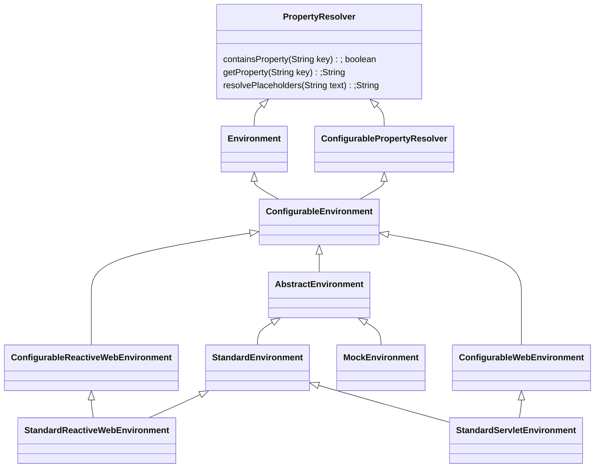

# Spring IOC Environment

## Environment

### 继承关系：



### 初始化、加载配置流程：

```sequence
SpringApplication -> SpringApplication: prepareEnvironment()
SpringApplication -> SpringApplication: getOrCreateEnvironment()
SpringApplication -> SpringApplication: listeners.environmentPrepared(environment)
SpringApplication -> EventPublishingRunListener: environmentPrepared()
EventPublishingRunListener -> EventPublishingRunListener: push event:ApplicationEnvironmentPreparedEvent
EventPublishingRunListener -> ConfigFileApplicationListener: onApplicationEnvironmentPreparedEvent
ConfigFileApplicationListener -> EnvironmentPostProcessor: postProcessor.postProcessEnvironment()
EnvironmentPostProcessor -> ConfigFileApplicationListener: addPropertySources
ConfigFileApplicationListener -> ConfigFileApplicationListener: new Loader(environment, resourceLoader).load();
ConfigFileApplicationListener -> Loader: load and save to MutablePropertySources
```

简单流程说明：

1. SpringApplication run()启动时，在容器刷新前，构建Environment，并调用SpringApplicationRunListeners的environmentPrepared方法
2. SpringApplicationRunListeners environmentPrepared方法中将会发送ApplicationEnvironmentPreparedEvent事件
3. ConfigFileApplicationListener监听事件，调用EnvironmentPostProcessor的postProcessEnvironment方法
4. ConfigFileApplicationListener实现了EnvironmentPostProcessor的postProcessEnvironment方法，方法中使用Loader进行加载配置文件
5. Loader使用对应的PropertySourceLoader加载profile配置，并将PropertySource添加到MutablePropertySources的propertySourceList

## PropertySource

todo

